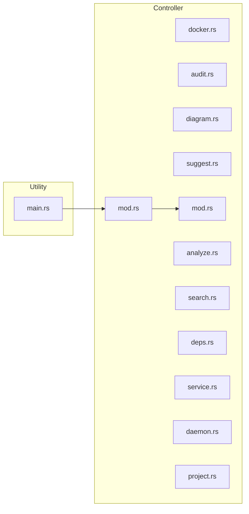
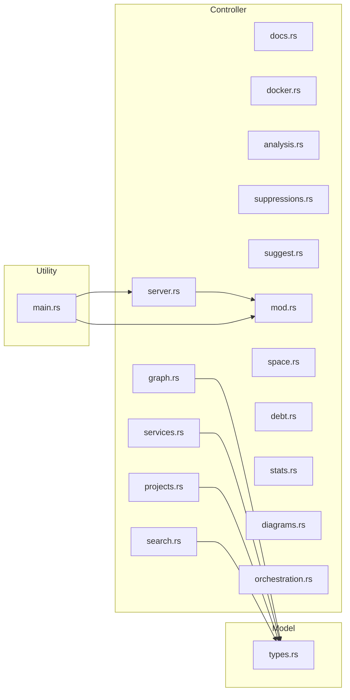
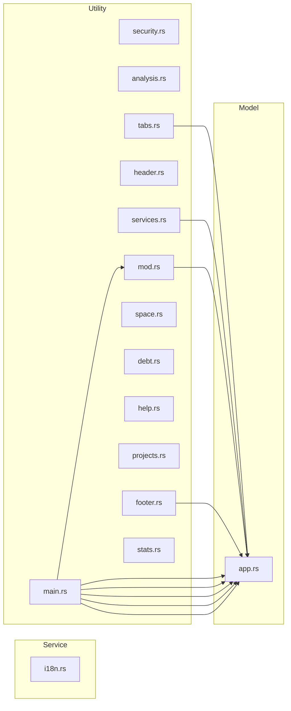
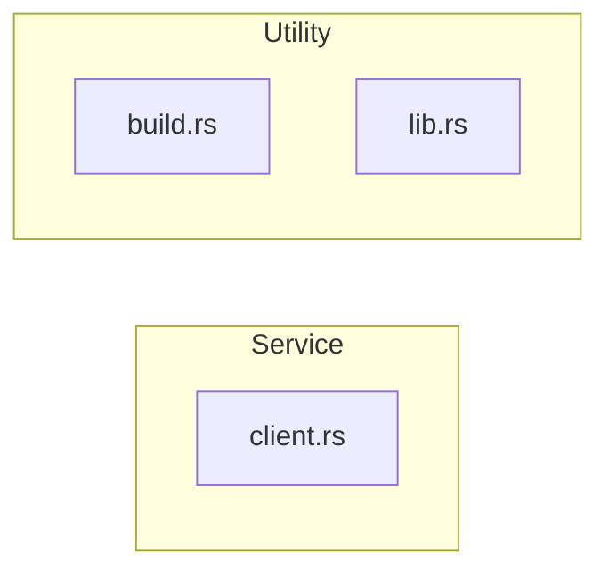
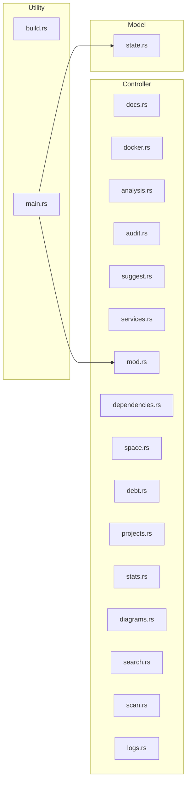
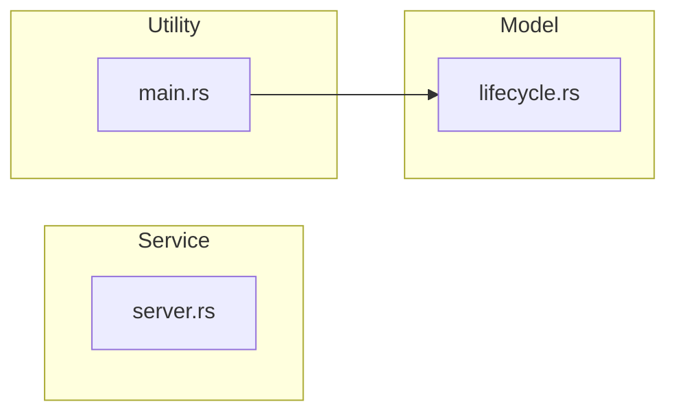

```mermaid
graph LR
    subgraph controller ["Controller"]
        src_global_config_mod_rs["mod.rs"]
        src_diagram_api_routes_node_rs["node.rs"]
        src_diagram_api_routes_python_rs["python.rs"]
        src_diagram_drawio_mod_rs["mod.rs"]
        src_diagram_service_detection_rs["service_detection.rs"]
        src_diagram_db_models_drift_rs["drift.rs"]
        src_audit_vuln_patterns_mod_rs["mod.rs"]
        src_ai_ollama_rs["ollama.rs"]
        src_analyzer_imports_dart_rs["dart.rs"]
        src_analyzer_imports_classifier_signals_rs["signals.rs"]
        src_analyzer_docs_mod_rs["mod.rs"]
    end
    subgraph service ["Service"]
        src_diagram_architecture_infra_mod_rs["mod.rs"]
        src_diagram_drawio_common_rs["common.rs"]
        src_backend_rs["backend.rs"]
        src_runner_docker_rs["docker.rs"]
        src_runner_local_rs["local.rs"]
        src_process_util_rs["process_util.rs"]
        src_runner_rs["runner.rs"]
        src_manager_mod_rs["mod.rs"]
        src_detector_docker_rs["docker.rs"]
        src_detector_env_rs["env.rs"]
        src_detector_clippy_rs["clippy.rs"]
        src_detector_flutter_rs["flutter.rs"]
        src_detector_rust_lang_rs["rust_lang.rs"]
        src_detector_react_doctor_rs["react_doctor.rs"]
        src_detector_ollama_rs["ollama.rs"]
        src_detector_mod_rs["mod.rs"]
        src_detector_node_rs["node.rs"]
        src_detector_ruff_rs["ruff.rs"]
        src_detector_golang_rs["golang.rs"]
        src_detector_flutter_analyze_rs["flutter_analyze.rs"]
        src_detector_python_rs["python.rs"]
        src_detector_cuda_rs["cuda.rs"]
        src_detector_golangci_lint_rs["golangci_lint.rs"]
        src_structural_langs_rust_rs["rust.rs"]
        src_structural_langs_javascript_rs["javascript.rs"]
        src_structural_langs_go_rs["go.rs"]
        src_structural_model_rs["model.rs"]
        src_analyzer_patterns_antipatterns_rs["antipatterns.rs"]
        src_analyzer_imports_javascript_rs["javascript.rs"]
        src_analyzer_imports_python_rs["python.rs"]
        src_analyzer_history_rs["history.rs"]
    end
    subgraph repository ["Repository"]
        src_docker_generate_compose_rs["generate_compose.rs"]
        src_diagram_db_models_sequelize_rs["sequelize.rs"]
        src_diagram_db_models_gorm_rs["gorm.rs"]
        src_vector_index_db_rs["db.rs"]
        src_vector_index_mod_rs["mod.rs"]
        src_vector_index_indexer_rs["indexer.rs"]
        src_stats_rs["stats.rs"]
        src_structural_graph_rs["graph.rs"]
        src_structural_query_rs["query.rs"]
    end
    subgraph model ["Model"]
        src_docker_mod_rs["mod.rs"]
        src_diagram_mod_rs["mod.rs"]
        src_diagram_db_models_python_rs["python.rs"]
        src_vector_index_voidignore_rs["voidignore.rs"]
        src_error_rs["error.rs"]
        src_audit_findings_rs["findings.rs"]
        src_audit_suppress_rs["suppress.rs"]
        src_log_filter_rs["log_filter.rs"]
        src_structural_mod_rs["mod.rs"]
        src_structural_langs_others_rs["others.rs"]
        src_structural_langs_python_rs["python.rs"]
        src_claudeignore_rs["claudeignore.rs"]
        src_space_mod_rs["mod.rs"]
        src_analyzer_patterns_mod_rs["mod.rs"]
        src_analyzer_graph_rs["graph.rs"]
        src_analyzer_imports_golang_rs["golang.rs"]
        src_analyzer_cross_project_rs["cross_project.rs"]
        src_model_rs["model.rs"]
    end
    subgraph utility ["Utility"]
        src_docker_terraform_rs["terraform.rs"]
        src_docker_helm_rs["helm.rs"]
        src_docker_parse_rs["parse.rs"]
        src_docker_kubernetes_rs["kubernetes.rs"]
        src_docker_generate_dockerfile_flutter_rs["flutter.rs"]
        src_docker_generate_dockerfile_rust_lang_rs["rust_lang.rs"]
        src_docker_generate_dockerfile_go_rs["go.rs"]
        src_docker_generate_dockerfile_python_rs["python.rs"]
        src_file_reader_rs["file_reader.rs"]
        src_global_config_paths_rs["paths.rs"]
        src_global_config_scanner_rs["scanner.rs"]
        src_global_config_project_ops_rs["project_ops.rs"]
        src_security_rs["security.rs"]
        src_diagram_api_routes_swagger_rs["swagger.rs"]
        src_diagram_api_routes_grpc_rs["grpc.rs"]
        src_diagram_api_routes_mod_rs["mod.rs"]
        src_diagram_architecture_crates_rs["crates.rs"]
        src_diagram_architecture_infra_terraform_rs["terraform.rs"]
        src_diagram_architecture_infra_helm_rs["helm.rs"]
        src_diagram_architecture_infra_kubernetes_rs["kubernetes.rs"]
        src_diagram_architecture_mod_rs["mod.rs"]
        src_diagram_drawio_api_routes_rs["api_routes.rs"]
        src_diagram_drawio_db_models_rs["db_models.rs"]
        src_diagram_drawio_architecture_rs["architecture.rs"]
        src_diagram_db_models_proto_rs["proto.rs"]
        src_diagram_db_models_mod_rs["mod.rs"]
        src_diagram_db_models_prisma_rs["prisma.rs"]
        src_vector_index_chunker_rs["chunker.rs"]
        src_vector_index_stats_rs["stats.rs"]
        src_vector_index_search_rs["search.rs"]
        src_lib_rs["lib.rs"]
        src_fs_util_rs["fs_util.rs"]
        src_hooks_rs["hooks.rs"]
        src_manager_state_rs["state.rs"]
        src_manager_url_rs["url.rs"]
        src_manager_logs_rs["logs.rs"]
        src_audit_vuln_patterns_xss_rs["xss.rs"]
        src_audit_vuln_patterns_injection_rs["injection.rs"]
        src_audit_vuln_patterns_network_rs["network.rs"]
        src_audit_vuln_patterns_error_handling_rs["error_handling.rs"]
        src_audit_vuln_patterns_crypto_rs["crypto.rs"]
        src_audit_enrichment_rs["enrichment.rs"]
        src_audit_deps_rs["deps.rs"]
        src_audit_mod_rs["mod.rs"]
        src_audit_context_rs["context.rs"]
        src_ai_mod_rs["mod.rs"]
        src_ai_prompt_rs["prompt.rs"]
        src_structural_langs_mod_rs["mod.rs"]
        src_structural_parser_rs["parser.rs"]
        src_analyzer_complexity_rs["complexity.rs"]
        src_analyzer_imports_rust_lang_rs["rust_lang.rs"]
        src_analyzer_imports_classifier_mod_rs["mod.rs"]
        src_analyzer_imports_mod_rs["mod.rs"]
        src_analyzer_docs_coverage_rs["coverage.rs"]
        src_analyzer_docs_sanitize_rs["sanitize.rs"]
        src_analyzer_docs_markdown_rs["markdown.rs"]
        src_analyzer_mod_rs["mod.rs"]
        src_analyzer_explicit_debt_rs["explicit_debt.rs"]
        src_analyzer_best_practices_flutter_rs["flutter.rs"]
        src_analyzer_best_practices_react_rs["react.rs"]
        src_analyzer_best_practices_report_rs["report.rs"]
        src_analyzer_best_practices_mod_rs["mod.rs"]
        src_analyzer_best_practices_vue_rs["vue.rs"]
        src_analyzer_best_practices_rust_bp_rs["rust_bp.rs"]
        src_analyzer_best_practices_oxlint_rs["oxlint.rs"]
        src_analyzer_best_practices_go_bp_rs["go_bp.rs"]
        src_analyzer_best_practices_python_rs["python.rs"]
        src_ignore_rs["ignore.rs"]
    end
    subgraph config ["Config"]
        src_project_config_rs["project_config.rs"]
        src_docker_generate_dockerfile_mod_rs["mod.rs"]
        src_docker_generate_dockerfile_node_rs["node.rs"]
        src_diagram_architecture_externals_rs["externals.rs"]
        src_config_rs["config.rs"]
        src_manager_process_rs["process.rs"]
        src_audit_vuln_patterns_config_rs["config.rs"]
        src_audit_config_check_rs["config_check.rs"]
        src_audit_secrets_rs["secrets.rs"]
        src_analyzer_best_practices_angular_rs["angular.rs"]
        src_analyzer_best_practices_astro_rs["astro.rs"]
    end
    subgraph test ["Test"]
        tests_integration_analysis_rs["integration_analysis.rs"]
        src_analyzer_imports_classifier_tests_rs["tests.rs"]
    end
    src_docker_mod_rs --> src_docker_generate_dockerfile_mod_rs
    src_file_reader_rs --> src_error_rs
    src_global_config_paths_rs --> src_error_rs
    src_global_config_mod_rs --> src_error_rs
    src_diagram_mod_rs --> src_diagram_api_routes_mod_rs
    src_diagram_mod_rs --> src_diagram_architecture_mod_rs
    src_diagram_mod_rs --> src_diagram_db_models_mod_rs
    src_diagram_mod_rs --> src_diagram_drawio_mod_rs
    src_diagram_architecture_infra_terraform_rs --> src_docker_mod_rs
    src_diagram_architecture_infra_mod_rs --> src_docker_mod_rs
    src_diagram_architecture_infra_helm_rs --> src_docker_mod_rs
    src_diagram_architecture_infra_kubernetes_rs --> src_docker_mod_rs
    src_diagram_architecture_externals_rs --> src_security_rs
    src_diagram_architecture_mod_rs --> src_diagram_architecture_infra_mod_rs
    src_diagram_architecture_mod_rs --> src_docker_mod_rs
    src_diagram_drawio_architecture_rs --> src_security_rs
    src_config_rs --> src_error_rs
    src_runner_docker_rs --> src_error_rs
    src_runner_docker_rs --> src_model_rs
    src_runner_docker_rs --> src_process_util_rs
    src_runner_local_rs --> src_error_rs
    src_runner_local_rs --> src_model_rs
    src_lib_rs --> src_ai_mod_rs
    src_lib_rs --> src_analyzer_mod_rs
    src_lib_rs --> src_audit_mod_rs
    src_lib_rs --> src_detector_mod_rs
    src_lib_rs --> src_diagram_mod_rs
    src_lib_rs --> src_docker_mod_rs
    src_lib_rs --> src_global_config_mod_rs
    src_lib_rs --> src_manager_mod_rs
    src_lib_rs --> src_space_mod_rs
    src_lib_rs --> src_structural_mod_rs
    src_lib_rs --> src_vector_index_mod_rs
    src_hooks_rs --> src_error_rs
    src_hooks_rs --> src_model_rs
    src_hooks_rs --> src_process_util_rs
    src_runner_rs --> src_docker_mod_rs
    src_runner_rs --> src_model_rs
    src_manager_mod_rs --> src_model_rs
    src_manager_state_rs --> src_model_rs
    src_manager_state_rs --> src_runner_rs
    src_manager_process_rs --> src_error_rs
    src_manager_process_rs --> src_hooks_rs
    src_manager_process_rs --> src_model_rs
    src_manager_process_rs --> src_runner_rs
    src_detector_ollama_rs --> src_security_rs
    src_audit_mod_rs --> src_audit_vuln_patterns_mod_rs
    src_ai_ollama_rs --> src_error_rs
    src_ai_mod_rs --> src_error_rs
    src_analyzer_imports_mod_rs --> src_analyzer_imports_classifier_mod_rs
    %% ... y 6 conexiones mas
```

# Arquitectura: void-stack

## Resumen

| | |
|---|---|
| **Patron** | Layered (confianza: 80%) |
| **Lenguaje** | Rust |
| **Modulos** | 221 archivos |
| **LOC** | 34253 lineas |
| **Deps externas** | 38 paquetes |

## Distribucion por Capas

| Capa | Archivos | LOC | % |
|------|----------|-----|---|
| Controller | 55 | 8557 | 24% |
| Service | 30 | 2739 | 7% |
| Repository | 10 | 2282 | 6% |
| Model | 21 | 3609 | 10% |
| Utility | 91 | 13758 | 40% |
| Config | 12 | 2346 | 6% |
| Test | 2 | 962 | 2% |

## Anti-patrones Detectados

### Alta Severidad

- **Fat Controller**: Controller 'crates/void-stack-cli/src/commands/project.rs' tiene 420 LOC — demasiada logica
  - *Sugerencia*: Mover la logica de negocio a una capa de servicio
- **Fat Controller**: Controller 'crates/void-stack-mcp/src/tools/orchestration.rs' tiene 524 LOC — demasiada logica
  - *Sugerencia*: Mover la logica de negocio a una capa de servicio
- **Fat Controller**: Controller 'crates/void-stack-mcp/src/server.rs' tiene 516 LOC — demasiada logica
  - *Sugerencia*: Mover la logica de negocio a una capa de servicio
- **Fat Controller**: Controller 'crates/void-stack-core/src/analyzer/imports/classifier/signals.rs' tiene 1009 LOC — demasiada logica
  - *Sugerencia*: Mover la logica de negocio a una capa de servicio
- **Excessive Coupling**: 'crates/void-stack-core/src/lib.rs' importa 26 modulos (fan-out alto)
  - *Sugerencia*: Reducir dependencias usando inyeccion de dependencias o fachadas

### Severidad Media

- **God Class**: 'crates/void-stack-tui/src/main.rs' es demasiado grande (611 LOC)
  - *Sugerencia*: Dividir 'crates/void-stack-tui/src/main.rs' en modulos mas pequenos con responsabilidades claras
- **God Class**: 'crates/void-stack-core/src/vector_index/indexer.rs' es demasiado grande (652 LOC)
  - *Sugerencia*: Dividir 'crates/void-stack-core/src/vector_index/indexer.rs' en modulos mas pequenos con responsabilidades claras
- **God Class**: 'crates/void-stack-core/src/ai/mod.rs' es demasiado grande (21 funciones)
  - *Sugerencia*: Dividir 'crates/void-stack-core/src/ai/mod.rs' en modulos mas pequenos con responsabilidades claras
- **God Class**: 'crates/void-stack-core/src/analyzer/imports/classifier/signals.rs' es demasiado grande (1009 LOC)
  - *Sugerencia*: Dividir 'crates/void-stack-core/src/analyzer/imports/classifier/signals.rs' en modulos mas pequenos con responsabilidades claras
- **Fat Controller**: Controller 'crates/void-stack-cli/src/commands/analysis/analyze.rs' tiene 400 LOC — demasiada logica
  - *Sugerencia*: Mover la logica de negocio a una capa de servicio
- **Fat Controller**: Controller 'crates/void-stack-cli/src/commands/service.rs' tiene 265 LOC — demasiada logica
  - *Sugerencia*: Mover la logica de negocio a una capa de servicio
- **Fat Controller**: Controller 'crates/void-stack-mcp/src/tools/analysis.rs' tiene 230 LOC — demasiada logica
  - *Sugerencia*: Mover la logica de negocio a una capa de servicio
- **Fat Controller**: Controller 'crates/void-stack-mcp/src/tools/projects.rs' tiene 256 LOC — demasiada logica
  - *Sugerencia*: Mover la logica de negocio a una capa de servicio
- **Fat Controller**: Controller 'crates/void-stack-mcp/src/tools/search.rs' tiene 302 LOC — demasiada logica
  - *Sugerencia*: Mover la logica de negocio a una capa de servicio
- **Fat Controller**: Controller 'crates/void-stack-desktop/src/commands/docker.rs' tiene 237 LOC — demasiada logica
  - *Sugerencia*: Mover la logica de negocio a una capa de servicio
- **Fat Controller**: Controller 'crates/void-stack-desktop/src/commands/analysis.rs' tiene 300 LOC — demasiada logica
  - *Sugerencia*: Mover la logica de negocio a una capa de servicio
- **Fat Controller**: Controller 'crates/void-stack-desktop/src/commands/debt.rs' tiene 279 LOC — demasiada logica
  - *Sugerencia*: Mover la logica de negocio a una capa de servicio
- **Fat Controller**: Controller 'crates/void-stack-desktop/src/commands/projects.rs' tiene 256 LOC — demasiada logica
  - *Sugerencia*: Mover la logica de negocio a una capa de servicio
- **Fat Controller**: Controller 'crates/void-stack-desktop/src/commands/scan.rs' tiene 328 LOC — demasiada logica
  - *Sugerencia*: Mover la logica de negocio a una capa de servicio
- **Excessive Coupling**: 'crates/void-stack-core/src/runner/docker.rs' importa 13 modulos (fan-out alto)
  - *Sugerencia*: Reducir dependencias usando inyeccion de dependencias o fachadas
- **Excessive Coupling**: 'crates/void-stack-core/src/analyzer/best_practices/mod.rs' importa 11 modulos (fan-out alto)
  - *Sugerencia*: Reducir dependencias usando inyeccion de dependencias o fachadas
- **Excessive Coupling**: 'crates/void-stack-core/src/detector/mod.rs' importa 16 modulos (fan-out alto)
  - *Sugerencia*: Reducir dependencias usando inyeccion de dependencias o fachadas
- **Excessive Coupling**: 'crates/void-stack-tui/src/ui/mod.rs' importa 15 modulos (fan-out alto)
  - *Sugerencia*: Reducir dependencias usando inyeccion de dependencias o fachadas
- **Excessive Coupling**: 'crates/void-stack-mcp/src/tools/mod.rs' importa 14 modulos (fan-out alto)
  - *Sugerencia*: Reducir dependencias usando inyeccion de dependencias o fachadas
- **Excessive Coupling**: 'crates/void-stack-core/src/vector_index/indexer.rs' importa 12 modulos (fan-out alto)
  - *Sugerencia*: Reducir dependencias usando inyeccion de dependencias o fachadas
- **Excessive Coupling**: 'crates/void-stack-desktop/src/commands/mod.rs' importa 15 modulos (fan-out alto)
  - *Sugerencia*: Reducir dependencias usando inyeccion de dependencias o fachadas
- **Excessive Coupling**: 'crates/void-stack-core/src/runner/local.rs' importa 11 modulos (fan-out alto)
  - *Sugerencia*: Reducir dependencias usando inyeccion de dependencias o fachadas

## Mapa de Dependencias

```mermaid
graph LR
    subgraph controller ["Controller"]
        crates_void_stack_cli_src_commands_docker_rs["docker.rs"]
        crates_void_stack_cli_src_commands_analysis_audit_rs["audit.rs"]
        crates_void_stack_cli_src_commands_analysis_diagram_rs["diagram.rs"]
        crates_void_stack_cli_src_commands_analysis_suggest_rs["suggest.rs"]
        crates_void_stack_cli_src_commands_analysis_mod_rs["mod.rs"]
        crates_void_stack_cli_src_commands_analysis_analyze_rs["analyze.rs"]
        crates_void_stack_cli_src_commands_analysis_search_rs["search.rs"]
        crates_void_stack_cli_src_commands_deps_rs["deps.rs"]
        crates_void_stack_cli_src_commands_service_rs["service.rs"]
        crates_void_stack_cli_src_commands_mod_rs["mod.rs"]
        crates_void_stack_cli_src_commands_daemon_rs["daemon.rs"]
        crates_void_stack_cli_src_commands_project_rs["project.rs"]
        crates_void_stack_mcp_src_tools_docs_rs["docs.rs"]
        crates_void_stack_mcp_src_tools_docker_rs["docker.rs"]
        crates_void_stack_mcp_src_tools_graph_rs["graph.rs"]
        crates_void_stack_mcp_src_tools_analysis_rs["analysis.rs"]
        crates_void_stack_mcp_src_tools_suppressions_rs["suppressions.rs"]
        crates_void_stack_mcp_src_tools_suggest_rs["suggest.rs"]
        crates_void_stack_mcp_src_tools_services_rs["services.rs"]
        crates_void_stack_mcp_src_tools_mod_rs["mod.rs"]
        crates_void_stack_mcp_src_tools_space_rs["space.rs"]
        crates_void_stack_mcp_src_tools_debt_rs["debt.rs"]
        crates_void_stack_mcp_src_tools_projects_rs["projects.rs"]
        crates_void_stack_mcp_src_tools_stats_rs["stats.rs"]
        crates_void_stack_mcp_src_tools_diagrams_rs["diagrams.rs"]
        crates_void_stack_mcp_src_tools_search_rs["search.rs"]
        crates_void_stack_mcp_src_tools_orchestration_rs["orchestration.rs"]
        crates_void_stack_mcp_src_server_rs["server.rs"]
        crates_void_stack_desktop_src_commands_docs_rs["docs.rs"]
        crates_void_stack_desktop_src_commands_docker_rs["docker.rs"]
        crates_void_stack_desktop_src_commands_analysis_rs["analysis.rs"]
        crates_void_stack_desktop_src_commands_audit_rs["audit.rs"]
        crates_void_stack_desktop_src_commands_suggest_rs["suggest.rs"]
        crates_void_stack_desktop_src_commands_services_rs["services.rs"]
        crates_void_stack_desktop_src_commands_mod_rs["mod.rs"]
        crates_void_stack_desktop_src_commands_dependencies_rs["dependencies.rs"]
        crates_void_stack_desktop_src_commands_space_rs["space.rs"]
        crates_void_stack_desktop_src_commands_debt_rs["debt.rs"]
        crates_void_stack_desktop_src_commands_projects_rs["projects.rs"]
        crates_void_stack_desktop_src_commands_stats_rs["stats.rs"]
        crates_void_stack_desktop_src_commands_diagrams_rs["diagrams.rs"]
        crates_void_stack_desktop_src_commands_search_rs["search.rs"]
        crates_void_stack_desktop_src_commands_scan_rs["scan.rs"]
        crates_void_stack_desktop_src_commands_logs_rs["logs.rs"]
        crates_void_stack_core_src_global_config_mod_rs["mod.rs"]
        crates_void_stack_core_src_diagram_api_routes_node_rs["node.rs"]
        crates_void_stack_core_src_diagram_api_routes_python_rs["python.rs"]
        crates_void_stack_core_src_diagram_drawio_mod_rs["mod.rs"]
        crates_void_stack_core_src_diagram_service_detection_rs["service_detection.rs"]
        crates_void_stack_core_src_diagram_db_models_drift_rs["drift.rs"]
        crates_void_stack_core_src_audit_vuln_patterns_mod_rs["mod.rs"]
        crates_void_stack_core_src_ai_ollama_rs["ollama.rs"]
        crates_void_stack_core_src_analyzer_imports_dart_rs["dart.rs"]
        crates_void_stack_core_src_analyzer_imports_classifier_signals_rs["signals.rs"]
        crates_void_stack_core_src_analyzer_docs_mod_rs["mod.rs"]
    end
    subgraph service ["Service"]
        crates_void_stack_proto_src_client_rs["client.rs"]
        crates_void_stack_desktop_src_state_rs["state.rs"]
        crates_void_stack_core_src_diagram_architecture_infra_mod_rs["mod.rs"]
        crates_void_stack_core_src_diagram_architecture_mod_rs["mod.rs"]
        crates_void_stack_core_src_backend_rs["backend.rs"]
        crates_void_stack_core_src_runner_docker_rs["docker.rs"]
        crates_void_stack_core_src_runner_local_rs["local.rs"]
        crates_void_stack_core_src_process_util_rs["process_util.rs"]
        crates_void_stack_core_src_runner_rs["runner.rs"]
        crates_void_stack_core_src_manager_mod_rs["mod.rs"]
        crates_void_stack_core_src_detector_docker_rs["docker.rs"]
        crates_void_stack_core_src_detector_clippy_rs["clippy.rs"]
        crates_void_stack_core_src_detector_flutter_rs["flutter.rs"]
        crates_void_stack_core_src_detector_rust_lang_rs["rust_lang.rs"]
        crates_void_stack_core_src_detector_react_doctor_rs["react_doctor.rs"]
        crates_void_stack_core_src_detector_ollama_rs["ollama.rs"]
        crates_void_stack_core_src_detector_mod_rs["mod.rs"]
        crates_void_stack_core_src_detector_node_rs["node.rs"]
        crates_void_stack_core_src_detector_ruff_rs["ruff.rs"]
        crates_void_stack_core_src_detector_golang_rs["golang.rs"]
        crates_void_stack_core_src_detector_flutter_analyze_rs["flutter_analyze.rs"]
        crates_void_stack_core_src_detector_python_rs["python.rs"]
        crates_void_stack_core_src_detector_cuda_rs["cuda.rs"]
        crates_void_stack_core_src_detector_golangci_lint_rs["golangci_lint.rs"]
        crates_void_stack_core_src_structural_langs_javascript_rs["javascript.rs"]
        crates_void_stack_core_src_structural_langs_go_rs["go.rs"]
        crates_void_stack_core_src_structural_langs_python_rs["python.rs"]
        crates_void_stack_core_src_analyzer_patterns_antipatterns_rs["antipatterns.rs"]
        crates_void_stack_core_src_analyzer_imports_javascript_rs["javascript.rs"]
        crates_void_stack_core_src_analyzer_imports_python_rs["python.rs"]
    end
    subgraph repository ["Repository"]
        crates_void_stack_core_src_docker_generate_compose_rs["generate_compose.rs"]
        crates_void_stack_core_src_diagram_db_models_sequelize_rs["sequelize.rs"]
        crates_void_stack_core_src_diagram_db_models_gorm_rs["gorm.rs"]
        crates_void_stack_core_src_vector_index_db_rs["db.rs"]
        crates_void_stack_core_src_vector_index_mod_rs["mod.rs"]
        crates_void_stack_core_src_vector_index_indexer_rs["indexer.rs"]
        crates_void_stack_core_src_vector_index_stats_rs["stats.rs"]
        crates_void_stack_core_src_stats_rs["stats.rs"]
        crates_void_stack_core_src_structural_graph_rs["graph.rs"]
        crates_void_stack_core_src_structural_query_rs["query.rs"]
    end
    subgraph model ["Model"]
        crates_void_stack_mcp_src_types_rs["types.rs"]
        crates_void_stack_tui_src_app_rs["app.rs"]
        crates_void_stack_core_src_docker_mod_rs["mod.rs"]
        crates_void_stack_core_src_diagram_mod_rs["mod.rs"]
        crates_void_stack_core_src_diagram_db_models_mod_rs["mod.rs"]
        crates_void_stack_core_src_diagram_db_models_python_rs["python.rs"]
        crates_void_stack_core_src_vector_index_voidignore_rs["voidignore.rs"]
        crates_void_stack_core_src_error_rs["error.rs"]
        crates_void_stack_core_src_audit_findings_rs["findings.rs"]
        crates_void_stack_core_src_audit_suppress_rs["suppress.rs"]
        crates_void_stack_core_src_structural_mod_rs["mod.rs"]
        crates_void_stack_core_src_structural_langs_rust_rs["rust.rs"]
        crates_void_stack_core_src_structural_langs_others_rs["others.rs"]
        crates_void_stack_core_src_structural_model_rs["model.rs"]
        crates_void_stack_core_src_space_mod_rs["mod.rs"]
        crates_void_stack_core_src_analyzer_patterns_mod_rs["mod.rs"]
        crates_void_stack_core_src_analyzer_imports_golang_rs["golang.rs"]
        crates_void_stack_core_src_analyzer_cross_project_rs["cross_project.rs"]
        crates_void_stack_core_src_analyzer_history_rs["history.rs"]
        crates_void_stack_core_src_analyzer_best_practices_mod_rs["mod.rs"]
        crates_void_stack_core_src_model_rs["model.rs"]
    end
    subgraph utility ["Utility"]
        crates_void_stack_cli_src_main_rs["main.rs"]
        crates_void_stack_mcp_src_main_rs["main.rs"]
        crates_void_stack_tui_src_ui_security_rs["security.rs"]
        crates_void_stack_tui_src_ui_analysis_rs["analysis.rs"]
        crates_void_stack_tui_src_ui_tabs_rs["tabs.rs"]
        crates_void_stack_tui_src_ui_header_rs["header.rs"]
        crates_void_stack_tui_src_ui_services_rs["services.rs"]
        crates_void_stack_tui_src_ui_mod_rs["mod.rs"]
        crates_void_stack_tui_src_ui_space_rs["space.rs"]
        crates_void_stack_tui_src_ui_debt_rs["debt.rs"]
        crates_void_stack_tui_src_ui_help_rs["help.rs"]
        crates_void_stack_tui_src_ui_projects_rs["projects.rs"]
        crates_void_stack_tui_src_ui_footer_rs["footer.rs"]
        crates_void_stack_tui_src_ui_stats_rs["stats.rs"]
        crates_void_stack_tui_src_main_rs["main.rs"]
        crates_void_stack_tui_src_i18n_rs["i18n.rs"]
        crates_void_stack_proto_build_rs["build.rs"]
        crates_void_stack_proto_src_lib_rs["lib.rs"]
        crates_void_stack_desktop_build_rs["build.rs"]
        crates_void_stack_desktop_src_main_rs["main.rs"]
        crates_void_stack_daemon_src_server_rs["server.rs"]
        crates_void_stack_daemon_src_main_rs["main.rs"]
        crates_void_stack_daemon_src_lifecycle_rs["lifecycle.rs"]
        crates_void_stack_core_src_docker_terraform_rs["terraform.rs"]
        crates_void_stack_core_src_docker_helm_rs["helm.rs"]
        crates_void_stack_core_src_docker_parse_rs["parse.rs"]
        crates_void_stack_core_src_docker_kubernetes_rs["kubernetes.rs"]
        crates_void_stack_core_src_docker_generate_dockerfile_flutter_rs["flutter.rs"]
        crates_void_stack_core_src_docker_generate_dockerfile_rust_lang_rs["rust_lang.rs"]
        crates_void_stack_core_src_docker_generate_dockerfile_go_rs["go.rs"]
        crates_void_stack_core_src_docker_generate_dockerfile_python_rs["python.rs"]
        crates_void_stack_core_src_file_reader_rs["file_reader.rs"]
        crates_void_stack_core_src_global_config_paths_rs["paths.rs"]
        crates_void_stack_core_src_global_config_scanner_rs["scanner.rs"]
        crates_void_stack_core_src_global_config_project_ops_rs["project_ops.rs"]
        crates_void_stack_core_src_security_rs["security.rs"]
        crates_void_stack_core_src_diagram_api_routes_swagger_rs["swagger.rs"]
        crates_void_stack_core_src_diagram_api_routes_grpc_rs["grpc.rs"]
        crates_void_stack_core_src_diagram_api_routes_mod_rs["mod.rs"]
        crates_void_stack_core_src_diagram_architecture_crates_rs["crates.rs"]
        crates_void_stack_core_src_diagram_architecture_infra_terraform_rs["terraform.rs"]
        crates_void_stack_core_src_diagram_architecture_infra_helm_rs["helm.rs"]
        crates_void_stack_core_src_diagram_architecture_infra_kubernetes_rs["kubernetes.rs"]
        crates_void_stack_core_src_diagram_drawio_api_routes_rs["api_routes.rs"]
        crates_void_stack_core_src_diagram_drawio_db_models_rs["db_models.rs"]
        crates_void_stack_core_src_diagram_drawio_architecture_rs["architecture.rs"]
        crates_void_stack_core_src_diagram_drawio_common_rs["common.rs"]
        crates_void_stack_core_src_diagram_db_models_proto_rs["proto.rs"]
        crates_void_stack_core_src_diagram_db_models_prisma_rs["prisma.rs"]
        crates_void_stack_core_src_vector_index_chunker_rs["chunker.rs"]
        crates_void_stack_core_src_vector_index_search_rs["search.rs"]
        crates_void_stack_core_src_lib_rs["lib.rs"]
        crates_void_stack_core_src_fs_util_rs["fs_util.rs"]
        crates_void_stack_core_src_hooks_rs["hooks.rs"]
        crates_void_stack_core_src_manager_state_rs["state.rs"]
        crates_void_stack_core_src_manager_url_rs["url.rs"]
        crates_void_stack_core_src_manager_logs_rs["logs.rs"]
        crates_void_stack_core_src_audit_vuln_patterns_xss_rs["xss.rs"]
        crates_void_stack_core_src_audit_vuln_patterns_injection_rs["injection.rs"]
        crates_void_stack_core_src_audit_vuln_patterns_network_rs["network.rs"]
        crates_void_stack_core_src_audit_vuln_patterns_error_handling_rs["error_handling.rs"]
        crates_void_stack_core_src_audit_vuln_patterns_crypto_rs["crypto.rs"]
        crates_void_stack_core_src_audit_enrichment_rs["enrichment.rs"]
        crates_void_stack_core_src_audit_deps_rs["deps.rs"]
        crates_void_stack_core_src_audit_mod_rs["mod.rs"]
        crates_void_stack_core_src_audit_context_rs["context.rs"]
        crates_void_stack_core_src_ai_mod_rs["mod.rs"]
        crates_void_stack_core_src_ai_prompt_rs["prompt.rs"]
        crates_void_stack_core_src_log_filter_rs["log_filter.rs"]
        crates_void_stack_core_src_structural_langs_mod_rs["mod.rs"]
        crates_void_stack_core_src_structural_parser_rs["parser.rs"]
        crates_void_stack_core_src_claudeignore_rs["claudeignore.rs"]
        crates_void_stack_core_src_analyzer_graph_rs["graph.rs"]
        crates_void_stack_core_src_analyzer_complexity_rs["complexity.rs"]
        crates_void_stack_core_src_analyzer_imports_rust_lang_rs["rust_lang.rs"]
        crates_void_stack_core_src_analyzer_imports_classifier_mod_rs["mod.rs"]
        crates_void_stack_core_src_analyzer_imports_mod_rs["mod.rs"]
        crates_void_stack_core_src_analyzer_docs_coverage_rs["coverage.rs"]
        crates_void_stack_core_src_analyzer_docs_sanitize_rs["sanitize.rs"]
        crates_void_stack_core_src_analyzer_docs_markdown_rs["markdown.rs"]
        crates_void_stack_core_src_analyzer_mod_rs["mod.rs"]
        crates_void_stack_core_src_analyzer_explicit_debt_rs["explicit_debt.rs"]
        crates_void_stack_core_src_analyzer_best_practices_flutter_rs["flutter.rs"]
        crates_void_stack_core_src_analyzer_best_practices_react_rs["react.rs"]
        crates_void_stack_core_src_analyzer_best_practices_report_rs["report.rs"]
        crates_void_stack_core_src_analyzer_best_practices_vue_rs["vue.rs"]
        crates_void_stack_core_src_analyzer_best_practices_rust_bp_rs["rust_bp.rs"]
        crates_void_stack_core_src_analyzer_best_practices_oxlint_rs["oxlint.rs"]
        crates_void_stack_core_src_analyzer_best_practices_go_bp_rs["go_bp.rs"]
        crates_void_stack_core_src_analyzer_best_practices_python_rs["python.rs"]
        crates_void_stack_core_src_ignore_rs["ignore.rs"]
    end
    subgraph config ["Config"]
        crates_void_stack_core_src_project_config_rs["project_config.rs"]
        crates_void_stack_core_src_docker_generate_dockerfile_mod_rs["mod.rs"]
        crates_void_stack_core_src_docker_generate_dockerfile_node_rs["node.rs"]
        crates_void_stack_core_src_diagram_architecture_externals_rs["externals.rs"]
        crates_void_stack_core_src_config_rs["config.rs"]
        crates_void_stack_core_src_manager_process_rs["process.rs"]
        crates_void_stack_core_src_detector_env_rs["env.rs"]
        crates_void_stack_core_src_audit_vuln_patterns_config_rs["config.rs"]
        crates_void_stack_core_src_audit_config_check_rs["config_check.rs"]
        crates_void_stack_core_src_audit_secrets_rs["secrets.rs"]
        crates_void_stack_core_src_analyzer_best_practices_angular_rs["angular.rs"]
        crates_void_stack_core_src_analyzer_best_practices_astro_rs["astro.rs"]
    end
    subgraph test ["Test"]
        crates_void_stack_core_tests_integration_analysis_rs["integration_analysis.rs"]
        crates_void_stack_core_src_analyzer_imports_classifier_tests_rs["tests.rs"]
    end
    crates_void_stack_cli_src_main_rs --> crates_void_stack_cli_src_commands_mod_rs
    crates_void_stack_cli_src_commands_mod_rs --> crates_void_stack_cli_src_commands_analysis_mod_rs
    crates_void_stack_mcp_src_main_rs --> crates_void_stack_mcp_src_tools_mod_rs
    crates_void_stack_tui_src_main_rs --> crates_void_stack_tui_src_ui_mod_rs
    crates_void_stack_desktop_src_main_rs --> crates_void_stack_desktop_src_commands_mod_rs
    crates_void_stack_core_src_docker_mod_rs --> crates_void_stack_core_src_docker_generate_dockerfile_mod_rs
    crates_void_stack_core_src_diagram_mod_rs --> crates_void_stack_core_src_diagram_api_routes_mod_rs
    crates_void_stack_core_src_diagram_mod_rs --> crates_void_stack_core_src_diagram_architecture_mod_rs
    crates_void_stack_core_src_diagram_mod_rs --> crates_void_stack_core_src_diagram_db_models_mod_rs
    crates_void_stack_core_src_diagram_mod_rs --> crates_void_stack_core_src_diagram_drawio_mod_rs
    crates_void_stack_core_src_diagram_architecture_mod_rs --> crates_void_stack_core_src_diagram_architecture_infra_mod_rs
    crates_void_stack_core_src_lib_rs --> crates_void_stack_core_src_ai_mod_rs
    crates_void_stack_core_src_lib_rs --> crates_void_stack_core_src_analyzer_mod_rs
    crates_void_stack_core_src_lib_rs --> crates_void_stack_core_src_audit_mod_rs
    crates_void_stack_core_src_lib_rs --> crates_void_stack_core_src_detector_mod_rs
    crates_void_stack_core_src_lib_rs --> crates_void_stack_core_src_diagram_mod_rs
    crates_void_stack_core_src_lib_rs --> crates_void_stack_core_src_docker_mod_rs
    crates_void_stack_core_src_lib_rs --> crates_void_stack_core_src_global_config_mod_rs
    crates_void_stack_core_src_lib_rs --> crates_void_stack_core_src_manager_mod_rs
    crates_void_stack_core_src_lib_rs --> crates_void_stack_core_src_space_mod_rs
    crates_void_stack_core_src_lib_rs --> crates_void_stack_core_src_structural_mod_rs
    crates_void_stack_core_src_lib_rs --> crates_void_stack_core_src_vector_index_mod_rs
    crates_void_stack_core_src_runner_rs --> crates_void_stack_core_src_docker_mod_rs
    crates_void_stack_core_src_audit_mod_rs --> crates_void_stack_core_src_audit_vuln_patterns_mod_rs
    crates_void_stack_core_src_analyzer_imports_mod_rs --> crates_void_stack_core_src_analyzer_imports_classifier_mod_rs
    crates_void_stack_core_src_analyzer_mod_rs --> crates_void_stack_core_src_analyzer_best_practices_mod_rs
    crates_void_stack_core_src_analyzer_mod_rs --> crates_void_stack_core_src_analyzer_docs_mod_rs
    crates_void_stack_core_src_analyzer_mod_rs --> crates_void_stack_core_src_analyzer_imports_mod_rs
    crates_void_stack_core_src_analyzer_mod_rs --> crates_void_stack_core_src_analyzer_patterns_mod_rs
```

## Modulos

| Archivo | Capa | LOC | Clases | Funciones |
|---------|------|-----|--------|----------|
| `crates/void-stack-core/src/analyzer/imports/classifier/signals.rs` | Controller | 1009 | 0 | 0 |
| `crates/void-stack-core/src/vector_index/indexer.rs` | Repository | 652 | 2 | 19 |
| `crates/void-stack-core/src/analyzer/imports/classifier/tests.rs` | Test | 628 | 0 | 40 |
| `crates/void-stack-tui/src/main.rs` | Utility | 611 | 1 | 16 |
| `crates/void-stack-mcp/src/tools/orchestration.rs` | Controller | 524 | 3 | 10 |
| `crates/void-stack-mcp/src/server.rs` | Controller | 516 | 1 | 47 |
| `crates/void-stack-core/src/analyzer/complexity.rs` | Utility | 490 | 2 | 16 |
| `crates/void-stack-tui/src/ui/analysis.rs` | Utility | 471 | 0 | 6 |
| `crates/void-stack-core/src/analyzer/docs/markdown.rs` | Utility | 460 | 0 | 14 |
| `crates/void-stack-cli/src/commands/project.rs` | Controller | 420 | 0 | 12 |
| `crates/void-stack-core/src/diagram/architecture/externals.rs` | Config | 401 | 0 | 10 |
| `crates/void-stack-cli/src/commands/analysis/analyze.rs` | Controller | 400 | 0 | 17 |
| `crates/void-stack-core/src/docker/parse.rs` | Utility | 398 | 0 | 12 |
| `crates/void-stack-tui/src/app.rs` | Model | 397 | 4 | 20 |
| `crates/void-stack-core/src/audit/secrets.rs` | Config | 362 | 1 | 4 |
| `crates/void-stack-cli/src/main.rs` | Utility | 357 | 3 | 1 |
| `crates/void-stack-core/src/space/mod.rs` | Model | 353 | 2 | 9 |
| `crates/void-stack-core/src/audit/config_check.rs` | Config | 344 | 0 | 8 |
| `crates/void-stack-core/src/analyzer/best_practices/mod.rs` | Model | 342 | 7 | 18 |
| `crates/void-stack-core/src/structural/parser.rs` | Utility | 336 | 1 | 17 |
| `crates/void-stack-tui/src/i18n.rs` | Utility | 335 | 1 | 5 |
| `crates/void-stack-core/tests/integration_analysis.rs` | Test | 334 | 0 | 22 |
| `crates/void-stack-desktop/src/commands/scan.rs` | Controller | 328 | 3 | 5 |
| `crates/void-stack-core/src/audit/deps.rs` | Utility | 325 | 0 | 7 |
| `crates/void-stack-core/src/ai/mod.rs` | Utility | 324 | 6 | 21 |
| `crates/void-stack-core/src/analyzer/imports/mod.rs` | Utility | 321 | 3 | 7 |
| `crates/void-stack-core/src/runner/docker.rs` | Service | 316 | 2 | 14 |
| `crates/void-stack-core/src/analyzer/history.rs` | Model | 304 | 5 | 11 |
| `crates/void-stack-mcp/src/tools/search.rs` | Controller | 302 | 0 | 14 |
| `crates/void-stack-desktop/src/commands/analysis.rs` | Controller | 300 | 9 | 2 |

*... y 191 módulos más (ordenados por LOC, mostrando top 30)*

## Dependencias Externas

- `anyhow`
- `app`
- `async_trait`
- `chrono`
- `clap`
- `complexity`
- `coverage`
- `crossterm`
- `explicit_debt`
- `graph`
- `hnsw_rs`
- `notify`
- `patterns`
- `ratatui`
- `rayon`
- `regex`
- `rmcp`
- `rusqlite`
- `schemars`
- `serde`
- `serde_yaml`
- `server`
- `sha2`
- `signals`
- `state`
- `std`
- `super`
- `tauri`
- `tempfile`
- `thiserror`
- `tokio`
- `tokio_stream`
- `tonic`
- `tracing`
- `tree_sitter`
- `uuid`
- `void_stack_core`
- `void_stack_proto`

## Complejidad Ciclomatica

**Promedio**: 3.5 | **Funciones analizadas**: 2153 | **Funciones complejas (>=10)**: 202

| Funcion | Archivo | Linea | CC | LOC |
|---------|---------|-------|----|-----|
| `es` !! | `i18n.rs` | 33 | 152 | 173 |
| `en` !! | `i18n.rs` | 225 | 152 | 173 |
| `detect_const_context` !! | `context.rs` | 158 | 38 | 61 |
| `assemble_report` !! | `orchestration.rs` | 261 | 36 | 237 |
| `cmd_docker` !! | `docker.rs` | 7 | 34 | 152 |
| `generate` !! | `mod.rs` | 19 | 34 | 147 |
| `detect_from_env` !! | `externals.rs` | 51 | 33 | 93 |
| `detect_service_tech` !! | `projects.rs` | 72 | 32 | 58 |
| `render_db_models_page` !! | `db_models.rs` | 7 | 31 | 159 |
| `parse_k8s_yaml` !! | `kubernetes.rs` | 102 | 30 | 119 |
| `scan_weak_cryptography` !! | `crypto.rs` | 151 | 30 | 87 |
| `scan_subprojects` !! | `scanner.rs` | 8 | 29 | 74 |
| `collect_files_recursive` !! | `indexer.rs` | 746 | 29 | 90 |
| `main` !! | `main.rs` | 309 | 28 | 173 |
| `cmd_start` !! | `service.rs` | 15 | 28 | 136 |
| `parse_swagger_yaml_routes` !! | `swagger.rs` | 98 | 28 | 117 |
| `check` !! | `python.rs` | 21 | 28 | 121 |
| `detect_crate_relationships` !! | `crates.rs` | 6 | 26 | 70 |
| `parse_file` !! | `javascript.rs` | 17 | 26 | 73 |
| `install_hint` !! | `process_util.rs` | 139 | 25 | 49 |

## Metricas de Acoplamiento

| Modulo | Fan-in | Fan-out |
|--------|--------|--------|
| `lib.rs` | 0 | 26 |
| `mod.rs` | 1 | 16 |
| `mod.rs` | 1 | 15 |
| `mod.rs` | 1 | 15 |
| `mod.rs` | 1 | 14 |
| `docker.rs` | 0 | 13 |
| `indexer.rs` | 0 | 12 |
| `mod.rs` | 1 | 11 |
| `local.rs` | 0 | 11 |
| `mod.rs` | 1 | 10 |
| `hooks.rs` | 0 | 9 |
| `mod.rs` | 1 | 9 |
| `process.rs` | 0 | 9 |
| `mod.rs` | 1 | 9 |
| `mod.rs` | 1 | 8 |
| `config.rs` | 0 | 8 |
| `mod.rs` | 1 | 8 |
| `mod.rs` | 1 | 8 |
| `mod.rs` | 1 | 8 |
| `mod.rs` | 1 | 8 |

## Test Coverage

⚠️ No se encontraron reportes de cobertura.

Para generar reportes de cobertura, ejecutar:
- **Rust**: `cargo install cargo-tarpaulin && cargo tarpaulin --out xml` (genera `cobertura.xml`)

## Deuda Tecnica Explicita

**Total**: 33 marcadores (BUG: 3, FIXME: 1, HACK: 1, OPTIMIZE: 6, TEMP: 9, TODO: 11, XXX: 2)

| Archivo | Linea | Tipo | Texto |
|---------|-------|------|-------|
| `...-cli/src/commands/analysis/analyze.rs` | 228 | TODO | /FIXME/HACK). |
| `crates/void-stack-cli/src/main.rs` | 245 | OPTIMIZE | d .voidignore for semantic index quality |
| `crates/void-stack-cli/src/main.rs` | 266 | OPTIMIZE | d for the project's tech stack |
| `crates/void-stack-core/src/ai/prompt.rs` | 15 | OPTIMIZE | d prompt from analysis results. |
| `...ck-core/src/analyzer/explicit_debt.rs` | 3 | TODO | , FIXME, HACK, XXX, OPTIMIZE, BUG, TEMP, WORKAROUND. |
| `...ck-core/src/analyzer/explicit_debt.rs` | 228 | TODO | implement error handling", "rust"); |
| `...ck-core/src/analyzer/explicit_debt.rs` | 238 | FIXME | this is broken\n\ |
| `...ck-core/src/analyzer/explicit_debt.rs` | 240 | HACK | temporary workaround", |
| `...ck-core/src/analyzer/explicit_debt.rs` | 266 | TODO | add validation\n/* FIXME: memory leak */", |
| `...ck-core/src/analyzer/explicit_debt.rs` | 282 | TODO | a\n// FIXME: b\n// HACK: c\n// XXX: d\n// OPTIMIZE: e\n//... |
| `...ck-core/src/analyzer/explicit_debt.rs` | 304 | TODO | lowercase", "rust"); |
| `...ck-core/src/analyzer/explicit_debt.rs` | 314 | TODO | add logging\n}\n", |
| `...ck-core/src/analyzer/explicit_debt.rs` | 325 | TODO | should be skipped", |
| `...s/void-stack-core/src/analyzer/mod.rs` | 32 | TODO | , FIXME, HACK, etc.) found in source code. |
| `.../void-stack-core/src/audit/secrets.rs` | 179 | TEMP | late/placeholder syntax that |
| `.../void-stack-core/src/audit/secrets.rs` | 184 | TEMP | late variables, string interpolation |
| `.../void-stack-core/src/audit/secrets.rs` | 189 | TEMP | late generation) |
| `.../void-stack-core/src/audit/secrets.rs` | 347 | TEMP | late/format string generation |
| `...s/void-stack-core/src/claudeignore.rs` | 3 | OPTIMIZE | d `.claudeignore` patterns |
| `...re/src/diagram/db_models/sequelize.rs` | 174 | XXX | ' or "xxx") from a line. |
| `...re/src/diagram/db_models/sequelize.rs` | 190 | XXX | from a line and map to a simple type. |
| `...es/void-stack-core/src/diagram/mod.rs` | 97 | TEMP | dir alive by leaking it (test only) |
| `...src/docker/generate_dockerfile/mod.rs` | 3 | TEMP | lates follow official best practices: |
| `...es/void-stack-core/src/file_reader.rs` | 141 | TEMP | project directory for testing. |
| `crates/void-stack-core/src/stats.rs` | 135 | TEMP | file::tempdir) |
| `...id-stack-core/src/vector_index/mod.rs` | 546 | BUG | 2) ──────────────────... |
| `...id-stack-core/src/vector_index/mod.rs` | 607 | BUG | 4: the watch thread used to call |
| `...id-stack-core/src/vector_index/mod.rs` | 612 | BUG | . |
| `...id-stack-core/src/vector_index/mod.rs` | 1016 | TEMP | directory and index stats on disk |
| `...k-core/src/vector_index/voidignore.rs` | 5 | OPTIMIZE | d for semantic index quality. |
| `...k-core/src/vector_index/voidignore.rs` | 12 | OPTIMIZE | d for the vector index. |
| `...ck-core/tests/integration_analysis.rs` | 147 | TODO | add error handling\nfunction run() { /* FIXME: memory lea... |
| `crates/void-stack-tui/src/ui/debt.rs` | 10 | TODO | /FIXME/HACK markers found in source code. |

---
*Generado automaticamente por VoidStack*


---

# Arquitectura: crates/void-stack-cli

## Resumen

| | |
|---|---|
| **Patron** | Unknown (confianza: 30%) |
| **Lenguaje** | Rust |
| **Modulos** | 13 archivos |
| **LOC** | 2016 lineas |
| **Deps externas** | 5 paquetes |

## Distribucion por Capas

| Capa | Archivos | LOC | % |
|------|----------|-----|---|
| Controller | 12 | 1659 | 82% |
| Utility | 1 | 357 | 17% |

## Anti-patrones Detectados

### Alta Severidad

- **Fat Controller**: Controller 'src/commands/project.rs' tiene 420 LOC — demasiada logica
  - *Sugerencia*: Mover la logica de negocio a una capa de servicio

### Severidad Media

- **Fat Controller**: Controller 'src/commands/analysis/analyze.rs' tiene 400 LOC — demasiada logica
  - *Sugerencia*: Mover la logica de negocio a una capa de servicio
- **Fat Controller**: Controller 'src/commands/service.rs' tiene 265 LOC — demasiada logica
  - *Sugerencia*: Mover la logica de negocio a una capa de servicio
- **No Service Layer**: Proyecto tiene 12 controllers pero ninguna capa de servicio
  - *Sugerencia*: Crear una capa de servicios para separar la logica de negocio de los endpoints

## Mapa de Dependencias



## Modulos

| Archivo | Capa | LOC | Clases | Funciones |
|---------|------|-----|--------|----------|
| `src/commands/project.rs` | Controller | 420 | 0 | 12 |
| `src/commands/analysis/analyze.rs` | Controller | 400 | 0 | 17 |
| `src/main.rs` | Utility | 357 | 3 | 1 |
| `src/commands/service.rs` | Controller | 265 | 0 | 5 |
| `src/commands/docker.rs` | Controller | 149 | 0 | 1 |
| `src/commands/analysis/suggest.rs` | Controller | 80 | 0 | 1 |
| `src/commands/analysis/audit.rs` | Controller | 76 | 0 | 1 |
| `src/commands/analysis/diagram.rs` | Controller | 69 | 0 | 1 |
| `src/commands/analysis/search.rs` | Controller | 67 | 0 | 3 |
| `src/commands/deps.rs` | Controller | 61 | 0 | 1 |
| `src/commands/daemon.rs` | Controller | 54 | 0 | 3 |
| `src/commands/analysis/mod.rs` | Controller | 12 | 0 | 0 |
| `src/commands/mod.rs` | Controller | 6 | 0 | 0 |

## Dependencias Externas

- `anyhow`
- `clap`
- `std`
- `void_stack_core`
- `void_stack_proto`

## Complejidad Ciclomatica

**Promedio**: 7.7 | **Funciones analizadas**: 46 | **Funciones complejas (>=10)**: 10

| Funcion | Archivo | Linea | CC | LOC |
|---------|---------|-------|----|-----|
| `cmd_docker` !! | `docker.rs` | 7 | 34 | 152 |
| `main` !! | `main.rs` | 309 | 28 | 173 |
| `cmd_start` !! | `service.rs` | 15 | 28 | 136 |
| `cmd_audit` !! | `audit.rs` | 8 | 23 | 76 |
| `cmd_suggest` !! | `suggest.rs` | 6 | 20 | 79 |
| `cmd_check` !! | `deps.rs` | 7 | 19 | 60 |
| `cmd_diagram` !! | `diagram.rs` | 6 | 17 | 67 |
| `cmd_add_service` !! | `project.rs` | 97 | 15 | 79 |
| `cmd_list` ! | `project.rs` | 200 | 11 | 40 |
| `resolve_wsl_path` ! | `project.rs` | 438 | 10 | 43 |
| `print_complexity_summary`  | `analyze.rs` | 157 | 9 | 44 |
| `run_cross_project_analysis`  | `analyze.rs` | 316 | 9 | 44 |
| `cmd_analyze`  | `analyze.rs` | 12 | 8 | 54 |
| `cmd_status`  | `service.rs` | 198 | 8 | 34 |
| `collect_service_dirs`  | `analyze.rs` | 77 | 6 | 30 |
| `cmd_search`  | `search.rs` | 54 | 6 | 25 |
| `cmd_logs`  | `service.rs` | 237 | 6 | 48 |
| `status_icon`  | `service.rs` | 294 | 6 | 9 |
| `cmd_stats`  | `project.rs` | 335 | 6 | 42 |
| `cmd_claudeignore`  | `project.rs` | 395 | 6 | 30 |

## Metricas de Acoplamiento

| Modulo | Fan-in | Fan-out |
|--------|--------|--------|
| `mod.rs` | 1 | 6 |
| `mod.rs` | 1 | 5 |
| `daemon.rs` | 0 | 1 |
| `main.rs` | 0 | 1 |

## Test Coverage

⚠️ No se encontraron reportes de cobertura.

Para generar reportes de cobertura, ejecutar:
- **Rust**: `cargo install cargo-tarpaulin && cargo tarpaulin --out xml` (genera `cobertura.xml`)

## Deuda Tecnica Explicita

**Total**: 3 marcadores (OPTIMIZE: 2, TODO: 1)

| Archivo | Linea | Tipo | Texto |
|---------|-------|------|-------|
| `src/commands/analysis/analyze.rs` | 228 | TODO | /FIXME/HACK). |
| `src/main.rs` | 245 | OPTIMIZE | d .voidignore for semantic index quality |
| `src/main.rs` | 266 | OPTIMIZE | d for the project's tech stack |

---
*Generado automaticamente por VoidStack*


---

# Arquitectura: crates/void-stack-mcp

## Resumen

| | |
|---|---|
| **Patron** | MVC (confianza: 75%) |
| **Lenguaje** | Rust |
| **Modulos** | 18 archivos |
| **LOC** | 3081 lineas |
| **Deps externas** | 8 paquetes |

## Distribucion por Capas

| Capa | Archivos | LOC | % |
|------|----------|-----|---|
| Controller | 16 | 2860 | 92% |
| Model | 1 | 199 | 6% |
| Utility | 1 | 22 | 0% |

## Anti-patrones Detectados

### Alta Severidad

- **Fat Controller**: Controller 'src/tools/orchestration.rs' tiene 524 LOC — demasiada logica
  - *Sugerencia*: Mover la logica de negocio a una capa de servicio
- **Fat Controller**: Controller 'src/server.rs' tiene 516 LOC — demasiada logica
  - *Sugerencia*: Mover la logica de negocio a una capa de servicio

### Severidad Media

- **Fat Controller**: Controller 'src/tools/analysis.rs' tiene 230 LOC — demasiada logica
  - *Sugerencia*: Mover la logica de negocio a una capa de servicio
- **Fat Controller**: Controller 'src/tools/projects.rs' tiene 256 LOC — demasiada logica
  - *Sugerencia*: Mover la logica de negocio a una capa de servicio
- **Fat Controller**: Controller 'src/tools/search.rs' tiene 302 LOC — demasiada logica
  - *Sugerencia*: Mover la logica de negocio a una capa de servicio
- **No Service Layer**: Proyecto tiene 16 controllers pero ninguna capa de servicio
  - *Sugerencia*: Crear una capa de servicios para separar la logica de negocio de los endpoints
- **Excessive Coupling**: 'src/tools/mod.rs' importa 14 modulos (fan-out alto)
  - *Sugerencia*: Reducir dependencias usando inyeccion de dependencias o fachadas

## Mapa de Dependencias



## Modulos

| Archivo | Capa | LOC | Clases | Funciones |
|---------|------|-----|--------|----------|
| `src/tools/orchestration.rs` | Controller | 524 | 3 | 10 |
| `src/server.rs` | Controller | 516 | 1 | 47 |
| `src/tools/search.rs` | Controller | 302 | 0 | 14 |
| `src/tools/projects.rs` | Controller | 256 | 0 | 5 |
| `src/tools/analysis.rs` | Controller | 230 | 0 | 4 |
| `src/types.rs` | Model | 199 | 0 | 2 |
| `src/tools/docs.rs` | Controller | 188 | 0 | 5 |
| `src/tools/docker.rs` | Controller | 161 | 0 | 2 |
| `src/tools/services.rs` | Controller | 144 | 0 | 6 |
| `src/tools/debt.rs` | Controller | 110 | 0 | 3 |
| `src/tools/graph.rs` | Controller | 94 | 0 | 3 |
| `src/tools/suppressions.rs` | Controller | 85 | 0 | 1 |
| `src/tools/suggest.rs` | Controller | 76 | 0 | 1 |
| `src/tools/space.rs` | Controller | 73 | 0 | 2 |
| `src/tools/mod.rs` | Controller | 49 | 0 | 3 |
| `src/tools/diagrams.rs` | Controller | 43 | 0 | 1 |
| `src/main.rs` | Utility | 22 | 0 | 1 |
| `src/tools/stats.rs` | Controller | 9 | 0 | 1 |

## Dependencias Externas

- `anyhow`
- `rmcp`
- `schemars`
- `serde`
- `std`
- `tokio`
- `tracing`
- `void_stack_core`

## Complejidad Ciclomatica

**Promedio**: 3.6 | **Funciones analizadas**: 115 | **Funciones complejas (>=10)**: 11

| Funcion | Archivo | Linea | CC | LOC |
|---------|---------|-------|----|-----|
| `assemble_report` !! | `orchestration.rs` | 261 | 36 | 237 |
| `docker_analyze` !! | `docker.rs` | 8 | 18 | 97 |
| `detect_language` !! | `orchestration.rs` | 43 | 18 | 22 |
| `identify_hot_spots` !! | `orchestration.rs` | 131 | 17 | 71 |
| `suggest_refactoring` !! | `suggest.rs` | 8 | 16 | 76 |
| `docker_generate` !! | `docker.rs` | 115 | 15 | 63 |
| `manage_suppressions` !! | `suppressions.rs` | 13 | 15 | 78 |
| `get_index_stats` ! | `search.rs` | 185 | 13 | 71 |
| `analyze_cross_project` ! | `analysis.rs` | 204 | 12 | 70 |
| `read_all_docs` ! | `docs.rs` | 72 | 11 | 80 |
| `analyze_project` ! | `analysis.rs` | 12 | 10 | 63 |
| `audit_project`  | `analysis.rs` | 85 | 9 | 73 |
| `add_service`  | `projects.rs` | 226 | 9 | 69 |
| `generate_diagram`  | `diagrams.rs` | 8 | 9 | 39 |
| `get_impact_radius`  | `graph.rs` | 37 | 8 | 52 |
| `check_dependencies`  | `analysis.rs` | 171 | 8 | 27 |
| `generate_actions`  | `orchestration.rs` | 520 | 8 | 57 |
| `list_doc_files`  | `mod.rs` | 33 | 7 | 19 |
| `enrich_spots`  | `orchestration.rs` | 209 | 7 | 20 |
| `query_graph`  | `graph.rs` | 97 | 6 | 26 |

## Metricas de Acoplamiento

| Modulo | Fan-in | Fan-out |
|--------|--------|--------|
| `mod.rs` | 2 | 14 |
| `search.rs` | 0 | 6 |
| `graph.rs` | 0 | 6 |
| `projects.rs` | 0 | 6 |
| `services.rs` | 0 | 5 |
| `main.rs` | 0 | 4 |
| `orchestration.rs` | 0 | 2 |
| `server.rs` | 1 | 2 |
| `suppressions.rs` | 0 | 2 |
| `space.rs` | 0 | 1 |
| `docs.rs` | 0 | 1 |
| `analysis.rs` | 0 | 1 |
| `stats.rs` | 0 | 1 |
| `types.rs` | 4 | 0 |

## Test Coverage

⚠️ No se encontraron reportes de cobertura.

Para generar reportes de cobertura, ejecutar:
- **Rust**: `cargo install cargo-tarpaulin && cargo tarpaulin --out xml` (genera `cobertura.xml`)

---
*Generado automaticamente por VoidStack*


---

# Arquitectura: crates/void-stack-tui

## Resumen

| | |
|---|---|
| **Patron** | Unknown (confianza: 30%) |
| **Lenguaje** | Rust |
| **Modulos** | 15 archivos |
| **LOC** | 3041 lineas |
| **Deps externas** | 7 paquetes |

## Distribucion por Capas

| Capa | Archivos | LOC | % |
|------|----------|-----|---|
| Service | 1 | 335 | 11% |
| Model | 1 | 397 | 13% |
| Utility | 13 | 2309 | 75% |

## Anti-patrones Detectados

### Severidad Media

- **God Class**: 'src/main.rs' es demasiado grande (611 LOC)
  - *Sugerencia*: Dividir 'src/main.rs' en modulos mas pequenos con responsabilidades claras
- **Excessive Coupling**: 'src/ui/mod.rs' importa 15 modulos (fan-out alto)
  - *Sugerencia*: Reducir dependencias usando inyeccion de dependencias o fachadas

## Mapa de Dependencias



## Modulos

| Archivo | Capa | LOC | Clases | Funciones |
|---------|------|-----|--------|----------|
| `src/main.rs` | Utility | 611 | 1 | 16 |
| `src/ui/analysis.rs` | Utility | 471 | 0 | 6 |
| `src/app.rs` | Model | 397 | 4 | 20 |
| `src/i18n.rs` | Service | 335 | 1 | 5 |
| `src/ui/services.rs` | Utility | 255 | 0 | 4 |
| `src/ui/security.rs` | Utility | 222 | 0 | 3 |
| `src/ui/space.rs` | Utility | 128 | 0 | 2 |
| `src/ui/debt.rs` | Utility | 124 | 0 | 1 |
| `src/ui/stats.rs` | Utility | 112 | 0 | 1 |
| `src/ui/help.rs` | Utility | 88 | 0 | 1 |
| `src/ui/header.rs` | Utility | 73 | 0 | 1 |
| `src/ui/footer.rs` | Utility | 73 | 0 | 1 |
| `src/ui/projects.rs` | Utility | 59 | 0 | 1 |
| `src/ui/mod.rs` | Utility | 54 | 0 | 2 |
| `src/ui/tabs.rs` | Utility | 39 | 0 | 1 |

## Dependencias Externas

- `anyhow`
- `chrono`
- `clap`
- `crossterm`
- `ratatui`
- `std`
- `void_stack_core`

## Complejidad Ciclomatica

**Promedio**: 10.0 | **Funciones analizadas**: 65 | **Funciones complejas (>=10)**: 13

| Funcion | Archivo | Linea | CC | LOC |
|---------|---------|-------|----|-----|
| `es` !! | `i18n.rs` | 33 | 152 | 173 |
| `en` !! | `i18n.rs` | 225 | 152 | 173 |
| `handle_key` !! | `main.rs` | 187 | 21 | 75 |
| `draw_services_table` ! | `services.rs` | 54 | 13 | 106 |
| `handle_services_key` ! | `main.rs` | 623 | 13 | 40 |
| `run_tab_action` ! | `main.rs` | 491 | 11 | 72 |
| `refresh_current` ! | `app.rs` | 262 | 11 | 30 |
| `start_selected` ! | `app.rs` | 351 | 11 | 25 |
| `draw_analysis_tab` ! | `analysis.rs` | 11 | 10 | 64 |
| `draw_complexity` ! | `analysis.rs` | 309 | 10 | 95 |
| `draw_debt_tab` ! | `debt.rs` | 11 | 10 | 118 |
| `handle_projects_key` ! | `main.rs` | 592 | 10 | 30 |
| `refresh_all` ! | `app.rs` | 294 | 10 | 28 |
| `run_loop`  | `main.rs` | 142 | 9 | 38 |
| `stop_selected`  | `app.rs` | 377 | 9 | 22 |
| `draw_findings`  | `security.rs` | 143 | 8 | 95 |
| `draw_with_project_sidebar`  | `mod.rs` | 51 | 8 | 18 |
| `move_down`  | `app.rs` | 221 | 8 | 22 |
| `start_all`  | `app.rs` | 324 | 8 | 26 |
| `check_deps`  | `app.rs` | 414 | 8 | 32 |

## Metricas de Acoplamiento

| Modulo | Fan-in | Fan-out |
|--------|--------|--------|
| `mod.rs` | 1 | 15 |
| `main.rs` | 0 | 8 |
| `footer.rs` | 0 | 5 |
| `tabs.rs` | 0 | 4 |
| `services.rs` | 0 | 4 |
| `stats.rs` | 0 | 2 |
| `projects.rs` | 0 | 2 |
| `analysis.rs` | 0 | 2 |
| `header.rs` | 0 | 2 |
| `debt.rs` | 0 | 2 |
| `security.rs` | 0 | 2 |
| `help.rs` | 0 | 2 |
| `space.rs` | 0 | 2 |
| `app.rs` | 9 | 1 |

## Test Coverage

⚠️ No se encontraron reportes de cobertura.

Para generar reportes de cobertura, ejecutar:
- **Rust**: `cargo install cargo-tarpaulin && cargo tarpaulin --out xml` (genera `cobertura.xml`)

## Deuda Tecnica Explicita

**Total**: 1 marcadores (TODO: 1)

| Archivo | Linea | Tipo | Texto |
|---------|-------|------|-------|
| `src/ui/debt.rs` | 10 | TODO | /FIXME/HACK markers found in source code. |

---
*Generado automaticamente por VoidStack*


---

# Arquitectura: crates/void-stack-proto

## Resumen

| | |
|---|---|
| **Patron** | Monolith (confianza: 50%) |
| **Lenguaje** | Rust |
| **Modulos** | 3 archivos |
| **LOC** | 233 lineas |
| **Deps externas** | 2 paquetes |

## Distribucion por Capas

| Capa | Archivos | LOC | % |
|------|----------|-----|---|
| Service | 1 | 147 | 63% |
| Utility | 2 | 86 | 36% |

## Anti-patrones

No se detectaron anti-patrones significativos.

## Mapa de Dependencias



## Modulos

| Archivo | Capa | LOC | Clases | Funciones |
|---------|------|-----|--------|----------|
| `src/client.rs` | Service | 147 | 1 | 12 |
| `src/lib.rs` | Utility | 82 | 0 | 4 |
| `build.rs` | Utility | 4 | 0 | 1 |

## Dependencias Externas

- `async_trait`
- `void_stack_core`

## Complejidad Ciclomatica

**Promedio**: 2.1 | **Funciones analizadas**: 17 | **Funciones complejas (>=10)**: 0

| Funcion | Archivo | Linea | CC | LOC |
|---------|---------|-------|----|-----|
| `from`  | `lib.rs` | 16 | 6 | 9 |
| `from`  | `lib.rs` | 28 | 6 | 9 |

## Metricas de Acoplamiento

| Modulo | Fan-in | Fan-out |
|--------|--------|--------|
| `client.rs` | 0 | 2 |
| `lib.rs` | 0 | 1 |

## Test Coverage

⚠️ No se encontraron reportes de cobertura.

Para generar reportes de cobertura, ejecutar:
- **Rust**: `cargo install cargo-tarpaulin && cargo tarpaulin --out xml` (genera `cobertura.xml`)

---
*Generado automaticamente por VoidStack*


---

# Arquitectura: crates/void-stack-desktop

## Resumen

| | |
|---|---|
| **Patron** | MVC (confianza: 75%) |
| **Lenguaje** | Rust |
| **Modulos** | 19 archivos |
| **LOC** | 2190 lineas |
| **Deps externas** | 5 paquetes |

## Distribucion por Capas

| Capa | Archivos | LOC | % |
|------|----------|-----|---|
| Controller | 16 | 2095 | 95% |
| Model | 1 | 33 | 1% |
| Utility | 2 | 62 | 2% |

## Anti-patrones Detectados

### Severidad Media

- **Fat Controller**: Controller 'src/commands/docker.rs' tiene 237 LOC — demasiada logica
  - *Sugerencia*: Mover la logica de negocio a una capa de servicio
- **Fat Controller**: Controller 'src/commands/analysis.rs' tiene 300 LOC — demasiada logica
  - *Sugerencia*: Mover la logica de negocio a una capa de servicio
- **Fat Controller**: Controller 'src/commands/debt.rs' tiene 279 LOC — demasiada logica
  - *Sugerencia*: Mover la logica de negocio a una capa de servicio
- **Fat Controller**: Controller 'src/commands/projects.rs' tiene 256 LOC — demasiada logica
  - *Sugerencia*: Mover la logica de negocio a una capa de servicio
- **Fat Controller**: Controller 'src/commands/scan.rs' tiene 328 LOC — demasiada logica
  - *Sugerencia*: Mover la logica de negocio a una capa de servicio
- **No Service Layer**: Proyecto tiene 16 controllers pero ninguna capa de servicio
  - *Sugerencia*: Crear una capa de servicios para separar la logica de negocio de los endpoints
- **Excessive Coupling**: 'src/commands/mod.rs' importa 15 modulos (fan-out alto)
  - *Sugerencia*: Reducir dependencias usando inyeccion de dependencias o fachadas

## Mapa de Dependencias



## Modulos

| Archivo | Capa | LOC | Clases | Funciones |
|---------|------|-----|--------|----------|
| `src/commands/scan.rs` | Controller | 328 | 3 | 5 |
| `src/commands/analysis.rs` | Controller | 300 | 9 | 2 |
| `src/commands/debt.rs` | Controller | 279 | 8 | 7 |
| `src/commands/projects.rs` | Controller | 256 | 3 | 7 |
| `src/commands/docker.rs` | Controller | 237 | 12 | 3 |
| `src/commands/docs.rs` | Controller | 121 | 0 | 6 |
| `src/commands/services.rs` | Controller | 96 | 1 | 6 |
| `src/commands/suggest.rs` | Controller | 84 | 2 | 1 |
| `src/commands/audit.rs` | Controller | 75 | 3 | 1 |
| `src/commands/search.rs` | Controller | 69 | 0 | 4 |
| `src/commands/diagrams.rs` | Controller | 68 | 1 | 2 |
| `src/commands/space.rs` | Controller | 62 | 1 | 4 |
| `src/main.rs` | Utility | 59 | 0 | 1 |
| `src/commands/dependencies.rs` | Controller | 51 | 1 | 1 |
| `src/commands/logs.rs` | Controller | 47 | 1 | 2 |
| `src/state.rs` | Model | 33 | 1 | 3 |
| `src/commands/mod.rs` | Controller | 16 | 0 | 0 |
| `src/commands/stats.rs` | Controller | 6 | 0 | 1 |
| `build.rs` | Utility | 3 | 0 | 1 |

## Dependencias Externas

- `serde`
- `std`
- `tauri`
- `tokio`
- `void_stack_core`

## Complejidad Ciclomatica

**Promedio**: 4.0 | **Funciones analizadas**: 57 | **Funciones complejas (>=10)**: 8

| Funcion | Archivo | Linea | CC | LOC |
|---------|---------|-------|----|-----|
| `detect_service_tech` !! | `projects.rs` | 72 | 32 | 58 |
| `analyze_project_sync` !! | `analysis.rs` | 109 | 18 | 209 |
| `import_docker_services` !! | `scan.rs` | 269 | 15 | 106 |
| `detect_docker_services` ! | `scan.rs` | 170 | 12 | 85 |
| `suggest_refactoring` ! | `suggest.rs` | 28 | 11 | 66 |
| `list_project_docs` ! | `docs.rs` | 44 | 10 | 27 |
| `docker_generate` ! | `docker.rs` | 207 | 10 | 52 |
| `add_service_cmd` ! | `scan.rs` | 74 | 10 | 58 |
| `check_dependencies`  | `dependencies.rs` | 20 | 8 | 37 |
| `enriched_dto`  | `debt.rs` | 121 | 7 | 91 |
| `read_project_doc`  | `docs.rs` | 77 | 6 | 17 |
| `states_to_dto`  | `services.rs` | 18 | 6 | 19 |
| `run_analysis`  | `debt.rs` | 218 | 5 | 17 |

## Metricas de Acoplamiento

| Modulo | Fan-in | Fan-out |
|--------|--------|--------|
| `mod.rs` | 1 | 15 |
| `main.rs` | 0 | 3 |
| `audit.rs` | 0 | 1 |
| `debt.rs` | 0 | 1 |
| `projects.rs` | 0 | 1 |
| `logs.rs` | 0 | 1 |
| `suggest.rs` | 0 | 1 |
| `search.rs` | 0 | 1 |
| `services.rs` | 0 | 1 |
| `space.rs` | 0 | 1 |
| `analysis.rs` | 0 | 1 |
| `dependencies.rs` | 0 | 1 |
| `docker.rs` | 0 | 1 |
| `docs.rs` | 0 | 1 |
| `diagrams.rs` | 0 | 1 |
| `state.rs` | 1 | 0 |

## Test Coverage

⚠️ No se encontraron reportes de cobertura.

Para generar reportes de cobertura, ejecutar:
- **Rust**: `cargo install cargo-tarpaulin && cargo tarpaulin --out xml` (genera `cobertura.xml`)

---
*Generado automaticamente por VoidStack*


---

# Arquitectura: crates/void-stack-daemon

## Resumen

| | |
|---|---|
| **Patron** | Monolith (confianza: 50%) |
| **Lenguaje** | Rust |
| **Modulos** | 3 archivos |
| **LOC** | 423 lineas |
| **Deps externas** | 9 paquetes |

## Distribucion por Capas

| Capa | Archivos | LOC | % |
|------|----------|-----|---|
| Service | 1 | 176 | 41% |
| Model | 1 | 75 | 17% |
| Utility | 1 | 172 | 40% |

## Anti-patrones

No se detectaron anti-patrones significativos.

## Mapa de Dependencias



## Modulos

| Archivo | Capa | LOC | Clases | Funciones |
|---------|------|-----|--------|----------|
| `src/server.rs` | Service | 176 | 1 | 12 |
| `src/main.rs` | Utility | 172 | 2 | 4 |
| `src/lifecycle.rs` | Model | 75 | 1 | 6 |

## Dependencias Externas

- `anyhow`
- `clap`
- `std`
- `tokio`
- `tokio_stream`
- `tonic`
- `tracing`
- `void_stack_core`
- `void_stack_proto`

## Complejidad Ciclomatica

**Promedio**: 2.8 | **Funciones analizadas**: 22 | **Funciones complejas (>=10)**: 1

| Funcion | Archivo | Linea | CC | LOC |
|---------|---------|-------|----|-----|
| `read_pid_file` ! | `lifecycle.rs` | 46 | 12 | 31 |
| `cmd_start`  | `main.rs` | 68 | 8 | 57 |
| `stream_logs`  | `server.rs` | 147 | 7 | 26 |
| `cmd_status`  | `main.rs` | 179 | 6 | 38 |

## Metricas de Acoplamiento

| Modulo | Fan-in | Fan-out |
|--------|--------|--------|
| `main.rs` | 0 | 4 |
| `lifecycle.rs` | 1 | 0 |

## Test Coverage

⚠️ No se encontraron reportes de cobertura.

Para generar reportes de cobertura, ejecutar:
- **Rust**: `cargo install cargo-tarpaulin && cargo tarpaulin --out xml` (genera `cobertura.xml`)

---
*Generado automaticamente por VoidStack*


---

# Arquitectura: crates/void-stack-core

## Resumen

| | |
|---|---|
| **Patron** | Layered (confianza: 80%) |
| **Lenguaje** | Rust |
| **Modulos** | 150 archivos |
| **LOC** | 23269 lineas |
| **Deps externas** | 25 paquetes |

## Distribucion por Capas

| Capa | Archivos | LOC | % |
|------|----------|-----|---|
| Controller | 11 | 1943 | 8% |
| Service | 31 | 2895 | 12% |
| Repository | 9 | 2149 | 9% |
| Model | 18 | 2774 | 11% |
| Utility | 68 | 10286 | 44% |
| Config | 11 | 2260 | 9% |
| Test | 2 | 962 | 4% |

## Anti-patrones Detectados

### Alta Severidad

- **Fat Controller**: Controller 'src/analyzer/imports/classifier/signals.rs' tiene 1009 LOC — demasiada logica
  - *Sugerencia*: Mover la logica de negocio a una capa de servicio
- **Excessive Coupling**: 'src/lib.rs' importa 26 modulos (fan-out alto)
  - *Sugerencia*: Reducir dependencias usando inyeccion de dependencias o fachadas

### Severidad Media

- **God Class**: 'src/vector_index/indexer.rs' es demasiado grande (652 LOC)
  - *Sugerencia*: Dividir 'src/vector_index/indexer.rs' en modulos mas pequenos con responsabilidades claras
- **God Class**: 'src/ai/mod.rs' es demasiado grande (21 funciones)
  - *Sugerencia*: Dividir 'src/ai/mod.rs' en modulos mas pequenos con responsabilidades claras
- **God Class**: 'src/analyzer/imports/classifier/signals.rs' es demasiado grande (1009 LOC)
  - *Sugerencia*: Dividir 'src/analyzer/imports/classifier/signals.rs' en modulos mas pequenos con responsabilidades claras
- **Excessive Coupling**: 'src/vector_index/indexer.rs' importa 12 modulos (fan-out alto)
  - *Sugerencia*: Reducir dependencias usando inyeccion de dependencias o fachadas
- **Excessive Coupling**: 'src/analyzer/best_practices/mod.rs' importa 11 modulos (fan-out alto)
  - *Sugerencia*: Reducir dependencias usando inyeccion de dependencias o fachadas
- **Excessive Coupling**: 'src/runner/local.rs' importa 11 modulos (fan-out alto)
  - *Sugerencia*: Reducir dependencias usando inyeccion de dependencias o fachadas
- **Excessive Coupling**: 'src/detector/mod.rs' importa 16 modulos (fan-out alto)
  - *Sugerencia*: Reducir dependencias usando inyeccion de dependencias o fachadas
- **Excessive Coupling**: 'src/runner/docker.rs' importa 13 modulos (fan-out alto)
  - *Sugerencia*: Reducir dependencias usando inyeccion de dependencias o fachadas

## Mapa de Dependencias



## Modulos

| Archivo | Capa | LOC | Clases | Funciones |
|---------|------|-----|--------|----------|
| `src/analyzer/imports/classifier/signals.rs` | Controller | 1009 | 0 | 0 |
| `src/vector_index/indexer.rs` | Repository | 652 | 2 | 19 |
| `src/analyzer/imports/classifier/tests.rs` | Test | 628 | 0 | 40 |
| `src/analyzer/complexity.rs` | Utility | 490 | 2 | 16 |
| `src/analyzer/docs/markdown.rs` | Utility | 460 | 0 | 14 |
| `src/diagram/architecture/externals.rs` | Config | 401 | 0 | 10 |
| `src/docker/parse.rs` | Utility | 398 | 0 | 12 |
| `src/audit/secrets.rs` | Config | 362 | 1 | 4 |
| `src/space/mod.rs` | Model | 353 | 2 | 9 |
| `src/audit/config_check.rs` | Config | 344 | 0 | 8 |
| `src/analyzer/best_practices/mod.rs` | Utility | 342 | 7 | 18 |
| `src/structural/parser.rs` | Utility | 336 | 1 | 17 |
| `tests/integration_analysis.rs` | Test | 334 | 0 | 22 |
| `src/audit/deps.rs` | Utility | 325 | 0 | 7 |
| `src/ai/mod.rs` | Utility | 324 | 6 | 21 |
| `src/analyzer/imports/mod.rs` | Utility | 321 | 3 | 7 |
| `src/runner/docker.rs` | Service | 316 | 2 | 14 |
| `src/analyzer/history.rs` | Service | 304 | 5 | 11 |
| `src/docker/generate_compose.rs` | Repository | 294 | 1 | 8 |
| `src/global_config/scanner.rs` | Utility | 290 | 0 | 9 |
| `src/diagram/db_models/sequelize.rs` | Repository | 269 | 0 | 6 |
| `src/docker/generate_dockerfile/node.rs` | Config | 268 | 0 | 11 |
| `src/analyzer/imports/rust_lang.rs` | Utility | 259 | 1 | 6 |
| `src/detector/mod.rs` | Service | 255 | 4 | 12 |
| `src/audit/vuln_patterns/error_handling.rs` | Utility | 254 | 0 | 6 |
| `src/diagram/api_routes/mod.rs` | Utility | 252 | 2 | 12 |
| `src/runner/local.rs` | Service | 251 | 1 | 12 |
| `src/vector_index/db.rs` | Repository | 250 | 0 | 10 |
| `src/analyzer/cross_project.rs` | Model | 249 | 2 | 10 |
| `src/vector_index/chunker.rs` | Utility | 244 | 0 | 6 |

*... y 120 módulos más (ordenados por LOC, mostrando top 30)*

## Dependencias Externas

- `async_trait`
- `chrono`
- `complexity`
- `coverage`
- `explicit_debt`
- `graph`
- `hnsw_rs`
- `notify`
- `patterns`
- `rayon`
- `regex`
- `rusqlite`
- `serde`
- `serde_yaml`
- `sha2`
- `signals`
- `std`
- `super`
- `tempfile`
- `thiserror`
- `tokio`
- `tracing`
- `tree_sitter`
- `uuid`
- `void_stack_core`

## Complejidad Ciclomatica

**Promedio**: 3.1 | **Funciones analizadas**: 1831 | **Funciones complejas (>=10)**: 159

| Funcion | Archivo | Linea | CC | LOC |
|---------|---------|-------|----|-----|
| `detect_const_context` !! | `context.rs` | 158 | 38 | 61 |
| `generate` !! | `mod.rs` | 19 | 34 | 147 |
| `detect_from_env` !! | `externals.rs` | 51 | 33 | 93 |
| `render_db_models_page` !! | `db_models.rs` | 7 | 31 | 159 |
| `parse_k8s_yaml` !! | `kubernetes.rs` | 102 | 30 | 119 |
| `scan_weak_cryptography` !! | `crypto.rs` | 151 | 30 | 87 |
| `scan_subprojects` !! | `scanner.rs` | 8 | 29 | 74 |
| `collect_files_recursive` !! | `indexer.rs` | 746 | 29 | 90 |
| `parse_swagger_yaml_routes` !! | `swagger.rs` | 98 | 28 | 117 |
| `check` !! | `python.rs` | 21 | 28 | 121 |
| `detect_crate_relationships` !! | `crates.rs` | 6 | 26 | 70 |
| `parse_file` !! | `javascript.rs` | 17 | 26 | 73 |
| `install_hint` !! | `process_util.rs` | 139 | 25 | 49 |
| `scan_debug_mode` !! | `config_check.rs` | 55 | 25 | 71 |
| `detect_language` !! | `context.rs` | 9 | 24 | 33 |
| `scan_go_error_discard` !! | `error_handling.rs` | 205 | 23 | 76 |
| `count_js_branches` !! | `complexity.rs` | 323 | 23 | 44 |
| `generate_architecture_page` !! | `architecture.rs` | 12 | 22 | 139 |
| `extract_datatype_from_line` !! | `sequelize.rs` | 191 | 22 | 40 |
| `parse_django_field` !! | `python.rs` | 194 | 22 | 34 |

## Metricas de Acoplamiento

| Modulo | Fan-in | Fan-out |
|--------|--------|--------|
| `lib.rs` | 0 | 26 |
| `mod.rs` | 1 | 16 |
| `docker.rs` | 0 | 13 |
| `indexer.rs` | 0 | 12 |
| `local.rs` | 0 | 11 |
| `mod.rs` | 1 | 11 |
| `mod.rs` | 1 | 10 |
| `mod.rs` | 1 | 9 |
| `hooks.rs` | 1 | 9 |
| `mod.rs` | 1 | 9 |
| `process.rs` | 0 | 9 |
| `mod.rs` | 1 | 8 |
| `mod.rs` | 1 | 8 |
| `mod.rs` | 1 | 8 |
| `mod.rs` | 1 | 8 |
| `mod.rs` | 1 | 8 |
| `config.rs` | 0 | 8 |
| `state.rs` | 0 | 7 |
| `ollama.rs` | 0 | 7 |
| `mod.rs` | 1 | 7 |

## Test Coverage

⚠️ No se encontraron reportes de cobertura.

Para generar reportes de cobertura, ejecutar:
- **Rust**: `cargo install cargo-tarpaulin && cargo tarpaulin --out xml` (genera `cobertura.xml`)

## Deuda Tecnica Explicita

**Total**: 29 marcadores (BUG: 3, FIXME: 1, HACK: 1, OPTIMIZE: 4, TEMP: 9, TODO: 9, XXX: 2)

| Archivo | Linea | Tipo | Texto |
|---------|-------|------|-------|
| `src/ai/prompt.rs` | 15 | OPTIMIZE | d prompt from analysis results. |
| `src/analyzer/explicit_debt.rs` | 3 | TODO | , FIXME, HACK, XXX, OPTIMIZE, BUG, TEMP, WORKAROUND. |
| `src/analyzer/explicit_debt.rs` | 228 | TODO | implement error handling", "rust"); |
| `src/analyzer/explicit_debt.rs` | 238 | FIXME | this is broken\n\ |
| `src/analyzer/explicit_debt.rs` | 240 | HACK | temporary workaround", |
| `src/analyzer/explicit_debt.rs` | 266 | TODO | add validation\n/* FIXME: memory leak */", |
| `src/analyzer/explicit_debt.rs` | 282 | TODO | a\n// FIXME: b\n// HACK: c\n// XXX: d\n// OPTIMIZE: e\n//... |
| `src/analyzer/explicit_debt.rs` | 304 | TODO | lowercase", "rust"); |
| `src/analyzer/explicit_debt.rs` | 314 | TODO | add logging\n}\n", |
| `src/analyzer/explicit_debt.rs` | 325 | TODO | should be skipped", |
| `src/analyzer/mod.rs` | 32 | TODO | , FIXME, HACK, etc.) found in source code. |
| `src/audit/secrets.rs` | 179 | TEMP | late/placeholder syntax that |
| `src/audit/secrets.rs` | 184 | TEMP | late variables, string interpolation |
| `src/audit/secrets.rs` | 189 | TEMP | late generation) |
| `src/audit/secrets.rs` | 347 | TEMP | late/format string generation |
| `src/claudeignore.rs` | 3 | OPTIMIZE | d `.claudeignore` patterns |
| `src/diagram/db_models/sequelize.rs` | 174 | XXX | ' or "xxx") from a line. |
| `src/diagram/db_models/sequelize.rs` | 190 | XXX | from a line and map to a simple type. |
| `src/diagram/mod.rs` | 97 | TEMP | dir alive by leaking it (test only) |
| `src/docker/generate_dockerfile/mod.rs` | 3 | TEMP | lates follow official best practices: |
| `src/file_reader.rs` | 141 | TEMP | project directory for testing. |
| `src/stats.rs` | 135 | TEMP | file::tempdir) |
| `src/vector_index/mod.rs` | 546 | BUG | 2) ──────────────────... |
| `src/vector_index/mod.rs` | 607 | BUG | 4: the watch thread used to call |
| `src/vector_index/mod.rs` | 612 | BUG | . |
| `src/vector_index/mod.rs` | 1016 | TEMP | directory and index stats on disk |
| `src/vector_index/voidignore.rs` | 5 | OPTIMIZE | d for semantic index quality. |
| `src/vector_index/voidignore.rs` | 12 | OPTIMIZE | d for the vector index. |
| `tests/integration_analysis.rs` | 147 | TODO | add error handling\nfunction run() { /* FIXME: memory lea... |

---
*Generado automaticamente por VoidStack*


---

