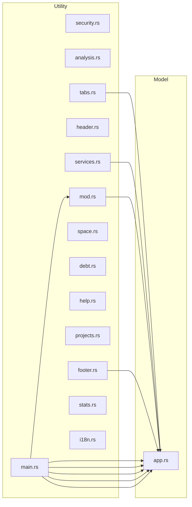

# Arquitectura: crates/void-stack-tui

## Resumen

| | |
|---|---|
| **Patron** | Unknown (confianza: 30%) |
| **Lenguaje** | Rust |
| **Modulos** | 15 archivos |
| **LOC** | 3041 lineas |
| **Deps externas** | 7 paquetes |

## Distribucion por Capas

| Capa | Archivos | LOC | % |
|------|----------|-----|---|
| Model | 1 | 397 | 13% |
| Utility | 14 | 2644 | 86% |

## Anti-patrones Detectados

### Severidad Media

- **God Class**: 'src/main.rs' es demasiado grande (611 LOC)
  - *Sugerencia*: Dividir 'src/main.rs' en modulos mas pequenos con responsabilidades claras
- **Excessive Coupling**: 'src/ui/mod.rs' importa 15 modulos (fan-out alto)
  - *Sugerencia*: Reducir dependencias usando inyeccion de dependencias o fachadas

## Mapa de Dependencias

## Modulos

| Archivo | Capa | LOC | Clases | Funciones |
|---------|------|-----|--------|----------|
| `src/main.rs` | Utility | 611 | 1 | 16 |
| `src/ui/analysis.rs` | Utility | 471 | 0 | 6 |
| `src/app.rs` | Model | 397 | 4 | 20 |
| `src/i18n.rs` | Utility | 335 | 1 | 5 |
| `src/ui/services.rs` | Utility | 255 | 0 | 4 |
| `src/ui/security.rs` | Utility | 222 | 0 | 3 |
| `src/ui/space.rs` | Utility | 128 | 0 | 2 |
| `src/ui/debt.rs` | Utility | 124 | 0 | 1 |
| `src/ui/stats.rs` | Utility | 112 | 0 | 1 |
| `src/ui/help.rs` | Utility | 88 | 0 | 1 |
| `src/ui/header.rs` | Utility | 73 | 0 | 1 |
| `src/ui/footer.rs` | Utility | 73 | 0 | 1 |
| `src/ui/projects.rs` | Utility | 59 | 0 | 1 |
| `src/ui/mod.rs` | Utility | 54 | 0 | 2 |
| `src/ui/tabs.rs` | Utility | 39 | 0 | 1 |

## Dependencias Externas

- `anyhow`
- `chrono`
- `clap`
- `crossterm`
- `ratatui`
- `std`
- `void_stack_core`

## Complejidad Ciclomatica

**Promedio**: 10.0 | **Funciones analizadas**: 65 | **Funciones complejas (>=10)**: 13

| Funcion | Archivo | Linea | CC | LOC |
|---------|---------|-------|----|-----|
| `es` !! | `i18n.rs` | 33 | 152 | 173 |
| `en` !! | `i18n.rs` | 225 | 152 | 173 |
| `handle_key` !! | `main.rs` | 187 | 21 | 75 |
| `draw_services_table` ! | `services.rs` | 54 | 13 | 106 |
| `handle_services_key` ! | `main.rs` | 623 | 13 | 40 |
| `run_tab_action` ! | `main.rs` | 491 | 11 | 72 |
| `refresh_current` ! | `app.rs` | 262 | 11 | 30 |
| `start_selected` ! | `app.rs` | 351 | 11 | 25 |
| `draw_analysis_tab` ! | `analysis.rs` | 11 | 10 | 64 |
| `draw_complexity` ! | `analysis.rs` | 309 | 10 | 95 |
| `draw_debt_tab` ! | `debt.rs` | 11 | 10 | 118 |
| `handle_projects_key` ! | `main.rs` | 592 | 10 | 30 |
| `refresh_all` ! | `app.rs` | 294 | 10 | 28 |
| `run_loop`  | `main.rs` | 142 | 9 | 38 |
| `stop_selected`  | `app.rs` | 377 | 9 | 22 |
| `draw_findings`  | `security.rs` | 143 | 8 | 95 |
| `draw_with_project_sidebar`  | `mod.rs` | 51 | 8 | 18 |
| `move_down`  | `app.rs` | 221 | 8 | 22 |
| `start_all`  | `app.rs` | 324 | 8 | 26 |
| `check_deps`  | `app.rs` | 414 | 8 | 32 |

## Metricas de Acoplamiento

| Modulo | Fan-in | Fan-out |
|--------|--------|--------|
| `mod.rs` | 1 | 15 |
| `main.rs` | 0 | 8 |
| `footer.rs` | 0 | 5 |
| `services.rs` | 0 | 4 |
| `tabs.rs` | 0 | 4 |
| `stats.rs` | 0 | 2 |
| `space.rs` | 0 | 2 |
| `header.rs` | 0 | 2 |
| `projects.rs` | 0 | 2 |
| `analysis.rs` | 0 | 2 |
| `debt.rs` | 0 | 2 |
| `security.rs` | 0 | 2 |
| `help.rs` | 0 | 2 |
| `app.rs` | 9 | 1 |

## Deuda Tecnica Explicita

**Total**: 1 marcadores (TODO: 1)

| Archivo | Linea | Tipo | Texto |
|---------|-------|------|-------|
| `src/ui/debt.rs` | 10 | TODO | /FIXME/HACK markers found in source code. |

---
*Generado automaticamente por VoidStack*

## Best Practices

**Overall Score: 100/100** — Excelente
*Tools used: clippy*

### 💡 Suggestion (1 findings)

- **[clippy-timeout]** — cargo clippy excedió el tiempo límite (180s) — proyecto muy grande o necesita compilación
  > Fix: Ejecutar 'cargo build' primero para compilar, luego reintentar

*Run `void analyze <project> --best-practices` to refresh*

