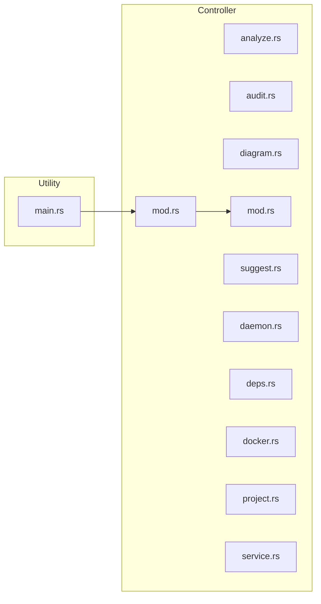
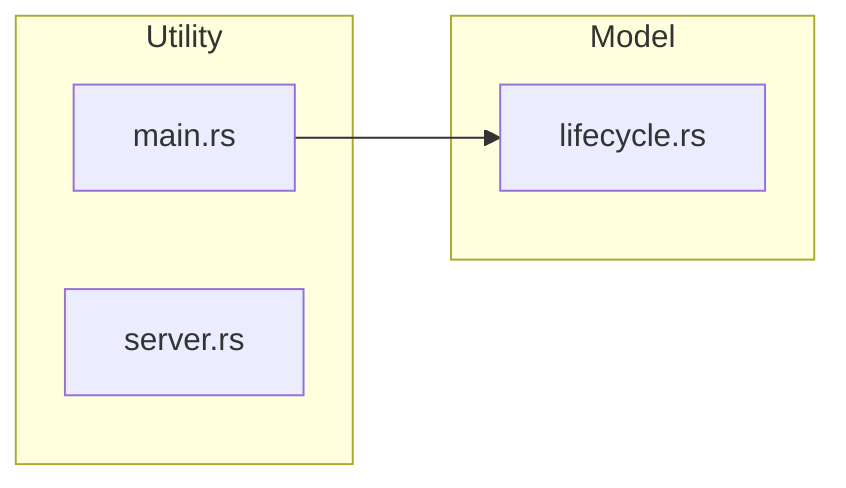
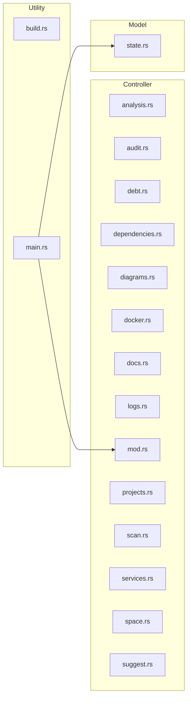
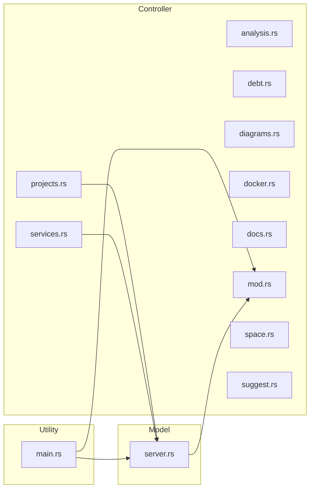
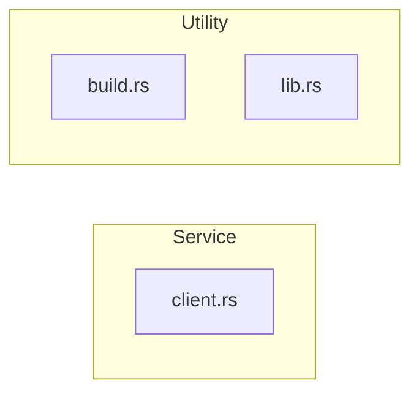
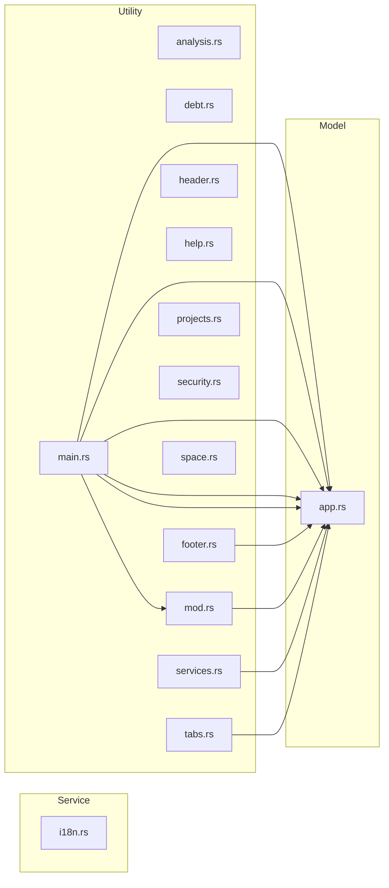

```mermaid
graph LR
    subgraph controller ["Controller"]
        crates_void_stack_cli_src_commands_analysis_analyze_rs["analyze.rs"]
        crates_void_stack_cli_src_commands_analysis_audit_rs["audit.rs"]
        crates_void_stack_cli_src_commands_analysis_diagram_rs["diagram.rs"]
        crates_void_stack_cli_src_commands_analysis_mod_rs["mod.rs"]
        crates_void_stack_cli_src_commands_analysis_suggest_rs["suggest.rs"]
        crates_void_stack_cli_src_commands_daemon_rs["daemon.rs"]
        crates_void_stack_cli_src_commands_deps_rs["deps.rs"]
        crates_void_stack_cli_src_commands_docker_rs["docker.rs"]
        crates_void_stack_cli_src_commands_mod_rs["mod.rs"]
        crates_void_stack_cli_src_commands_project_rs["project.rs"]
        crates_void_stack_cli_src_commands_service_rs["service.rs"]
        crates_void_stack_core_src_ai_ollama_rs["ollama.rs"]
        crates_void_stack_core_src_analyzer_docs_mod_rs["mod.rs"]
        crates_void_stack_core_src_analyzer_imports_classifier_signals_rs["signals.rs"]
        crates_void_stack_core_src_analyzer_imports_dart_rs["dart.rs"]
        crates_void_stack_core_src_audit_vuln_patterns_mod_rs["mod.rs"]
        crates_void_stack_core_src_diagram_api_routes_node_rs["node.rs"]
        crates_void_stack_core_src_diagram_api_routes_python_rs["python.rs"]
        crates_void_stack_core_src_diagram_db_models_drift_rs["drift.rs"]
        crates_void_stack_core_src_diagram_drawio_mod_rs["mod.rs"]
        crates_void_stack_core_src_hooks_rs["hooks.rs"]
        crates_void_stack_desktop_src_commands_analysis_rs["analysis.rs"]
        crates_void_stack_desktop_src_commands_audit_rs["audit.rs"]
        crates_void_stack_desktop_src_commands_debt_rs["debt.rs"]
        crates_void_stack_desktop_src_commands_dependencies_rs["dependencies.rs"]
        crates_void_stack_desktop_src_commands_diagrams_rs["diagrams.rs"]
        crates_void_stack_desktop_src_commands_docker_rs["docker.rs"]
        crates_void_stack_desktop_src_commands_docs_rs["docs.rs"]
        crates_void_stack_desktop_src_commands_logs_rs["logs.rs"]
        crates_void_stack_desktop_src_commands_mod_rs["mod.rs"]
        crates_void_stack_desktop_src_commands_projects_rs["projects.rs"]
        crates_void_stack_desktop_src_commands_scan_rs["scan.rs"]
        crates_void_stack_desktop_src_commands_services_rs["services.rs"]
        crates_void_stack_desktop_src_commands_space_rs["space.rs"]
        crates_void_stack_desktop_src_commands_suggest_rs["suggest.rs"]
        crates_void_stack_mcp_src_tools_analysis_rs["analysis.rs"]
        crates_void_stack_mcp_src_tools_debt_rs["debt.rs"]
        crates_void_stack_mcp_src_tools_diagrams_rs["diagrams.rs"]
        crates_void_stack_mcp_src_tools_docker_rs["docker.rs"]
        crates_void_stack_mcp_src_tools_docs_rs["docs.rs"]
        crates_void_stack_mcp_src_tools_mod_rs["mod.rs"]
        crates_void_stack_mcp_src_tools_projects_rs["projects.rs"]
        crates_void_stack_mcp_src_tools_services_rs["services.rs"]
        crates_void_stack_mcp_src_tools_space_rs["space.rs"]
        crates_void_stack_mcp_src_tools_suggest_rs["suggest.rs"]
    end
    subgraph service ["Service"]
        crates_void_stack_core_src_analyzer_history_rs["history.rs"]
        crates_void_stack_core_src_analyzer_imports_javascript_rs["javascript.rs"]
        crates_void_stack_core_src_analyzer_imports_python_rs["python.rs"]
        crates_void_stack_core_src_backend_rs["backend.rs"]
        crates_void_stack_core_src_detector_clippy_rs["clippy.rs"]
        crates_void_stack_core_src_detector_cuda_rs["cuda.rs"]
        crates_void_stack_core_src_detector_docker_rs["docker.rs"]
        crates_void_stack_core_src_detector_flutter_rs["flutter.rs"]
        crates_void_stack_core_src_detector_flutter_analyze_rs["flutter_analyze.rs"]
        crates_void_stack_core_src_detector_golang_rs["golang.rs"]
        crates_void_stack_core_src_detector_golangci_lint_rs["golangci_lint.rs"]
        crates_void_stack_core_src_detector_mod_rs["mod.rs"]
        crates_void_stack_core_src_detector_node_rs["node.rs"]
        crates_void_stack_core_src_detector_ollama_rs["ollama.rs"]
        crates_void_stack_core_src_detector_python_rs["python.rs"]
        crates_void_stack_core_src_detector_react_doctor_rs["react_doctor.rs"]
        crates_void_stack_core_src_detector_ruff_rs["ruff.rs"]
        crates_void_stack_core_src_detector_rust_lang_rs["rust_lang.rs"]
        crates_void_stack_core_src_diagram_architecture_infra_mod_rs["mod.rs"]
        crates_void_stack_core_src_diagram_architecture_mod_rs["mod.rs"]
        crates_void_stack_core_src_diagram_drawio_common_rs["common.rs"]
        crates_void_stack_core_src_docker_terraform_rs["terraform.rs"]
        crates_void_stack_core_src_manager_mod_rs["mod.rs"]
        crates_void_stack_core_src_manager_process_rs["process.rs"]
        crates_void_stack_core_src_runner_docker_rs["docker.rs"]
        crates_void_stack_core_src_runner_local_rs["local.rs"]
        crates_void_stack_core_src_runner_rs["runner.rs"]
        crates_void_stack_desktop_src_state_rs["state.rs"]
        crates_void_stack_proto_src_client_rs["client.rs"]
        crates_void_stack_tui_src_i18n_rs["i18n.rs"]
    end
    subgraph repository ["Repository"]
        crates_void_stack_core_src_diagram_db_models_gorm_rs["gorm.rs"]
        crates_void_stack_core_src_diagram_db_models_sequelize_rs["sequelize.rs"]
        crates_void_stack_core_src_docker_generate_compose_rs["generate_compose.rs"]
    end
    subgraph model ["Model"]
        crates_void_stack_core_src_analyzer_best_practices_mod_rs["mod.rs"]
        crates_void_stack_core_src_analyzer_cross_project_rs["cross_project.rs"]
        crates_void_stack_core_src_analyzer_graph_rs["graph.rs"]
        crates_void_stack_core_src_analyzer_imports_golang_rs["golang.rs"]
        crates_void_stack_core_src_analyzer_patterns_antipatterns_rs["antipatterns.rs"]
        crates_void_stack_core_src_analyzer_patterns_mod_rs["mod.rs"]
        crates_void_stack_core_src_audit_findings_rs["findings.rs"]
        crates_void_stack_core_src_claudeignore_rs["claudeignore.rs"]
        crates_void_stack_core_src_diagram_db_models_python_rs["python.rs"]
        crates_void_stack_core_src_diagram_mod_rs["mod.rs"]
        crates_void_stack_core_src_diagram_service_detection_rs["service_detection.rs"]
        crates_void_stack_core_src_docker_mod_rs["mod.rs"]
        crates_void_stack_core_src_error_rs["error.rs"]
        crates_void_stack_core_src_log_filter_rs["log_filter.rs"]
        crates_void_stack_core_src_model_rs["model.rs"]
        crates_void_stack_core_src_space_mod_rs["mod.rs"]
        crates_void_stack_mcp_src_server_rs["server.rs"]
        crates_void_stack_tui_src_app_rs["app.rs"]
    end
    subgraph utility ["Utility"]
        crates_void_stack_cli_src_main_rs["main.rs"]
        crates_void_stack_core_src_ai_mod_rs["mod.rs"]
        crates_void_stack_core_src_ai_prompt_rs["prompt.rs"]
        crates_void_stack_core_src_analyzer_best_practices_flutter_rs["flutter.rs"]
        crates_void_stack_core_src_analyzer_best_practices_go_bp_rs["go_bp.rs"]
        crates_void_stack_core_src_analyzer_best_practices_oxlint_rs["oxlint.rs"]
        crates_void_stack_core_src_analyzer_best_practices_python_rs["python.rs"]
        crates_void_stack_core_src_analyzer_best_practices_react_rs["react.rs"]
        crates_void_stack_core_src_analyzer_best_practices_report_rs["report.rs"]
        crates_void_stack_core_src_analyzer_best_practices_rust_bp_rs["rust_bp.rs"]
        crates_void_stack_core_src_analyzer_best_practices_vue_rs["vue.rs"]
        crates_void_stack_core_src_analyzer_complexity_rs["complexity.rs"]
        crates_void_stack_core_src_analyzer_docs_coverage_rs["coverage.rs"]
        crates_void_stack_core_src_analyzer_docs_markdown_rs["markdown.rs"]
        crates_void_stack_core_src_analyzer_docs_sanitize_rs["sanitize.rs"]
        crates_void_stack_core_src_analyzer_explicit_debt_rs["explicit_debt.rs"]
        crates_void_stack_core_src_analyzer_imports_classifier_mod_rs["mod.rs"]
        crates_void_stack_core_src_analyzer_imports_mod_rs["mod.rs"]
        crates_void_stack_core_src_analyzer_imports_rust_lang_rs["rust_lang.rs"]
        crates_void_stack_core_src_analyzer_mod_rs["mod.rs"]
        crates_void_stack_core_src_audit_deps_rs["deps.rs"]
        crates_void_stack_core_src_audit_mod_rs["mod.rs"]
        crates_void_stack_core_src_audit_vuln_patterns_crypto_rs["crypto.rs"]
        crates_void_stack_core_src_audit_vuln_patterns_error_handling_rs["error_handling.rs"]
        crates_void_stack_core_src_audit_vuln_patterns_injection_rs["injection.rs"]
        crates_void_stack_core_src_audit_vuln_patterns_network_rs["network.rs"]
        crates_void_stack_core_src_audit_vuln_patterns_xss_rs["xss.rs"]
        crates_void_stack_core_src_diagram_api_routes_grpc_rs["grpc.rs"]
        crates_void_stack_core_src_diagram_api_routes_mod_rs["mod.rs"]
        crates_void_stack_core_src_diagram_api_routes_swagger_rs["swagger.rs"]
        crates_void_stack_core_src_diagram_architecture_crates_rs["crates.rs"]
        crates_void_stack_core_src_diagram_architecture_infra_helm_rs["helm.rs"]
        crates_void_stack_core_src_diagram_architecture_infra_kubernetes_rs["kubernetes.rs"]
        crates_void_stack_core_src_diagram_architecture_infra_terraform_rs["terraform.rs"]
        crates_void_stack_core_src_diagram_db_models_mod_rs["mod.rs"]
        crates_void_stack_core_src_diagram_db_models_prisma_rs["prisma.rs"]
        crates_void_stack_core_src_diagram_db_models_proto_rs["proto.rs"]
        crates_void_stack_core_src_diagram_drawio_api_routes_rs["api_routes.rs"]
        crates_void_stack_core_src_diagram_drawio_architecture_rs["architecture.rs"]
        crates_void_stack_core_src_diagram_drawio_db_models_rs["db_models.rs"]
        crates_void_stack_core_src_docker_generate_dockerfile_flutter_rs["flutter.rs"]
        crates_void_stack_core_src_docker_generate_dockerfile_go_rs["go.rs"]
        crates_void_stack_core_src_docker_generate_dockerfile_python_rs["python.rs"]
        crates_void_stack_core_src_docker_generate_dockerfile_rust_lang_rs["rust_lang.rs"]
        crates_void_stack_core_src_docker_helm_rs["helm.rs"]
        crates_void_stack_core_src_docker_kubernetes_rs["kubernetes.rs"]
        crates_void_stack_core_src_docker_parse_rs["parse.rs"]
        crates_void_stack_core_src_file_reader_rs["file_reader.rs"]
        crates_void_stack_core_src_ignore_rs["ignore.rs"]
        crates_void_stack_core_src_lib_rs["lib.rs"]
        crates_void_stack_core_src_manager_logs_rs["logs.rs"]
        crates_void_stack_core_src_manager_state_rs["state.rs"]
        crates_void_stack_core_src_manager_url_rs["url.rs"]
        crates_void_stack_core_src_process_util_rs["process_util.rs"]
        crates_void_stack_core_src_security_rs["security.rs"]
        crates_void_stack_daemon_src_lifecycle_rs["lifecycle.rs"]
        crates_void_stack_daemon_src_main_rs["main.rs"]
        crates_void_stack_daemon_src_server_rs["server.rs"]
        crates_void_stack_desktop_build_rs["build.rs"]
        crates_void_stack_desktop_src_main_rs["main.rs"]
        crates_void_stack_mcp_src_main_rs["main.rs"]
        crates_void_stack_proto_build_rs["build.rs"]
        crates_void_stack_proto_src_lib_rs["lib.rs"]
        crates_void_stack_tui_src_main_rs["main.rs"]
        crates_void_stack_tui_src_ui_analysis_rs["analysis.rs"]
        crates_void_stack_tui_src_ui_debt_rs["debt.rs"]
        crates_void_stack_tui_src_ui_footer_rs["footer.rs"]
        crates_void_stack_tui_src_ui_header_rs["header.rs"]
        crates_void_stack_tui_src_ui_help_rs["help.rs"]
        crates_void_stack_tui_src_ui_mod_rs["mod.rs"]
        crates_void_stack_tui_src_ui_projects_rs["projects.rs"]
        crates_void_stack_tui_src_ui_security_rs["security.rs"]
        crates_void_stack_tui_src_ui_services_rs["services.rs"]
        crates_void_stack_tui_src_ui_space_rs["space.rs"]
        crates_void_stack_tui_src_ui_tabs_rs["tabs.rs"]
    end
    subgraph config ["Config"]
        crates_void_stack_core_src_analyzer_best_practices_angular_rs["angular.rs"]
        crates_void_stack_core_src_analyzer_best_practices_astro_rs["astro.rs"]
        crates_void_stack_core_src_audit_config_check_rs["config_check.rs"]
        crates_void_stack_core_src_audit_secrets_rs["secrets.rs"]
        crates_void_stack_core_src_audit_vuln_patterns_config_rs["config.rs"]
        crates_void_stack_core_src_config_rs["config.rs"]
        crates_void_stack_core_src_detector_env_rs["env.rs"]
        crates_void_stack_core_src_diagram_architecture_externals_rs["externals.rs"]
        crates_void_stack_core_src_docker_generate_dockerfile_mod_rs["mod.rs"]
        crates_void_stack_core_src_docker_generate_dockerfile_node_rs["node.rs"]
        crates_void_stack_core_src_global_config_rs["global_config.rs"]
    end
    subgraph test ["Test"]
        crates_void_stack_core_src_analyzer_imports_classifier_tests_rs["tests.rs"]
        crates_void_stack_core_tests_integration_analysis_rs["integration_analysis.rs"]
    end
    crates_void_stack_cli_src_commands_mod_rs --> crates_void_stack_cli_src_commands_analysis_mod_rs
    crates_void_stack_cli_src_main_rs --> crates_void_stack_cli_src_commands_mod_rs
    crates_void_stack_core_src_analyzer_imports_mod_rs --> crates_void_stack_core_src_analyzer_imports_classifier_mod_rs
    crates_void_stack_core_src_analyzer_mod_rs --> crates_void_stack_core_src_analyzer_best_practices_mod_rs
    crates_void_stack_core_src_analyzer_mod_rs --> crates_void_stack_core_src_analyzer_docs_mod_rs
    crates_void_stack_core_src_analyzer_mod_rs --> crates_void_stack_core_src_analyzer_imports_mod_rs
    crates_void_stack_core_src_analyzer_mod_rs --> crates_void_stack_core_src_analyzer_patterns_mod_rs
    crates_void_stack_core_src_audit_mod_rs --> crates_void_stack_core_src_audit_vuln_patterns_mod_rs
    crates_void_stack_core_src_diagram_architecture_mod_rs --> crates_void_stack_core_src_diagram_architecture_infra_mod_rs
    crates_void_stack_core_src_diagram_mod_rs --> crates_void_stack_core_src_diagram_api_routes_mod_rs
    crates_void_stack_core_src_diagram_mod_rs --> crates_void_stack_core_src_diagram_architecture_mod_rs
    crates_void_stack_core_src_diagram_mod_rs --> crates_void_stack_core_src_diagram_db_models_mod_rs
    crates_void_stack_core_src_diagram_mod_rs --> crates_void_stack_core_src_diagram_drawio_mod_rs
    crates_void_stack_core_src_docker_mod_rs --> crates_void_stack_core_src_docker_generate_dockerfile_mod_rs
    crates_void_stack_core_src_lib_rs --> crates_void_stack_core_src_ai_mod_rs
    crates_void_stack_core_src_lib_rs --> crates_void_stack_core_src_analyzer_mod_rs
    crates_void_stack_core_src_lib_rs --> crates_void_stack_core_src_audit_mod_rs
    crates_void_stack_core_src_lib_rs --> crates_void_stack_core_src_detector_mod_rs
    crates_void_stack_core_src_lib_rs --> crates_void_stack_core_src_diagram_mod_rs
    crates_void_stack_core_src_lib_rs --> crates_void_stack_core_src_docker_mod_rs
    crates_void_stack_core_src_lib_rs --> crates_void_stack_core_src_manager_mod_rs
    crates_void_stack_core_src_lib_rs --> crates_void_stack_core_src_space_mod_rs
    crates_void_stack_core_src_runner_rs --> crates_void_stack_core_src_docker_mod_rs
    crates_void_stack_desktop_src_main_rs --> crates_void_stack_desktop_src_commands_mod_rs
    crates_void_stack_mcp_src_main_rs --> crates_void_stack_mcp_src_tools_mod_rs
    crates_void_stack_tui_src_main_rs --> crates_void_stack_tui_src_ui_mod_rs
```

```mermaid
graph LR
    subgraph controller ["Controller"]
        src_ai_ollama_rs["ollama.rs"]
        src_analyzer_docs_mod_rs["mod.rs"]
        src_analyzer_imports_classifier_signals_rs["signals.rs"]
        src_analyzer_imports_dart_rs["dart.rs"]
        src_audit_vuln_patterns_mod_rs["mod.rs"]
        src_diagram_api_routes_node_rs["node.rs"]
        src_diagram_api_routes_python_rs["python.rs"]
        src_diagram_db_models_drift_rs["drift.rs"]
        src_diagram_drawio_mod_rs["mod.rs"]
        src_hooks_rs["hooks.rs"]
    end
    subgraph service ["Service"]
        src_analyzer_imports_golang_rs["golang.rs"]
        src_analyzer_imports_javascript_rs["javascript.rs"]
        src_analyzer_imports_python_rs["python.rs"]
        src_backend_rs["backend.rs"]
        src_detector_clippy_rs["clippy.rs"]
        src_detector_cuda_rs["cuda.rs"]
        src_detector_docker_rs["docker.rs"]
        src_detector_flutter_rs["flutter.rs"]
        src_detector_flutter_analyze_rs["flutter_analyze.rs"]
        src_detector_golang_rs["golang.rs"]
        src_detector_golangci_lint_rs["golangci_lint.rs"]
        src_detector_mod_rs["mod.rs"]
        src_detector_node_rs["node.rs"]
        src_detector_ollama_rs["ollama.rs"]
        src_detector_python_rs["python.rs"]
        src_detector_react_doctor_rs["react_doctor.rs"]
        src_detector_ruff_rs["ruff.rs"]
        src_detector_rust_lang_rs["rust_lang.rs"]
        src_diagram_architecture_infra_mod_rs["mod.rs"]
        src_diagram_architecture_infra_terraform_rs["terraform.rs"]
        src_diagram_drawio_common_rs["common.rs"]
        src_manager_mod_rs["mod.rs"]
        src_manager_process_rs["process.rs"]
        src_manager_state_rs["state.rs"]
        src_process_util_rs["process_util.rs"]
        src_runner_docker_rs["docker.rs"]
        src_runner_local_rs["local.rs"]
        src_runner_rs["runner.rs"]
    end
    subgraph repository ["Repository"]
        src_diagram_db_models_gorm_rs["gorm.rs"]
        src_diagram_db_models_sequelize_rs["sequelize.rs"]
        src_docker_generate_compose_rs["generate_compose.rs"]
    end
    subgraph model ["Model"]
        src_ai_mod_rs["mod.rs"]
        src_analyzer_graph_rs["graph.rs"]
        src_analyzer_history_rs["history.rs"]
        src_analyzer_patterns_antipatterns_rs["antipatterns.rs"]
        src_analyzer_patterns_mod_rs["mod.rs"]
        src_audit_findings_rs["findings.rs"]
        src_claudeignore_rs["claudeignore.rs"]
        src_diagram_db_models_mod_rs["mod.rs"]
        src_diagram_db_models_python_rs["python.rs"]
        src_diagram_mod_rs["mod.rs"]
        src_docker_mod_rs["mod.rs"]
        src_error_rs["error.rs"]
        src_model_rs["model.rs"]
        src_space_mod_rs["mod.rs"]
    end
    subgraph utility ["Utility"]
        src_ai_prompt_rs["prompt.rs"]
        src_analyzer_best_practices_flutter_rs["flutter.rs"]
        src_analyzer_best_practices_go_bp_rs["go_bp.rs"]
        src_analyzer_best_practices_mod_rs["mod.rs"]
        src_analyzer_best_practices_oxlint_rs["oxlint.rs"]
        src_analyzer_best_practices_python_rs["python.rs"]
        src_analyzer_best_practices_react_rs["react.rs"]
        src_analyzer_best_practices_report_rs["report.rs"]
        src_analyzer_best_practices_rust_bp_rs["rust_bp.rs"]
        src_analyzer_best_practices_vue_rs["vue.rs"]
        src_analyzer_complexity_rs["complexity.rs"]
        src_analyzer_cross_project_rs["cross_project.rs"]
        src_analyzer_docs_coverage_rs["coverage.rs"]
        src_analyzer_docs_markdown_rs["markdown.rs"]
        src_analyzer_docs_sanitize_rs["sanitize.rs"]
        src_analyzer_explicit_debt_rs["explicit_debt.rs"]
        src_analyzer_imports_classifier_mod_rs["mod.rs"]
        src_analyzer_imports_mod_rs["mod.rs"]
        src_analyzer_imports_rust_lang_rs["rust_lang.rs"]
        src_analyzer_mod_rs["mod.rs"]
        src_audit_deps_rs["deps.rs"]
        src_audit_mod_rs["mod.rs"]
        src_audit_vuln_patterns_crypto_rs["crypto.rs"]
        src_audit_vuln_patterns_error_handling_rs["error_handling.rs"]
        src_audit_vuln_patterns_injection_rs["injection.rs"]
        src_audit_vuln_patterns_network_rs["network.rs"]
        src_audit_vuln_patterns_xss_rs["xss.rs"]
        src_diagram_api_routes_grpc_rs["grpc.rs"]
        src_diagram_api_routes_mod_rs["mod.rs"]
        src_diagram_api_routes_swagger_rs["swagger.rs"]
        src_diagram_architecture_crates_rs["crates.rs"]
        src_diagram_architecture_infra_helm_rs["helm.rs"]
        src_diagram_architecture_infra_kubernetes_rs["kubernetes.rs"]
        src_diagram_architecture_mod_rs["mod.rs"]
        src_diagram_db_models_prisma_rs["prisma.rs"]
        src_diagram_db_models_proto_rs["proto.rs"]
        src_diagram_drawio_api_routes_rs["api_routes.rs"]
        src_diagram_drawio_architecture_rs["architecture.rs"]
        src_diagram_drawio_db_models_rs["db_models.rs"]
        src_diagram_service_detection_rs["service_detection.rs"]
        src_docker_generate_dockerfile_flutter_rs["flutter.rs"]
        src_docker_generate_dockerfile_go_rs["go.rs"]
        src_docker_generate_dockerfile_python_rs["python.rs"]
        src_docker_generate_dockerfile_rust_lang_rs["rust_lang.rs"]
        src_docker_helm_rs["helm.rs"]
        src_docker_kubernetes_rs["kubernetes.rs"]
        src_docker_parse_rs["parse.rs"]
        src_docker_terraform_rs["terraform.rs"]
        src_file_reader_rs["file_reader.rs"]
        src_ignore_rs["ignore.rs"]
        src_lib_rs["lib.rs"]
        src_log_filter_rs["log_filter.rs"]
        src_manager_logs_rs["logs.rs"]
        src_manager_url_rs["url.rs"]
        src_security_rs["security.rs"]
    end
    subgraph config ["Config"]
        src_analyzer_best_practices_angular_rs["angular.rs"]
        src_analyzer_best_practices_astro_rs["astro.rs"]
        src_audit_config_check_rs["config_check.rs"]
        src_audit_secrets_rs["secrets.rs"]
        src_audit_vuln_patterns_config_rs["config.rs"]
        src_config_rs["config.rs"]
        src_detector_env_rs["env.rs"]
        src_diagram_architecture_externals_rs["externals.rs"]
        src_docker_generate_dockerfile_mod_rs["mod.rs"]
        src_docker_generate_dockerfile_node_rs["node.rs"]
        src_global_config_rs["global_config.rs"]
    end
    subgraph test ["Test"]
        src_analyzer_imports_classifier_tests_rs["tests.rs"]
        tests_integration_analysis_rs["integration_analysis.rs"]
    end
    src_ai_mod_rs --> src_error_rs
    src_ai_ollama_rs --> src_error_rs
    src_ai_prompt_rs --> src_analyzer_patterns_mod_rs
    src_analyzer_docs_coverage_rs --> src_analyzer_graph_rs
    src_analyzer_docs_coverage_rs --> src_analyzer_graph_rs
    src_analyzer_docs_markdown_rs --> src_analyzer_complexity_rs
    src_analyzer_docs_markdown_rs --> src_analyzer_patterns_antipatterns_rs
    src_analyzer_docs_markdown_rs --> src_analyzer_patterns_mod_rs
    src_analyzer_history_rs --> src_analyzer_graph_rs
    src_analyzer_history_rs --> src_analyzer_patterns_mod_rs
    src_analyzer_history_rs --> src_analyzer_complexity_rs
    src_analyzer_history_rs --> src_analyzer_graph_rs
    src_analyzer_history_rs --> src_analyzer_patterns_mod_rs
    src_analyzer_history_rs --> src_analyzer_graph_rs
    src_analyzer_history_rs --> src_analyzer_patterns_mod_rs
    src_analyzer_imports_mod_rs --> src_analyzer_imports_classifier_mod_rs
    src_analyzer_imports_mod_rs --> src_security_rs
    src_analyzer_mod_rs --> src_analyzer_best_practices_mod_rs
    src_analyzer_mod_rs --> src_analyzer_docs_mod_rs
    src_analyzer_mod_rs --> src_analyzer_imports_mod_rs
    src_analyzer_mod_rs --> src_analyzer_patterns_mod_rs
    src_audit_mod_rs --> src_audit_vuln_patterns_mod_rs
    src_config_rs --> src_error_rs
    src_detector_ollama_rs --> src_security_rs
    src_diagram_architecture_externals_rs --> src_security_rs
    src_diagram_architecture_infra_helm_rs --> src_docker_mod_rs
    src_diagram_architecture_infra_kubernetes_rs --> src_docker_mod_rs
    src_diagram_architecture_infra_mod_rs --> src_docker_mod_rs
    src_diagram_architecture_infra_terraform_rs --> src_docker_mod_rs
    src_diagram_architecture_mod_rs --> src_diagram_architecture_infra_mod_rs
    src_diagram_architecture_mod_rs --> src_docker_mod_rs
    src_diagram_drawio_architecture_rs --> src_security_rs
    src_diagram_drawio_mod_rs --> src_model_rs
    src_diagram_mod_rs --> src_diagram_api_routes_mod_rs
    src_diagram_mod_rs --> src_diagram_architecture_mod_rs
    src_diagram_mod_rs --> src_diagram_db_models_mod_rs
    src_diagram_mod_rs --> src_diagram_drawio_mod_rs
    src_diagram_mod_rs --> src_model_rs
    src_docker_generate_compose_rs --> src_model_rs
    src_docker_mod_rs --> src_docker_generate_dockerfile_mod_rs
    src_file_reader_rs --> src_error_rs
    src_global_config_rs --> src_error_rs
    src_hooks_rs --> src_error_rs
    src_hooks_rs --> src_model_rs
    src_hooks_rs --> src_process_util_rs
    src_lib_rs --> src_ai_mod_rs
    src_lib_rs --> src_analyzer_mod_rs
    src_lib_rs --> src_audit_mod_rs
    src_lib_rs --> src_detector_mod_rs
    src_lib_rs --> src_diagram_mod_rs
    %% ... y 17 conexiones mas
```

# Arquitectura: devlaunch-rs

## Resumen

| | |
|---|---|
| **Patron** | Layered (confianza: 80%) |
| **Lenguaje** | Rust |
| **Modulos** | 184 archivos |
| **LOC** | 36924 lineas |
| **Deps externas** | 32 paquetes |

## Distribucion por Capas

| Capa | Archivos | LOC | % |
|------|----------|-----|---|
| Controller | 45 | 7371 | 19% |
| Service | 30 | 4540 | 12% |
| Repository | 3 | 1018 | 2% |
| Model | 18 | 5803 | 15% |
| Utility | 75 | 13567 | 36% |
| Config | 11 | 3703 | 10% |
| Test | 2 | 922 | 2% |

## Anti-patrones Detectados

### Alta Severidad

- **God Class**: 'crates/void-stack-core/src/ai/mod.rs' es demasiado grande (34 funciones)
  - *Sugerencia*: Dividir 'crates/void-stack-core/src/ai/mod.rs' en modulos mas pequenos con responsabilidades claras
- **God Class**: 'crates/void-stack-core/src/analyzer/best_practices/mod.rs' es demasiado grande (568 LOC y 31 funciones)
  - *Sugerencia*: Dividir 'crates/void-stack-core/src/analyzer/best_practices/mod.rs' en modulos mas pequenos con responsabilidades claras
- **God Class**: 'crates/void-stack-core/src/analyzer/complexity.rs' es demasiado grande (849 LOC y 35 funciones)
  - *Sugerencia*: Dividir 'crates/void-stack-core/src/analyzer/complexity.rs' en modulos mas pequenos con responsabilidades claras
- **God Class**: 'crates/void-stack-core/src/analyzer/cross_project.rs' es demasiado grande (29 funciones)
  - *Sugerencia*: Dividir 'crates/void-stack-core/src/analyzer/cross_project.rs' en modulos mas pequenos con responsabilidades claras
- **God Class**: 'crates/void-stack-core/src/analyzer/docs/markdown.rs' es demasiado grande (609 LOC y 27 funciones)
  - *Sugerencia*: Dividir 'crates/void-stack-core/src/analyzer/docs/markdown.rs' en modulos mas pequenos con responsabilidades claras
- **God Class**: 'crates/void-stack-core/src/analyzer/history.rs' es demasiado grande (639 LOC y 30 funciones)
  - *Sugerencia*: Dividir 'crates/void-stack-core/src/analyzer/history.rs' en modulos mas pequenos con responsabilidades claras
- **God Class**: 'crates/void-stack-core/src/analyzer/imports/classifier/signals.rs' es demasiado grande (1009 LOC)
  - *Sugerencia*: Dividir 'crates/void-stack-core/src/analyzer/imports/classifier/signals.rs' en modulos mas pequenos con responsabilidades claras
- **God Class**: 'crates/void-stack-core/src/analyzer/imports/mod.rs' es demasiado grande (26 funciones)
  - *Sugerencia*: Dividir 'crates/void-stack-core/src/analyzer/imports/mod.rs' en modulos mas pequenos con responsabilidades claras
- **God Class**: 'crates/void-stack-core/src/audit/config_check.rs' es demasiado grande (547 LOC y 29 funciones)
  - *Sugerencia*: Dividir 'crates/void-stack-core/src/audit/config_check.rs' en modulos mas pequenos con responsabilidades claras
- **God Class**: 'crates/void-stack-core/src/claudeignore.rs' es demasiado grande (31 funciones)
  - *Sugerencia*: Dividir 'crates/void-stack-core/src/claudeignore.rs' en modulos mas pequenos con responsabilidades claras
- **God Class**: 'crates/void-stack-core/src/diagram/architecture/externals.rs' es demasiado grande (616 LOC y 27 funciones)
  - *Sugerencia*: Dividir 'crates/void-stack-core/src/diagram/architecture/externals.rs' en modulos mas pequenos con responsabilidades claras
- **God Class**: 'crates/void-stack-core/src/docker/generate_dockerfile/mod.rs' es demasiado grande (31 funciones)
  - *Sugerencia*: Dividir 'crates/void-stack-core/src/docker/generate_dockerfile/mod.rs' en modulos mas pequenos con responsabilidades claras
- **God Class**: 'crates/void-stack-core/src/docker/parse.rs' es demasiado grande (779 LOC y 33 funciones)
  - *Sugerencia*: Dividir 'crates/void-stack-core/src/docker/parse.rs' en modulos mas pequenos con responsabilidades claras
- **God Class**: 'crates/void-stack-core/src/global_config.rs' es demasiado grande (707 LOC y 44 funciones)
  - *Sugerencia*: Dividir 'crates/void-stack-core/src/global_config.rs' en modulos mas pequenos con responsabilidades claras
- **God Class**: 'crates/void-stack-core/src/log_filter.rs' es demasiado grande (41 funciones)
  - *Sugerencia*: Dividir 'crates/void-stack-core/src/log_filter.rs' en modulos mas pequenos con responsabilidades claras
- **God Class**: 'crates/void-stack-core/src/runner/docker.rs' es demasiado grande (33 funciones)
  - *Sugerencia*: Dividir 'crates/void-stack-core/src/runner/docker.rs' en modulos mas pequenos con responsabilidades claras
- **God Class**: 'crates/void-stack-core/src/runner/local.rs' es demasiado grande (28 funciones)
  - *Sugerencia*: Dividir 'crates/void-stack-core/src/runner/local.rs' en modulos mas pequenos con responsabilidades claras
- **God Class**: 'crates/void-stack-mcp/src/server.rs' es demasiado grande (36 funciones)
  - *Sugerencia*: Dividir 'crates/void-stack-mcp/src/server.rs' en modulos mas pequenos con responsabilidades claras
- **Fat Controller**: Controller 'crates/void-stack-core/src/analyzer/imports/classifier/signals.rs' tiene 1009 LOC — demasiada logica
  - *Sugerencia*: Mover la logica de negocio a una capa de servicio
- **Excessive Coupling**: 'crates/void-stack-core/src/analyzer/history.rs' importa 31 modulos (fan-out alto)
  - *Sugerencia*: Reducir dependencias usando inyeccion de dependencias o fachadas
- **Excessive Coupling**: 'crates/void-stack-core/src/lib.rs' importa 21 modulos (fan-out alto)
  - *Sugerencia*: Reducir dependencias usando inyeccion de dependencias o fachadas

### Severidad Media

- **God Class**: 'crates/void-stack-cli/src/commands/analysis/analyze.rs' es demasiado grande (17 funciones)
  - *Sugerencia*: Dividir 'crates/void-stack-cli/src/commands/analysis/analyze.rs' en modulos mas pequenos con responsabilidades claras
- **God Class**: 'crates/void-stack-core/src/analyzer/patterns/antipatterns.rs' es demasiado grande (22 funciones)
  - *Sugerencia*: Dividir 'crates/void-stack-core/src/analyzer/patterns/antipatterns.rs' en modulos mas pequenos con responsabilidades claras
- **God Class**: 'crates/void-stack-core/src/audit/findings.rs' es demasiado grande (17 funciones)
  - *Sugerencia*: Dividir 'crates/void-stack-core/src/audit/findings.rs' en modulos mas pequenos con responsabilidades claras
- **God Class**: 'crates/void-stack-core/src/audit/secrets.rs' es demasiado grande (532 LOC y 25 funciones)
  - *Sugerencia*: Dividir 'crates/void-stack-core/src/audit/secrets.rs' en modulos mas pequenos con responsabilidades claras
- **God Class**: 'crates/void-stack-core/src/audit/vuln_patterns/error_handling.rs' es demasiado grande (19 funciones)
  - *Sugerencia*: Dividir 'crates/void-stack-core/src/audit/vuln_patterns/error_handling.rs' en modulos mas pequenos con responsabilidades claras
- **God Class**: 'crates/void-stack-core/src/audit/vuln_patterns/mod.rs' es demasiado grande (22 funciones)
  - *Sugerencia*: Dividir 'crates/void-stack-core/src/audit/vuln_patterns/mod.rs' en modulos mas pequenos con responsabilidades claras
- **God Class**: 'crates/void-stack-core/src/detector/mod.rs' es demasiado grande (18 funciones)
  - *Sugerencia*: Dividir 'crates/void-stack-core/src/detector/mod.rs' en modulos mas pequenos con responsabilidades claras
- **God Class**: 'crates/void-stack-core/src/diagram/api_routes/mod.rs' es demasiado grande (21 funciones)
  - *Sugerencia*: Dividir 'crates/void-stack-core/src/diagram/api_routes/mod.rs' en modulos mas pequenos con responsabilidades claras
- **God Class**: 'crates/void-stack-core/src/diagram/drawio/mod.rs' es demasiado grande (18 funciones)
  - *Sugerencia*: Dividir 'crates/void-stack-core/src/diagram/drawio/mod.rs' en modulos mas pequenos con responsabilidades claras
- **God Class**: 'crates/void-stack-core/src/file_reader.rs' es demasiado grande (22 funciones)
  - *Sugerencia*: Dividir 'crates/void-stack-core/src/file_reader.rs' en modulos mas pequenos con responsabilidades claras
- **God Class**: 'crates/void-stack-core/src/ignore.rs' es demasiado grande (22 funciones)
  - *Sugerencia*: Dividir 'crates/void-stack-core/src/ignore.rs' en modulos mas pequenos con responsabilidades claras
- **God Class**: 'crates/void-stack-core/src/model.rs' es demasiado grande (20 funciones)
  - *Sugerencia*: Dividir 'crates/void-stack-core/src/model.rs' en modulos mas pequenos con responsabilidades claras
- **God Class**: 'crates/void-stack-core/src/space/mod.rs' es demasiado grande (506 LOC y 25 funciones)
  - *Sugerencia*: Dividir 'crates/void-stack-core/src/space/mod.rs' en modulos mas pequenos con responsabilidades claras
- **God Class**: 'crates/void-stack-tui/src/app.rs' es demasiado grande (20 funciones)
  - *Sugerencia*: Dividir 'crates/void-stack-tui/src/app.rs' en modulos mas pequenos con responsabilidades claras
- **Fat Controller**: Controller 'crates/void-stack-cli/src/commands/analysis/analyze.rs' tiene 386 LOC — demasiada logica
  - *Sugerencia*: Mover la logica de negocio a una capa de servicio
- **Fat Controller**: Controller 'crates/void-stack-cli/src/commands/project.rs' tiene 369 LOC — demasiada logica
  - *Sugerencia*: Mover la logica de negocio a una capa de servicio
- **Fat Controller**: Controller 'crates/void-stack-cli/src/commands/service.rs' tiene 264 LOC — demasiada logica
  - *Sugerencia*: Mover la logica de negocio a una capa de servicio
- **Fat Controller**: Controller 'crates/void-stack-core/src/analyzer/imports/dart.rs' tiene 227 LOC — demasiada logica
  - *Sugerencia*: Mover la logica de negocio a una capa de servicio
- **Fat Controller**: Controller 'crates/void-stack-core/src/audit/vuln_patterns/mod.rs' tiene 391 LOC — demasiada logica
  - *Sugerencia*: Mover la logica de negocio a una capa de servicio
- **Fat Controller**: Controller 'crates/void-stack-desktop/src/commands/analysis.rs' tiene 300 LOC — demasiada logica
  - *Sugerencia*: Mover la logica de negocio a una capa de servicio
- **Fat Controller**: Controller 'crates/void-stack-desktop/src/commands/debt.rs' tiene 279 LOC — demasiada logica
  - *Sugerencia*: Mover la logica de negocio a una capa de servicio
- **Fat Controller**: Controller 'crates/void-stack-desktop/src/commands/docker.rs' tiene 237 LOC — demasiada logica
  - *Sugerencia*: Mover la logica de negocio a una capa de servicio
- **Fat Controller**: Controller 'crates/void-stack-desktop/src/commands/projects.rs' tiene 256 LOC — demasiada logica
  - *Sugerencia*: Mover la logica de negocio a una capa de servicio
- **Fat Controller**: Controller 'crates/void-stack-desktop/src/commands/scan.rs' tiene 328 LOC — demasiada logica
  - *Sugerencia*: Mover la logica de negocio a una capa de servicio
- **Fat Controller**: Controller 'crates/void-stack-mcp/src/tools/projects.rs' tiene 255 LOC — demasiada logica
  - *Sugerencia*: Mover la logica de negocio a una capa de servicio
- **Excessive Coupling**: 'crates/void-stack-core/src/runner/local.rs' importa 13 modulos (fan-out alto)
  - *Sugerencia*: Reducir dependencias usando inyeccion de dependencias o fachadas
- **Excessive Coupling**: 'crates/void-stack-core/src/analyzer/imports/rust_lang.rs' importa 11 modulos (fan-out alto)
  - *Sugerencia*: Reducir dependencias usando inyeccion de dependencias o fachadas
- **Excessive Coupling**: 'crates/void-stack-core/src/global_config.rs' importa 13 modulos (fan-out alto)
  - *Sugerencia*: Reducir dependencias usando inyeccion de dependencias o fachadas
- **Excessive Coupling**: 'crates/void-stack-core/src/analyzer/best_practices/mod.rs' importa 12 modulos (fan-out alto)
  - *Sugerencia*: Reducir dependencias usando inyeccion de dependencias o fachadas
- **Excessive Coupling**: 'crates/void-stack-core/src/analyzer/docs/markdown.rs' importa 20 modulos (fan-out alto)
  - *Sugerencia*: Reducir dependencias usando inyeccion de dependencias o fachadas
- **Excessive Coupling**: 'crates/void-stack-tui/src/ui/mod.rs' importa 14 modulos (fan-out alto)
  - *Sugerencia*: Reducir dependencias usando inyeccion de dependencias o fachadas
- **Excessive Coupling**: 'crates/void-stack-core/src/detector/mod.rs' importa 17 modulos (fan-out alto)
  - *Sugerencia*: Reducir dependencias usando inyeccion de dependencias o fachadas
- **Excessive Coupling**: 'crates/void-stack-core/src/diagram/mod.rs' importa 11 modulos (fan-out alto)
  - *Sugerencia*: Reducir dependencias usando inyeccion de dependencias o fachadas
- **Excessive Coupling**: 'crates/void-stack-core/src/runner/docker.rs' importa 15 modulos (fan-out alto)
  - *Sugerencia*: Reducir dependencias usando inyeccion de dependencias o fachadas
- **Excessive Coupling**: 'crates/void-stack-desktop/src/commands/mod.rs' importa 13 modulos (fan-out alto)
  - *Sugerencia*: Reducir dependencias usando inyeccion de dependencias o fachadas
- **Excessive Coupling**: 'crates/void-stack-core/src/audit/vuln_patterns/mod.rs' importa 11 modulos (fan-out alto)
  - *Sugerencia*: Reducir dependencias usando inyeccion de dependencias o fachadas

## Mapa de Dependencias

## Modulos

| Archivo | Capa | LOC | Clases | Funciones |
|---------|------|-----|--------|----------|
| `crates/void-stack-cli/src/commands/analysis/analyze.rs` | Controller | 386 | 0 | 17 |
| `crates/void-stack-cli/src/commands/analysis/audit.rs` | Controller | 63 | 0 | 1 |
| `crates/void-stack-cli/src/commands/analysis/diagram.rs` | Controller | 69 | 0 | 1 |
| `crates/void-stack-cli/src/commands/analysis/mod.rs` | Controller | 8 | 0 | 0 |
| `crates/void-stack-cli/src/commands/analysis/suggest.rs` | Controller | 80 | 0 | 1 |
| `crates/void-stack-cli/src/commands/daemon.rs` | Controller | 54 | 0 | 3 |
| `crates/void-stack-cli/src/commands/deps.rs` | Controller | 61 | 0 | 1 |
| `crates/void-stack-cli/src/commands/docker.rs` | Controller | 149 | 0 | 1 |
| `crates/void-stack-cli/src/commands/mod.rs` | Controller | 6 | 0 | 0 |
| `crates/void-stack-cli/src/commands/project.rs` | Controller | 369 | 0 | 10 |
| `crates/void-stack-cli/src/commands/service.rs` | Controller | 264 | 0 | 5 |
| `crates/void-stack-cli/src/main.rs` | Utility | 310 | 3 | 1 |
| `crates/void-stack-core/src/ai/mod.rs` | Utility | 437 | 6 | 34 |
| `crates/void-stack-core/src/ai/ollama.rs` | Controller | 112 | 0 | 3 |
| `crates/void-stack-core/src/ai/prompt.rs` | Utility | 287 | 0 | 9 |
| `crates/void-stack-core/src/analyzer/best_practices/angular.rs` | Config | 121 | 0 | 5 |
| `crates/void-stack-core/src/analyzer/best_practices/astro.rs` | Config | 95 | 0 | 5 |
| `crates/void-stack-core/src/analyzer/best_practices/flutter.rs` | Utility | 120 | 0 | 5 |
| `crates/void-stack-core/src/analyzer/best_practices/go_bp.rs` | Utility | 147 | 0 | 6 |
| `crates/void-stack-core/src/analyzer/best_practices/mod.rs` | Model | 568 | 7 | 31 |
| `crates/void-stack-core/src/analyzer/best_practices/oxlint.rs` | Utility | 200 | 0 | 8 |
| `crates/void-stack-core/src/analyzer/best_practices/python.rs` | Utility | 173 | 0 | 6 |
| `crates/void-stack-core/src/analyzer/best_practices/react.rs` | Utility | 137 | 0 | 4 |
| `crates/void-stack-core/src/analyzer/best_practices/report.rs` | Utility | 249 | 0 | 11 |
| `crates/void-stack-core/src/analyzer/best_practices/rust_bp.rs` | Utility | 183 | 0 | 6 |
| `crates/void-stack-core/src/analyzer/best_practices/vue.rs` | Utility | 169 | 0 | 6 |
| `crates/void-stack-core/src/analyzer/complexity.rs` | Utility | 849 | 2 | 35 |
| `crates/void-stack-core/src/analyzer/cross_project.rs` | Model | 457 | 2 | 29 |
| `crates/void-stack-core/src/analyzer/docs/coverage.rs` | Utility | 95 | 0 | 8 |
| `crates/void-stack-core/src/analyzer/docs/markdown.rs` | Utility | 609 | 0 | 27 |
| `crates/void-stack-core/src/analyzer/docs/mod.rs` | Controller | 4 | 0 | 0 |
| `crates/void-stack-core/src/analyzer/docs/sanitize.rs` | Utility | 22 | 0 | 2 |
| `crates/void-stack-core/src/analyzer/explicit_debt.rs` | Utility | 291 | 1 | 15 |
| `crates/void-stack-core/src/analyzer/graph.rs` | Model | 309 | 5 | 15 |
| `crates/void-stack-core/src/analyzer/history.rs` | Service | 639 | 5 | 30 |
| `crates/void-stack-core/src/analyzer/imports/classifier/mod.rs` | Utility | 98 | 0 | 4 |
| `crates/void-stack-core/src/analyzer/imports/classifier/signals.rs` | Controller | 1009 | 0 | 0 |
| `crates/void-stack-core/src/analyzer/imports/classifier/tests.rs` | Test | 588 | 0 | 40 |
| `crates/void-stack-core/src/analyzer/imports/dart.rs` | Controller | 227 | 2 | 8 |
| `crates/void-stack-core/src/analyzer/imports/golang.rs` | Model | 151 | 1 | 8 |
| `crates/void-stack-core/src/analyzer/imports/javascript.rs` | Service | 150 | 1 | 10 |
| `crates/void-stack-core/src/analyzer/imports/mod.rs` | Utility | 466 | 3 | 26 |
| `crates/void-stack-core/src/analyzer/imports/python.rs` | Service | 111 | 1 | 6 |
| `crates/void-stack-core/src/analyzer/imports/rust_lang.rs` | Utility | 243 | 5 | 14 |
| `crates/void-stack-core/src/analyzer/mod.rs` | Utility | 113 | 1 | 4 |
| `crates/void-stack-core/src/analyzer/patterns/antipatterns.rs` | Model | 403 | 3 | 22 |
| `crates/void-stack-core/src/analyzer/patterns/mod.rs` | Model | 226 | 2 | 12 |
| `crates/void-stack-core/src/audit/config_check.rs` | Config | 547 | 0 | 29 |
| `crates/void-stack-core/src/audit/deps.rs` | Utility | 325 | 0 | 7 |
| `crates/void-stack-core/src/audit/findings.rs` | Model | 264 | 5 | 17 |
| `crates/void-stack-core/src/audit/mod.rs` | Utility | 168 | 0 | 8 |
| `crates/void-stack-core/src/audit/secrets.rs` | Config | 532 | 1 | 25 |
| `crates/void-stack-core/src/audit/vuln_patterns/config.rs` | Config | 200 | 0 | 4 |
| `crates/void-stack-core/src/audit/vuln_patterns/crypto.rs` | Utility | 139 | 0 | 2 |
| `crates/void-stack-core/src/audit/vuln_patterns/error_handling.rs` | Utility | 328 | 0 | 19 |
| `crates/void-stack-core/src/audit/vuln_patterns/injection.rs` | Utility | 148 | 0 | 3 |
| `crates/void-stack-core/src/audit/vuln_patterns/mod.rs` | Controller | 391 | 0 | 22 |
| `crates/void-stack-core/src/audit/vuln_patterns/network.rs` | Utility | 55 | 0 | 1 |
| `crates/void-stack-core/src/audit/vuln_patterns/xss.rs` | Utility | 74 | 0 | 1 |
| `crates/void-stack-core/src/backend.rs` | Service | 14 | 1 | 8 |
| `crates/void-stack-core/src/claudeignore.rs` | Model | 407 | 1 | 31 |
| `crates/void-stack-core/src/config.rs` | Config | 118 | 0 | 10 |
| `crates/void-stack-core/src/detector/clippy.rs` | Service | 31 | 1 | 3 |
| `crates/void-stack-core/src/detector/cuda.rs` | Service | 138 | 1 | 3 |
| `crates/void-stack-core/src/detector/docker.rs` | Service | 69 | 1 | 3 |
| `crates/void-stack-core/src/detector/env.rs` | Config | 139 | 1 | 8 |
| `crates/void-stack-core/src/detector/flutter.rs` | Service | 48 | 1 | 3 |
| `crates/void-stack-core/src/detector/flutter_analyze.rs` | Service | 35 | 1 | 3 |
| `crates/void-stack-core/src/detector/golang.rs` | Service | 39 | 1 | 3 |
| `crates/void-stack-core/src/detector/golangci_lint.rs` | Service | 36 | 1 | 3 |
| `crates/void-stack-core/src/detector/mod.rs` | Service | 312 | 4 | 18 |
| `crates/void-stack-core/src/detector/node.rs` | Service | 61 | 1 | 3 |
| `crates/void-stack-core/src/detector/ollama.rs` | Service | 136 | 1 | 4 |
| `crates/void-stack-core/src/detector/python.rs` | Service | 175 | 1 | 5 |
| `crates/void-stack-core/src/detector/react_doctor.rs` | Service | 37 | 1 | 3 |
| `crates/void-stack-core/src/detector/ruff.rs` | Service | 32 | 1 | 3 |
| `crates/void-stack-core/src/detector/rust_lang.rs` | Service | 47 | 1 | 3 |
| `crates/void-stack-core/src/diagram/api_routes/grpc.rs` | Utility | 170 | 0 | 7 |
| `crates/void-stack-core/src/diagram/api_routes/mod.rs` | Utility | 330 | 2 | 21 |
| `crates/void-stack-core/src/diagram/api_routes/node.rs` | Controller | 139 | 0 | 8 |
| `crates/void-stack-core/src/diagram/api_routes/python.rs` | Controller | 151 | 0 | 8 |
| `crates/void-stack-core/src/diagram/api_routes/swagger.rs` | Utility | 319 | 0 | 12 |
| `crates/void-stack-core/src/diagram/architecture/crates.rs` | Utility | 168 | 0 | 5 |
| `crates/void-stack-core/src/diagram/architecture/externals.rs` | Config | 616 | 0 | 27 |
| `crates/void-stack-core/src/diagram/architecture/infra/helm.rs` | Utility | 23 | 0 | 1 |
| `crates/void-stack-core/src/diagram/architecture/infra/kubernetes.rs` | Utility | 75 | 0 | 2 |
| `crates/void-stack-core/src/diagram/architecture/infra/mod.rs` | Service | 201 | 0 | 12 |
| `crates/void-stack-core/src/diagram/architecture/infra/terraform.rs` | Utility | 68 | 0 | 1 |
| `crates/void-stack-core/src/diagram/architecture/mod.rs` | Service | 161 | 0 | 2 |
| `crates/void-stack-core/src/diagram/db_models/drift.rs` | Controller | 197 | 0 | 9 |
| `crates/void-stack-core/src/diagram/db_models/gorm.rs` | Repository | 212 | 0 | 9 |
| `crates/void-stack-core/src/diagram/db_models/mod.rs` | Utility | 97 | 1 | 3 |
| `crates/void-stack-core/src/diagram/db_models/prisma.rs` | Utility | 168 | 0 | 6 |
| `crates/void-stack-core/src/diagram/db_models/proto.rs` | Utility | 262 | 0 | 12 |
| `crates/void-stack-core/src/diagram/db_models/python.rs` | Model | 351 | 0 | 13 |
| `crates/void-stack-core/src/diagram/db_models/sequelize.rs` | Repository | 422 | 0 | 13 |
| `crates/void-stack-core/src/diagram/drawio/api_routes.rs` | Utility | 68 | 0 | 1 |
| `crates/void-stack-core/src/diagram/drawio/architecture.rs` | Utility | 189 | 0 | 5 |
| `crates/void-stack-core/src/diagram/drawio/common.rs` | Service | 29 | 0 | 3 |
| `crates/void-stack-core/src/diagram/drawio/db_models.rs` | Utility | 199 | 0 | 2 |
| `crates/void-stack-core/src/diagram/drawio/mod.rs` | Controller | 200 | 0 | 18 |
| `crates/void-stack-core/src/diagram/mod.rs` | Model | 108 | 2 | 6 |
| `crates/void-stack-core/src/diagram/service_detection.rs` | Model | 194 | 2 | 11 |
| `crates/void-stack-core/src/docker/generate_compose.rs` | Repository | 384 | 1 | 14 |
| `crates/void-stack-core/src/docker/generate_dockerfile/flutter.rs` | Utility | 16 | 0 | 1 |
| `crates/void-stack-core/src/docker/generate_dockerfile/go.rs` | Utility | 19 | 0 | 1 |
| `crates/void-stack-core/src/docker/generate_dockerfile/mod.rs` | Config | 360 | 0 | 31 |
| `crates/void-stack-core/src/docker/generate_dockerfile/node.rs` | Config | 268 | 0 | 11 |
| `crates/void-stack-core/src/docker/generate_dockerfile/python.rs` | Utility | 97 | 0 | 3 |
| `crates/void-stack-core/src/docker/generate_dockerfile/rust_lang.rs` | Utility | 46 | 0 | 2 |
| `crates/void-stack-core/src/docker/helm.rs` | Utility | 152 | 0 | 6 |
| `crates/void-stack-core/src/docker/kubernetes.rs` | Utility | 375 | 0 | 9 |
| `crates/void-stack-core/src/docker/mod.rs` | Model | 271 | 16 | 10 |
| `crates/void-stack-core/src/docker/parse.rs` | Utility | 779 | 0 | 33 |
| `crates/void-stack-core/src/docker/terraform.rs` | Service | 365 | 0 | 12 |
| `crates/void-stack-core/src/error.rs` | Model | 25 | 1 | 0 |
| `crates/void-stack-core/src/file_reader.rs` | Utility | 254 | 0 | 22 |
| `crates/void-stack-core/src/global_config.rs` | Config | 707 | 1 | 44 |
| `crates/void-stack-core/src/hooks.rs` | Controller | 161 | 0 | 5 |
| `crates/void-stack-core/src/ignore.rs` | Utility | 291 | 2 | 22 |
| `crates/void-stack-core/src/lib.rs` | Utility | 21 | 0 | 0 |
| `crates/void-stack-core/src/log_filter.rs` | Model | 434 | 1 | 41 |
| `crates/void-stack-core/src/manager/logs.rs` | Utility | 143 | 0 | 4 |
| `crates/void-stack-core/src/manager/mod.rs` | Service | 65 | 1 | 9 |
| `crates/void-stack-core/src/manager/process.rs` | Service | 211 | 0 | 5 |
| `crates/void-stack-core/src/manager/state.rs` | Utility | 40 | 0 | 5 |
| `crates/void-stack-core/src/manager/url.rs` | Utility | 64 | 0 | 9 |
| `crates/void-stack-core/src/model.rs` | Model | 270 | 9 | 20 |
| `crates/void-stack-core/src/process_util.rs` | Utility | 142 | 1 | 10 |
| `crates/void-stack-core/src/runner.rs` | Service | 25 | 2 | 5 |
| `crates/void-stack-core/src/runner/docker.rs` | Service | 484 | 2 | 33 |
| `crates/void-stack-core/src/runner/local.rs` | Service | 433 | 1 | 28 |
| `crates/void-stack-core/src/security.rs` | Utility | 112 | 0 | 6 |
| `crates/void-stack-core/src/space/mod.rs` | Model | 506 | 2 | 25 |
| `crates/void-stack-core/tests/integration_analysis.rs` | Test | 334 | 0 | 22 |
| `crates/void-stack-daemon/src/lifecycle.rs` | Utility | 75 | 1 | 6 |
| `crates/void-stack-daemon/src/main.rs` | Utility | 172 | 2 | 4 |
| `crates/void-stack-daemon/src/server.rs` | Utility | 181 | 1 | 11 |
| `crates/void-stack-desktop/build.rs` | Utility | 3 | 0 | 1 |
| `crates/void-stack-desktop/src/commands/analysis.rs` | Controller | 300 | 9 | 2 |
| `crates/void-stack-desktop/src/commands/audit.rs` | Controller | 75 | 3 | 1 |
| `crates/void-stack-desktop/src/commands/debt.rs` | Controller | 279 | 8 | 7 |
| `crates/void-stack-desktop/src/commands/dependencies.rs` | Controller | 51 | 1 | 1 |
| `crates/void-stack-desktop/src/commands/diagrams.rs` | Controller | 68 | 1 | 2 |
| `crates/void-stack-desktop/src/commands/docker.rs` | Controller | 237 | 12 | 3 |
| `crates/void-stack-desktop/src/commands/docs.rs` | Controller | 121 | 0 | 6 |
| `crates/void-stack-desktop/src/commands/logs.rs` | Controller | 47 | 1 | 2 |
| `crates/void-stack-desktop/src/commands/mod.rs` | Controller | 13 | 0 | 0 |
| `crates/void-stack-desktop/src/commands/projects.rs` | Controller | 256 | 3 | 7 |
| `crates/void-stack-desktop/src/commands/scan.rs` | Controller | 328 | 3 | 5 |
| `crates/void-stack-desktop/src/commands/services.rs` | Controller | 96 | 1 | 6 |
| `crates/void-stack-desktop/src/commands/space.rs` | Controller | 62 | 1 | 4 |
| `crates/void-stack-desktop/src/commands/suggest.rs` | Controller | 84 | 2 | 1 |
| `crates/void-stack-desktop/src/main.rs` | Utility | 54 | 0 | 1 |
| `crates/void-stack-desktop/src/state.rs` | Service | 33 | 1 | 3 |
| `crates/void-stack-mcp/src/main.rs` | Utility | 21 | 0 | 1 |
| `crates/void-stack-mcp/src/server.rs` | Model | 498 | 1 | 36 |
| `crates/void-stack-mcp/src/tools/analysis.rs` | Controller | 163 | 0 | 4 |
| `crates/void-stack-mcp/src/tools/debt.rs` | Controller | 110 | 0 | 3 |
| `crates/void-stack-mcp/src/tools/diagrams.rs` | Controller | 43 | 0 | 1 |
| `crates/void-stack-mcp/src/tools/docker.rs` | Controller | 161 | 0 | 2 |
| `crates/void-stack-mcp/src/tools/docs.rs` | Controller | 188 | 0 | 5 |
| `crates/void-stack-mcp/src/tools/mod.rs` | Controller | 43 | 0 | 3 |
| `crates/void-stack-mcp/src/tools/projects.rs` | Controller | 255 | 0 | 5 |
| `crates/void-stack-mcp/src/tools/services.rs` | Controller | 142 | 0 | 6 |
| `crates/void-stack-mcp/src/tools/space.rs` | Controller | 73 | 0 | 2 |
| `crates/void-stack-mcp/src/tools/suggest.rs` | Controller | 76 | 0 | 1 |
| `crates/void-stack-proto/build.rs` | Utility | 4 | 0 | 1 |
| `crates/void-stack-proto/src/client.rs` | Service | 138 | 1 | 12 |
| `crates/void-stack-proto/src/lib.rs` | Utility | 82 | 0 | 4 |
| `crates/void-stack-tui/src/app.rs` | Model | 361 | 4 | 20 |
| `crates/void-stack-tui/src/i18n.rs` | Service | 285 | 1 | 5 |
| `crates/void-stack-tui/src/main.rs` | Utility | 395 | 1 | 8 |
| `crates/void-stack-tui/src/ui/analysis.rs` | Utility | 345 | 0 | 4 |
| `crates/void-stack-tui/src/ui/debt.rs` | Utility | 124 | 0 | 1 |
| `crates/void-stack-tui/src/ui/footer.rs` | Utility | 73 | 0 | 1 |
| `crates/void-stack-tui/src/ui/header.rs` | Utility | 73 | 0 | 1 |
| `crates/void-stack-tui/src/ui/help.rs` | Utility | 85 | 0 | 1 |
| `crates/void-stack-tui/src/ui/mod.rs` | Utility | 52 | 0 | 2 |
| `crates/void-stack-tui/src/ui/projects.rs` | Utility | 59 | 0 | 1 |
| `crates/void-stack-tui/src/ui/security.rs` | Utility | 222 | 0 | 3 |
| `crates/void-stack-tui/src/ui/services.rs` | Utility | 259 | 0 | 4 |
| `crates/void-stack-tui/src/ui/space.rs` | Utility | 128 | 0 | 2 |
| `crates/void-stack-tui/src/ui/tabs.rs` | Utility | 38 | 0 | 1 |

## Dependencias Externas

- `anyhow`
- `app`
- `async_trait`
- `chrono`
- `clap`
- `complexity`
- `coverage`
- `crossterm`
- `explicit_debt`
- `graph`
- `patterns`
- `ratatui`
- `regex`
- `rmcp`
- `schemars`
- `serde`
- `serde_yaml`
- `server`
- `signals`
- `state`
- `std`
- `super`
- `tauri`
- `tempfile`
- `thiserror`
- `tokio`
- `tokio_stream`
- `tonic`
- `tracing`
- `uuid`
- `void_stack_core`
- `void_stack_proto`

## Complejidad Ciclomatica

**Promedio**: 3.7 | **Funciones analizadas**: 1617 | **Funciones complejas (>=10)**: 166

| Funcion | Archivo | Linea | CC | LOC | Cobertura |
|---------|---------|-------|----|-----|----------|
| `es` !! | `i18n.rs` | 33 | 127 | 144 | - |
| `en` !! | `i18n.rs` | 192 | 127 | 144 | - |
| `cmd_docker` !! | `docker.rs` | 7 | 34 | 152 | - |
| `generate` !! | `mod.rs` | 19 | 34 | 147 | ✅ |
| `detect_from_env` !! | `externals.rs` | 51 | 33 | 93 | ✅ |
| `detect_service_tech` !! | `projects.rs` | 72 | 32 | 58 | - |
| `render_db_models_page` !! | `db_models.rs` | 7 | 31 | 159 | - |
| `scan_weak_cryptography` !! | `crypto.rs` | 67 | 30 | 87 | ✅ |
| `parse_k8s_yaml` !! | `kubernetes.rs` | 102 | 30 | 119 | ✅ |
| `scan_subprojects` !! | `global_config.rs` | 89 | 29 | 74 | ✅ |
| `cmd_start` !! | `service.rs` | 15 | 28 | 136 | - |
| `check` !! | `python.rs` | 21 | 28 | 121 | 🔴 |
| `parse_swagger_yaml_routes` !! | `swagger.rs` | 98 | 28 | 117 | ✅ |
| `parse_file` !! | `javascript.rs` | 17 | 26 | 71 | ✅ |
| `detect_crate_relationships` !! | `crates.rs` | 6 | 26 | 70 | ✅ |
| `scan_debug_mode` !! | `config_check.rs` | 55 | 25 | 72 | ✅ |
| `install_hint` !! | `process_util.rs` | 139 | 25 | 49 | ✅ |
| `main` !! | `main.rs` | 267 | 24 | 151 | - |
| `handle_key` !! | `main.rs` | 187 | 24 | 88 | - |
| `count_js_branches` !! | `complexity.rs` | 323 | 23 | 44 | ✅ |

## Metricas de Acoplamiento

| Modulo | Fan-in | Fan-out |
|--------|--------|--------|
| `history.rs` | 0 | 31 |
| `lib.rs` | 0 | 21 |
| `markdown.rs` | 0 | 20 |
| `mod.rs` | 1 | 17 |
| `docker.rs` | 0 | 15 |
| `mod.rs` | 1 | 14 |
| `global_config.rs` | 0 | 13 |
| `mod.rs` | 1 | 13 |
| `local.rs` | 0 | 13 |
| `mod.rs` | 1 | 12 |
| `mod.rs` | 1 | 11 |
| `mod.rs` | 1 | 11 |
| `rust_lang.rs` | 0 | 11 |
| `mod.rs` | 1 | 10 |
| `mod.rs` | 1 | 10 |
| `mod.rs` | 1 | 9 |
| `mod.rs` | 1 | 9 |
| `hooks.rs` | 0 | 9 |
| `process.rs` | 0 | 9 |
| `prompt.rs` | 0 | 9 |

## Test Coverage

**Herramienta**: lcov | **Cobertura total**: 79.7% (14658/18387 lineas)

🟡 `[███████████████░░░░░]` 79.7%

| Archivo | Cobertura | Lineas | Visual |
|---------|-----------|--------|--------|
| `...unch-rs\crates\void-stack-core\src\ai\ollama.rs` | 🔴 0.0% | 0/115 | `` |
| `...s\crates\void-stack-core\src\detector\clippy.rs` | 🔴 0.0% | 0/8 | `` |
| `...-rs\crates\void-stack-core\src\detector\cuda.rs` | 🔴 0.0% | 0/21 | `` |
| `...s\crates\void-stack-core\src\detector\docker.rs` | 🔴 0.0% | 0/13 | `` |
| `...\crates\void-stack-core\src\detector\flutter.rs` | 🔴 0.0% | 0/10 | `` |
| `...void-stack-core\src\detector\flutter_analyze.rs` | 🔴 0.0% | 0/8 | `` |
| `...s\crates\void-stack-core\src\detector\golang.rs` | 🔴 0.0% | 0/10 | `` |
| `...s\void-stack-core\src\detector\golangci_lint.rs` | 🔴 0.0% | 0/10 | `` |
| `...-rs\crates\void-stack-core\src\detector\node.rs` | 🔴 0.0% | 0/10 | `` |
| `...s\crates\void-stack-core\src\detector\ollama.rs` | 🔴 0.0% | 0/74 | `` |
| `...s\crates\void-stack-core\src\detector\python.rs` | 🔴 0.0% | 0/55 | `` |
| `...es\void-stack-core\src\detector\react_doctor.rs` | 🔴 0.0% | 0/13 | `` |
| `...-rs\crates\void-stack-core\src\detector\ruff.rs` | 🔴 0.0% | 0/10 | `` |
| `...rates\void-stack-core\src\detector\rust_lang.rs` | 🔴 0.0% | 0/10 | `` |
| `...evlaunch-rs\crates\void-stack-core\src\hooks.rs` | 🔴 0.0% | 0/143 | `` |
| `...h-rs\crates\void-stack-core\src\manager\logs.rs` | 🔴 0.0% | 0/103 | `` |
| `...ch-rs\crates\void-stack-core\src\manager\mod.rs` | 🔴 0.0% | 0/36 | `` |
| `...s\crates\void-stack-core\src\manager\process.rs` | 🔴 0.0% | 0/188 | `` |
| `...-rs\crates\void-stack-core\src\manager\state.rs` | 🔴 0.0% | 0/38 | `` |
| `...vlaunch-rs\crates\void-stack-core\src\runner.rs` | 🔴 0.0% | 0/7 | `` |
| `...nch-rs\crates\void-stack-core\src\audit\deps.rs` | 🔴 6.1% | 19/311 | `` |
| `...ack-core\src\analyzer\best_practices\rust_bp.rs` | 🔴 11.8% | 18/153 | `█` |
| `...ack-core\src\analyzer\best_practices\flutter.rs` | 🔴 24.4% | 22/90 | `██` |
| `...tack-core\src\analyzer\best_practices\oxlint.rs` | 🔴 25.9% | 45/174 | `██` |
| `...id-stack-core\src\audit\vuln_patterns\config.rs` | 🔴 26.4% | 42/159 | `██` |
| `...h-rs\crates\void-stack-core\src\process_util.rs` | 🔴 26.5% | 13/49 | `██` |
| `...stack-core\src\analyzer\best_practices\react.rs` | 🔴 35.5% | 43/121 | `███` |
| `...h-rs\crates\void-stack-core\src\analyzer\mod.rs` | 🔴 35.7% | 30/84 | `███` |
| `...tack-core\src\analyzer\best_practices\python.rs` | 🔴 36.2% | 47/130 | `███` |
| `...stack-core\src\analyzer\best_practices\go_bp.rs` | 🔴 36.6% | 45/123 | `███` |
| `...h-rs\crates\void-stack-core\src\detector\mod.rs` | 🔴 41.1% | 104/253 | `████` |
| `...stack-core\src\analyzer\best_practices\astro.rs` | 🔴 46.8% | 29/62 | `████` |
| `...ack-core\src\analyzer\best_practices\angular.rs` | 🔴 48.7% | 37/76 | `████` |
| `...void-stack-core\src\diagram\architecture\mod.rs` | 🟡 56.6% | 73/129 | `█████` |
| `...-rs\crates\void-stack-core\src\runner\docker.rs` | 🟡 62.7% | 202/322 | `██████` |
| `...es\void-stack-core\src\diagram\db_models\mod.rs` | 🟡 63.9% | 46/72 | `██████` |
| `...\void-stack-core\src\docker\generate_compose.rs` | 🟡 70.6% | 199/282 | `███████` |
| `...d-stack-core\src\analyzer\best_practices\mod.rs` | 🟡 71.6% | 255/356 | `███████` |
| `...d-stack-core\src\analyzer\best_practices\vue.rs` | 🟡 72.0% | 95/132 | `███████` |
| `...oid-stack-core\src\diagram\service_detection.rs` | 🟡 72.9% | 86/118 | `███████` |
| `...s\void-stack-core\src\diagram\api_routes\mod.rs` | 🟡 77.7% | 195/251 | `███████` |
| `...id-stack-core\src\audit\vuln_patterns\crypto.rs` | 🟡 78.0% | 85/109 | `███████` |
| `...-rs\crates\void-stack-core\src\global_config.rs` | 🟡 78.3% | 343/438 | `███████` |
| `...ore\src\docker\generate_dockerfile\rust_lang.rs` | 🟢 81.2% | 13/16 | `████████` |
| `...rs\crates\void-stack-core\src\diagram\drawio.rs` | 🟢 83.0% | 458/552 | `████████` |
| `...nch-rs\crates\void-stack-core\src\docker\mod.rs` | 🟢 83.3% | 105/126 | `████████` |
| `...id-stack-core\src\analyzer\imports\rust_lang.rs` | 🟢 85.3% | 192/225 | `████████` |
| `...s\void-stack-core\src\analyzer\cross_project.rs` | 🟢 85.9% | 310/361 | `████████` |
| `...vlaunch-rs\crates\void-stack-core\src\ai\mod.rs` | 🟢 86.0% | 277/322 | `████████` |
| `...es\void-stack-core\src\analyzer\patterns\mod.rs` | 🟢 86.5% | 148/171 | `████████` |
| `...unch-rs\crates\void-stack-core\src\audit\mod.rs` | 🟢 86.9% | 119/137 | `████████` |
| `...ch-rs\crates\void-stack-core\src\diagram\mod.rs` | 🟢 88.2% | 67/76 | `████████` |
| `...s\void-stack-core\src\analyzer\explicit_debt.rs` | 🟢 88.9% | 160/180 | `████████` |
| `...-rs\crates\void-stack-core\src\audit\secrets.rs` | 🟢 89.0% | 316/355 | `████████` |
| `...tes\void-stack-core\src\analyzer\imports\mod.rs` | 🟢 89.1% | 293/329 | `████████` |
| `...vlaunch-rs\crates\void-stack-core\src\config.rs` | 🟢 89.2% | 83/93 | `████████` |
| `...tack-core\src\diagram\architecture\externals.rs` | 🟢 90.0% | 380/422 | `█████████` |
| `...d-stack-core\src\audit\vuln_patterns\network.rs` | 🟢 91.1% | 41/45 | `█████████` |
| `...\crates\void-stack-core\src\docker\terraform.rs` | 🟢 91.1% | 236/259 | `█████████` |
| `...rs\crates\void-stack-core\src\audit\findings.rs` | 🟢 91.2% | 135/148 | `█████████` |
| `...id-stack-core\src\diagram\architecture\infra.rs` | 🟢 91.2% | 239/262 | `█████████` |
| `...ack-core\src\docker\generate_dockerfile\node.rs` | 🟢 91.3% | 126/138 | `█████████` |
| `...h-rs\crates\void-stack-core\src\runner\local.rs` | 🟢 91.4% | 222/243 | `█████████` |
| `...crates\void-stack-core\src\docker\kubernetes.rs` | 🟢 91.4% | 224/245 | `█████████` |
| `...\void-stack-core\src\analyzer\imports\golang.rs` | 🟢 91.8% | 134/146 | `█████████` |
| `...\void-stack-core\src\diagram\db_models\proto.rs` | 🟢 92.4% | 206/223 | `█████████` |
| `...id-stack-core\src\diagram\api_routes\swagger.rs` | 🟢 92.4% | 231/250 | `█████████` |
| `...d-stack-core\src\diagram\db_models\sequelize.rs` | 🟢 92.5% | 294/318 | `█████████` |
| `...ates\void-stack-core\src\analyzer\complexity.rs` | 🟢 92.5% | 621/671 | `█████████` |
| `...\void-stack-core\src\diagram\db_models\drift.rs` | 🟢 92.6% | 150/162 | `█████████` |
| `...k-core\src\docker\generate_dockerfile\python.rs` | 🟢 92.6% | 50/54 | `█████████` |
| `...stack-core\src\audit\vuln_patterns\injection.rs` | 🟢 92.7% | 114/123 | `█████████` |
| `...es\void-stack-core\src\analyzer\imports\dart.rs` | 🟢 93.0% | 174/187 | `█████████` |
| `...d-stack-core\src\analyzer\coverage\cobertura.rs` | 🟢 93.1% | 161/173 | `█████████` |
| `...es\void-stack-core\src\analyzer\coverage\mod.rs` | 🟢 93.5% | 188/201 | `█████████` |
| `...d-stack-core\src\diagram\architecture\crates.rs` | 🟢 93.9% | 107/114 | `█████████` |
| `...h-rs\crates\void-stack-core\src\detector\env.rs` | 🟢 94.4% | 68/72 | `█████████` |
| `...-rs\crates\void-stack-core\src\analyzer\docs.rs` | 🟢 94.6% | 510/539 | `█████████` |
| `...d-stack-core\src\analyzer\imports\javascript.rs` | 🟢 94.9% | 129/136 | `█████████` |
| `...oid-stack-core\src\diagram\api_routes\python.rs` | 🟢 94.9% | 94/99 | `█████████` |
| `...-core\src\audit\vuln_patterns\error_handling.rs` | 🟢 95.0% | 265/279 | `█████████` |
| `...void-stack-core\src\diagram\db_models\python.rs` | 🟢 95.4% | 290/304 | `█████████` |
| `...ch-rs\crates\void-stack-core\src\docker\helm.rs` | 🟢 95.5% | 106/111 | `█████████` |
| `...\void-stack-core\src\audit\vuln_patterns\mod.rs` | 🟢 95.8% | 230/240 | `█████████` |
| `...\void-stack-core\src\diagram\api_routes\grpc.rs` | 🟢 96.3% | 129/134 | `█████████` |
| `...id-stack-core\src\analyzer\coverage\go_cover.rs` | 🟢 96.7% | 87/90 | `█████████` |
| `...\void-stack-core\src\diagram\api_routes\node.rs` | 🟢 96.7% | 88/91 | `█████████` |
| `...s\void-stack-core\src\diagram\db_models\gorm.rs` | 🟢 96.7% | 178/184 | `█████████` |
| `...\void-stack-core\src\audit\vuln_patterns\xss.rs` | 🟢 96.8% | 61/63 | `█████████` |
| `...rates\void-stack-core\src\audit\config_check.rs` | 🟢 96.9% | 467/482 | `█████████` |
| `...id-stack-core\src\analyzer\coverage\istanbul.rs` | 🟢 97.2% | 207/213 | `█████████` |
| `...tack-core\src\docker\generate_dockerfile\mod.rs` | 🟢 97.2% | 280/288 | `█████████` |
| `...h-rs\crates\void-stack-core\src\docker\parse.rs` | 🟢 97.8% | 491/502 | `█████████` |
| `...s\void-stack-core\src\analyzer\coverage\lcov.rs` | 🟢 97.9% | 92/94 | `█████████` |
| `...\void-stack-core\src\analyzer\imports\python.rs` | 🟢 97.9% | 95/97 | `█████████` |
| `...unch-rs\crates\void-stack-core\src\space\mod.rs` | 🟢 98.0% | 297/303 | `█████████` |
| `...tack-core\src\analyzer\best_practices\report.rs` | 🟢 98.4% | 183/186 | `█████████` |
| `...aunch-rs\crates\void-stack-core\src\security.rs` | 🟢 98.5% | 67/68 | `█████████` |
| `...unch-rs\crates\void-stack-core\src\ai\prompt.rs` | 🟢 98.6% | 213/216 | `█████████` |
| `...\crates\void-stack-core\src\analyzer\history.rs` | 🟢 98.8% | 475/481 | `█████████` |
| `...ack-core\src\analyzer\imports\classifier\mod.rs` | 🟢 98.9% | 89/90 | `█████████` |
| `...void-stack-core\src\diagram\db_models\prisma.rs` | 🟢 99.3% | 150/151 | `█████████` |
| `...tack-core\src\analyzer\patterns\antipatterns.rs` | 🟢 99.6% | 251/252 | `█████████` |
| `...rs\crates\void-stack-core\src\analyzer\graph.rs` | 🟢 100.0% | 190/190 | `██████████` |
| `...-core\src\docker\generate_dockerfile\flutter.rs` | 🟢 100.0% | 20/20 | `██████████` |
| `...stack-core\src\docker\generate_dockerfile\go.rs` | 🟢 100.0% | 25/25 | `██████████` |
| `...ch-rs\crates\void-stack-core\src\manager\url.rs` | 🟢 100.0% | 48/48 | `██████████` |
| `...evlaunch-rs\crates\void-stack-core\src\model.rs` | 🟢 100.0% | 136/136 | `██████████` |

## Deuda Tecnica Explicita

**Total**: 25 marcadores (FIXME: 1, HACK: 1, OPTIMIZE: 3, TEMP: 7, TODO: 11, XXX: 2)

| Archivo | Linea | Tipo | Texto |
|---------|-------|------|-------|
| `...-cli/src/commands/analysis/analyze.rs` | 212 | TODO | /FIXME/HACK). |
| `crates/void-stack-cli/src/main.rs` | 224 | OPTIMIZE | d for the project's tech stack |
| `crates/void-stack-core/src/ai/prompt.rs` | 6 | OPTIMIZE | d prompt from analysis results. |
| `...ck-core/src/analyzer/explicit_debt.rs` | 3 | TODO | , FIXME, HACK, XXX, OPTIMIZE, BUG, TEMP, WORKAROUND. |
| `...ck-core/src/analyzer/explicit_debt.rs` | 228 | TODO | implement error handling", "rust"); |
| `...ck-core/src/analyzer/explicit_debt.rs` | 238 | FIXME | this is broken\n\ |
| `...ck-core/src/analyzer/explicit_debt.rs` | 240 | HACK | temporary workaround", |
| `...ck-core/src/analyzer/explicit_debt.rs` | 266 | TODO | add validation\n/* FIXME: memory leak */", |
| `...ck-core/src/analyzer/explicit_debt.rs` | 282 | TODO | a\n// FIXME: b\n// HACK: c\n// XXX: d\n// OPTIMIZE: e\n//... |
| `...ck-core/src/analyzer/explicit_debt.rs` | 304 | TODO | lowercase", "rust"); |
| `...ck-core/src/analyzer/explicit_debt.rs` | 314 | TODO | add logging\n}\n", |
| `...ck-core/src/analyzer/explicit_debt.rs` | 325 | TODO | should be skipped", |
| `...s/void-stack-core/src/analyzer/mod.rs` | 32 | TODO | , FIXME, HACK, etc.) found in source code. |
| `.../void-stack-core/src/audit/secrets.rs` | 179 | TEMP | late/placeholder syntax that |
| `.../void-stack-core/src/audit/secrets.rs` | 184 | TEMP | late variables, string interpolation |
| `.../void-stack-core/src/audit/secrets.rs` | 189 | TEMP | late generation) |
| `.../void-stack-core/src/audit/secrets.rs` | 347 | TEMP | late/format string generation |
| `...s/void-stack-core/src/claudeignore.rs` | 3 | OPTIMIZE | d `.claudeignore` patterns |
| `...re/src/diagram/db_models/sequelize.rs` | 174 | XXX | ' or "xxx") from a line. |
| `...re/src/diagram/db_models/sequelize.rs` | 190 | XXX | from a line and map to a simple type. |
| `...es/void-stack-core/src/diagram/mod.rs` | 97 | TEMP | dir alive by leaking it (test only) |
| `...src/docker/generate_dockerfile/mod.rs` | 3 | TEMP | lates follow official best practices: |
| `...es/void-stack-core/src/file_reader.rs` | 141 | TEMP | project directory for testing. |
| `...ck-core/tests/integration_analysis.rs` | 147 | TODO | add error handling\nfunction run() { /* FIXME: memory lea... |
| `crates/void-stack-tui/src/ui/debt.rs` | 10 | TODO | /FIXME/HACK markers found in source code. |

---
*Generado automaticamente por VoidStack*

---

# Arquitectura: crates/void-stack-cli

## Resumen

| | |
|---|---|
| **Patron** | Unknown (confianza: 30%) |
| **Lenguaje** | Rust |
| **Modulos** | 12 archivos |
| **LOC** | 1819 lineas |
| **Deps externas** | 5 paquetes |

## Distribucion por Capas

| Capa | Archivos | LOC | % |
|------|----------|-----|---|
| Controller | 11 | 1509 | 82% |
| Utility | 1 | 310 | 17% |

## Anti-patrones Detectados

### Severidad Media

- **God Class**: 'src/commands/analysis/analyze.rs' es demasiado grande (17 funciones)
  - *Sugerencia*: Dividir 'src/commands/analysis/analyze.rs' en modulos mas pequenos con responsabilidades claras
- **Fat Controller**: Controller 'src/commands/analysis/analyze.rs' tiene 386 LOC — demasiada logica
  - *Sugerencia*: Mover la logica de negocio a una capa de servicio
- **Fat Controller**: Controller 'src/commands/project.rs' tiene 369 LOC — demasiada logica
  - *Sugerencia*: Mover la logica de negocio a una capa de servicio
- **Fat Controller**: Controller 'src/commands/service.rs' tiene 264 LOC — demasiada logica
  - *Sugerencia*: Mover la logica de negocio a una capa de servicio
- **No Service Layer**: Proyecto tiene 11 controllers pero ninguna capa de servicio
  - *Sugerencia*: Crear una capa de servicios para separar la logica de negocio de los endpoints

## Mapa de Dependencias

## Modulos

| Archivo | Capa | LOC | Clases | Funciones |
|---------|------|-----|--------|----------|
| `src/commands/analysis/analyze.rs` | Controller | 386 | 0 | 17 |
| `src/commands/analysis/audit.rs` | Controller | 63 | 0 | 1 |
| `src/commands/analysis/diagram.rs` | Controller | 69 | 0 | 1 |
| `src/commands/analysis/mod.rs` | Controller | 8 | 0 | 0 |
| `src/commands/analysis/suggest.rs` | Controller | 80 | 0 | 1 |
| `src/commands/daemon.rs` | Controller | 54 | 0 | 3 |
| `src/commands/deps.rs` | Controller | 61 | 0 | 1 |
| `src/commands/docker.rs` | Controller | 149 | 0 | 1 |
| `src/commands/mod.rs` | Controller | 6 | 0 | 0 |
| `src/commands/project.rs` | Controller | 369 | 0 | 10 |
| `src/commands/service.rs` | Controller | 264 | 0 | 5 |
| `src/main.rs` | Utility | 310 | 3 | 1 |

## Dependencias Externas

- `anyhow`
- `clap`
- `std`
- `void_stack_core`
- `void_stack_proto`

## Complejidad Ciclomatica

**Promedio**: 7.9 | **Funciones analizadas**: 41 | **Funciones complejas (>=10)**: 10

| Funcion | Archivo | Linea | CC | LOC |
|---------|---------|-------|----|-----|
| `cmd_docker` !! | `docker.rs` | 7 | 34 | 152 |
| `cmd_start` !! | `service.rs` | 15 | 28 | 136 |
| `main` !! | `main.rs` | 267 | 24 | 151 |
| `cmd_audit` !! | `audit.rs` | 8 | 20 | 62 |
| `cmd_suggest` !! | `suggest.rs` | 6 | 20 | 79 |
| `cmd_check` !! | `deps.rs` | 7 | 19 | 60 |
| `cmd_diagram` !! | `diagram.rs` | 6 | 17 | 67 |
| `cmd_add_service` !! | `project.rs` | 97 | 15 | 79 |
| `cmd_list` ! | `project.rs` | 200 | 11 | 40 |
| `resolve_wsl_path` ! | `project.rs` | 378 | 10 | 43 |
| `print_complexity_summary`  | `analyze.rs` | 141 | 9 | 44 |
| `run_cross_project_analysis`  | `analyze.rs` | 300 | 9 | 44 |
| `cmd_status`  | `service.rs` | 198 | 8 | 34 |
| `cmd_analyze`  | `analyze.rs` | 12 | 7 | 39 |
| `collect_service_dirs`  | `analyze.rs` | 61 | 6 | 30 |
| `cmd_claudeignore`  | `project.rs` | 335 | 6 | 30 |
| `cmd_logs`  | `service.rs` | 237 | 6 | 47 |
| `status_icon`  | `service.rs` | 293 | 6 | 9 |
| `print_explicit_debt`  | `analyze.rs` | 213 | 5 | 30 |

## Metricas de Acoplamiento

| Modulo | Fan-in | Fan-out |
|--------|--------|--------|
| `mod.rs` | 1 | 6 |
| `mod.rs` | 1 | 4 |
| `daemon.rs` | 0 | 1 |
| `main.rs` | 0 | 1 |

## Test Coverage

⚠️ No se encontraron reportes de cobertura.

Para generar reportes de cobertura, ejecutar:
- **Rust**: `cargo install cargo-tarpaulin && cargo tarpaulin --out xml` (genera `cobertura.xml`)

## Deuda Tecnica Explicita

**Total**: 2 marcadores (OPTIMIZE: 1, TODO: 1)

| Archivo | Linea | Tipo | Texto |
|---------|-------|------|-------|
| `src/commands/analysis/analyze.rs` | 212 | TODO | /FIXME/HACK). |
| `src/main.rs` | 224 | OPTIMIZE | d for the project's tech stack |

---
*Generado automaticamente por VoidStack*

---

# Arquitectura: crates/void-stack-core

## Resumen

| | |
|---|---|
| **Patron** | Layered (confianza: 80%) |
| **Lenguaje** | Rust |
| **Modulos** | 123 archivos |
| **LOC** | 28074 lineas |
| **Deps externas** | 19 paquetes |

## Distribucion por Capas

| Capa | Archivos | LOC | % |
|------|----------|-----|---|
| Controller | 10 | 2591 | 9% |
| Service | 28 | 3320 | 11% |
| Repository | 3 | 1018 | 3% |
| Model | 14 | 4313 | 15% |
| Utility | 55 | 12207 | 43% |
| Config | 11 | 3703 | 13% |
| Test | 2 | 922 | 3% |

## Anti-patrones Detectados

### Alta Severidad

- **God Class**: 'src/ai/mod.rs' es demasiado grande (34 funciones)
  - *Sugerencia*: Dividir 'src/ai/mod.rs' en modulos mas pequenos con responsabilidades claras
- **God Class**: 'src/analyzer/best_practices/mod.rs' es demasiado grande (568 LOC y 31 funciones)
  - *Sugerencia*: Dividir 'src/analyzer/best_practices/mod.rs' en modulos mas pequenos con responsabilidades claras
- **God Class**: 'src/analyzer/complexity.rs' es demasiado grande (849 LOC y 35 funciones)
  - *Sugerencia*: Dividir 'src/analyzer/complexity.rs' en modulos mas pequenos con responsabilidades claras
- **God Class**: 'src/analyzer/cross_project.rs' es demasiado grande (29 funciones)
  - *Sugerencia*: Dividir 'src/analyzer/cross_project.rs' en modulos mas pequenos con responsabilidades claras
- **God Class**: 'src/analyzer/docs/markdown.rs' es demasiado grande (609 LOC y 27 funciones)
  - *Sugerencia*: Dividir 'src/analyzer/docs/markdown.rs' en modulos mas pequenos con responsabilidades claras
- **God Class**: 'src/analyzer/history.rs' es demasiado grande (639 LOC y 30 funciones)
  - *Sugerencia*: Dividir 'src/analyzer/history.rs' en modulos mas pequenos con responsabilidades claras
- **God Class**: 'src/analyzer/imports/classifier/signals.rs' es demasiado grande (1009 LOC)
  - *Sugerencia*: Dividir 'src/analyzer/imports/classifier/signals.rs' en modulos mas pequenos con responsabilidades claras
- **God Class**: 'src/analyzer/imports/mod.rs' es demasiado grande (26 funciones)
  - *Sugerencia*: Dividir 'src/analyzer/imports/mod.rs' en modulos mas pequenos con responsabilidades claras
- **God Class**: 'src/audit/config_check.rs' es demasiado grande (547 LOC y 29 funciones)
  - *Sugerencia*: Dividir 'src/audit/config_check.rs' en modulos mas pequenos con responsabilidades claras
- **God Class**: 'src/claudeignore.rs' es demasiado grande (31 funciones)
  - *Sugerencia*: Dividir 'src/claudeignore.rs' en modulos mas pequenos con responsabilidades claras
- **God Class**: 'src/diagram/architecture/externals.rs' es demasiado grande (616 LOC y 27 funciones)
  - *Sugerencia*: Dividir 'src/diagram/architecture/externals.rs' en modulos mas pequenos con responsabilidades claras
- **God Class**: 'src/docker/generate_dockerfile/mod.rs' es demasiado grande (31 funciones)
  - *Sugerencia*: Dividir 'src/docker/generate_dockerfile/mod.rs' en modulos mas pequenos con responsabilidades claras
- **God Class**: 'src/docker/parse.rs' es demasiado grande (779 LOC y 33 funciones)
  - *Sugerencia*: Dividir 'src/docker/parse.rs' en modulos mas pequenos con responsabilidades claras
- **God Class**: 'src/global_config.rs' es demasiado grande (707 LOC y 44 funciones)
  - *Sugerencia*: Dividir 'src/global_config.rs' en modulos mas pequenos con responsabilidades claras
- **God Class**: 'src/log_filter.rs' es demasiado grande (41 funciones)
  - *Sugerencia*: Dividir 'src/log_filter.rs' en modulos mas pequenos con responsabilidades claras
- **God Class**: 'src/runner/docker.rs' es demasiado grande (33 funciones)
  - *Sugerencia*: Dividir 'src/runner/docker.rs' en modulos mas pequenos con responsabilidades claras
- **God Class**: 'src/runner/local.rs' es demasiado grande (28 funciones)
  - *Sugerencia*: Dividir 'src/runner/local.rs' en modulos mas pequenos con responsabilidades claras
- **Fat Controller**: Controller 'src/analyzer/imports/classifier/signals.rs' tiene 1009 LOC — demasiada logica
  - *Sugerencia*: Mover la logica de negocio a una capa de servicio
- **Excessive Coupling**: 'src/analyzer/history.rs' importa 31 modulos (fan-out alto)
  - *Sugerencia*: Reducir dependencias usando inyeccion de dependencias o fachadas
- **Excessive Coupling**: 'src/lib.rs' importa 21 modulos (fan-out alto)
  - *Sugerencia*: Reducir dependencias usando inyeccion de dependencias o fachadas

### Severidad Media

- **God Class**: 'src/analyzer/patterns/antipatterns.rs' es demasiado grande (22 funciones)
  - *Sugerencia*: Dividir 'src/analyzer/patterns/antipatterns.rs' en modulos mas pequenos con responsabilidades claras
- **God Class**: 'src/audit/findings.rs' es demasiado grande (17 funciones)
  - *Sugerencia*: Dividir 'src/audit/findings.rs' en modulos mas pequenos con responsabilidades claras
- **God Class**: 'src/audit/secrets.rs' es demasiado grande (532 LOC y 25 funciones)
  - *Sugerencia*: Dividir 'src/audit/secrets.rs' en modulos mas pequenos con responsabilidades claras
- **God Class**: 'src/audit/vuln_patterns/error_handling.rs' es demasiado grande (19 funciones)
  - *Sugerencia*: Dividir 'src/audit/vuln_patterns/error_handling.rs' en modulos mas pequenos con responsabilidades claras
- **God Class**: 'src/audit/vuln_patterns/mod.rs' es demasiado grande (22 funciones)
  - *Sugerencia*: Dividir 'src/audit/vuln_patterns/mod.rs' en modulos mas pequenos con responsabilidades claras
- **God Class**: 'src/detector/mod.rs' es demasiado grande (18 funciones)
  - *Sugerencia*: Dividir 'src/detector/mod.rs' en modulos mas pequenos con responsabilidades claras
- **God Class**: 'src/diagram/api_routes/mod.rs' es demasiado grande (21 funciones)
  - *Sugerencia*: Dividir 'src/diagram/api_routes/mod.rs' en modulos mas pequenos con responsabilidades claras
- **God Class**: 'src/diagram/drawio/mod.rs' es demasiado grande (18 funciones)
  - *Sugerencia*: Dividir 'src/diagram/drawio/mod.rs' en modulos mas pequenos con responsabilidades claras
- **God Class**: 'src/file_reader.rs' es demasiado grande (22 funciones)
  - *Sugerencia*: Dividir 'src/file_reader.rs' en modulos mas pequenos con responsabilidades claras
- **God Class**: 'src/ignore.rs' es demasiado grande (22 funciones)
  - *Sugerencia*: Dividir 'src/ignore.rs' en modulos mas pequenos con responsabilidades claras
- **God Class**: 'src/model.rs' es demasiado grande (20 funciones)
  - *Sugerencia*: Dividir 'src/model.rs' en modulos mas pequenos con responsabilidades claras
- **God Class**: 'src/space/mod.rs' es demasiado grande (506 LOC y 25 funciones)
  - *Sugerencia*: Dividir 'src/space/mod.rs' en modulos mas pequenos con responsabilidades claras
- **Fat Controller**: Controller 'src/analyzer/imports/dart.rs' tiene 227 LOC — demasiada logica
  - *Sugerencia*: Mover la logica de negocio a una capa de servicio
- **Fat Controller**: Controller 'src/audit/vuln_patterns/mod.rs' tiene 391 LOC — demasiada logica
  - *Sugerencia*: Mover la logica de negocio a una capa de servicio
- **Excessive Coupling**: 'src/diagram/mod.rs' importa 11 modulos (fan-out alto)
  - *Sugerencia*: Reducir dependencias usando inyeccion de dependencias o fachadas
- **Excessive Coupling**: 'src/analyzer/docs/markdown.rs' importa 20 modulos (fan-out alto)
  - *Sugerencia*: Reducir dependencias usando inyeccion de dependencias o fachadas
- **Excessive Coupling**: 'src/runner/local.rs' importa 13 modulos (fan-out alto)
  - *Sugerencia*: Reducir dependencias usando inyeccion de dependencias o fachadas
- **Excessive Coupling**: 'src/audit/vuln_patterns/mod.rs' importa 11 modulos (fan-out alto)
  - *Sugerencia*: Reducir dependencias usando inyeccion de dependencias o fachadas
- **Excessive Coupling**: 'src/runner/docker.rs' importa 15 modulos (fan-out alto)
  - *Sugerencia*: Reducir dependencias usando inyeccion de dependencias o fachadas
- **Excessive Coupling**: 'src/analyzer/imports/rust_lang.rs' importa 11 modulos (fan-out alto)
  - *Sugerencia*: Reducir dependencias usando inyeccion de dependencias o fachadas
- **Excessive Coupling**: 'src/analyzer/best_practices/mod.rs' importa 12 modulos (fan-out alto)
  - *Sugerencia*: Reducir dependencias usando inyeccion de dependencias o fachadas
- **Excessive Coupling**: 'src/detector/mod.rs' importa 17 modulos (fan-out alto)
  - *Sugerencia*: Reducir dependencias usando inyeccion de dependencias o fachadas
- **Excessive Coupling**: 'src/global_config.rs' importa 13 modulos (fan-out alto)
  - *Sugerencia*: Reducir dependencias usando inyeccion de dependencias o fachadas

## Mapa de Dependencias

## Modulos

| Archivo | Capa | LOC | Clases | Funciones |
|---------|------|-----|--------|----------|
| `src/ai/mod.rs` | Model | 437 | 6 | 34 |
| `src/ai/ollama.rs` | Controller | 112 | 0 | 3 |
| `src/ai/prompt.rs` | Utility | 287 | 0 | 9 |
| `src/analyzer/best_practices/angular.rs` | Config | 121 | 0 | 5 |
| `src/analyzer/best_practices/astro.rs` | Config | 95 | 0 | 5 |
| `src/analyzer/best_practices/flutter.rs` | Utility | 120 | 0 | 5 |
| `src/analyzer/best_practices/go_bp.rs` | Utility | 147 | 0 | 6 |
| `src/analyzer/best_practices/mod.rs` | Utility | 568 | 7 | 31 |
| `src/analyzer/best_practices/oxlint.rs` | Utility | 200 | 0 | 8 |
| `src/analyzer/best_practices/python.rs` | Utility | 173 | 0 | 6 |
| `src/analyzer/best_practices/react.rs` | Utility | 137 | 0 | 4 |
| `src/analyzer/best_practices/report.rs` | Utility | 249 | 0 | 11 |
| `src/analyzer/best_practices/rust_bp.rs` | Utility | 183 | 0 | 6 |
| `src/analyzer/best_practices/vue.rs` | Utility | 169 | 0 | 6 |
| `src/analyzer/complexity.rs` | Utility | 849 | 2 | 35 |
| `src/analyzer/cross_project.rs` | Utility | 457 | 2 | 29 |
| `src/analyzer/docs/coverage.rs` | Utility | 95 | 0 | 8 |
| `src/analyzer/docs/markdown.rs` | Utility | 609 | 0 | 27 |
| `src/analyzer/docs/mod.rs` | Controller | 4 | 0 | 0 |
| `src/analyzer/docs/sanitize.rs` | Utility | 22 | 0 | 2 |
| `src/analyzer/explicit_debt.rs` | Utility | 291 | 1 | 15 |
| `src/analyzer/graph.rs` | Model | 309 | 5 | 15 |
| `src/analyzer/history.rs` | Model | 639 | 5 | 30 |
| `src/analyzer/imports/classifier/mod.rs` | Utility | 98 | 0 | 4 |
| `src/analyzer/imports/classifier/signals.rs` | Controller | 1009 | 0 | 0 |
| `src/analyzer/imports/classifier/tests.rs` | Test | 588 | 0 | 40 |
| `src/analyzer/imports/dart.rs` | Controller | 227 | 2 | 8 |
| `src/analyzer/imports/golang.rs` | Service | 151 | 1 | 8 |
| `src/analyzer/imports/javascript.rs` | Service | 150 | 1 | 10 |
| `src/analyzer/imports/mod.rs` | Utility | 466 | 3 | 26 |
| `src/analyzer/imports/python.rs` | Service | 111 | 1 | 6 |
| `src/analyzer/imports/rust_lang.rs` | Utility | 243 | 5 | 14 |
| `src/analyzer/mod.rs` | Utility | 113 | 1 | 4 |
| `src/analyzer/patterns/antipatterns.rs` | Model | 403 | 3 | 22 |
| `src/analyzer/patterns/mod.rs` | Model | 226 | 2 | 12 |
| `src/audit/config_check.rs` | Config | 547 | 0 | 29 |
| `src/audit/deps.rs` | Utility | 325 | 0 | 7 |
| `src/audit/findings.rs` | Model | 264 | 5 | 17 |
| `src/audit/mod.rs` | Utility | 168 | 0 | 8 |
| `src/audit/secrets.rs` | Config | 532 | 1 | 25 |
| `src/audit/vuln_patterns/config.rs` | Config | 200 | 0 | 4 |
| `src/audit/vuln_patterns/crypto.rs` | Utility | 139 | 0 | 2 |
| `src/audit/vuln_patterns/error_handling.rs` | Utility | 328 | 0 | 19 |
| `src/audit/vuln_patterns/injection.rs` | Utility | 148 | 0 | 3 |
| `src/audit/vuln_patterns/mod.rs` | Controller | 391 | 0 | 22 |
| `src/audit/vuln_patterns/network.rs` | Utility | 55 | 0 | 1 |
| `src/audit/vuln_patterns/xss.rs` | Utility | 74 | 0 | 1 |
| `src/backend.rs` | Service | 14 | 1 | 8 |
| `src/claudeignore.rs` | Model | 407 | 1 | 31 |
| `src/config.rs` | Config | 118 | 0 | 10 |
| `src/detector/clippy.rs` | Service | 31 | 1 | 3 |
| `src/detector/cuda.rs` | Service | 138 | 1 | 3 |
| `src/detector/docker.rs` | Service | 69 | 1 | 3 |
| `src/detector/env.rs` | Config | 139 | 1 | 8 |
| `src/detector/flutter.rs` | Service | 48 | 1 | 3 |
| `src/detector/flutter_analyze.rs` | Service | 35 | 1 | 3 |
| `src/detector/golang.rs` | Service | 39 | 1 | 3 |
| `src/detector/golangci_lint.rs` | Service | 36 | 1 | 3 |
| `src/detector/mod.rs` | Service | 312 | 4 | 18 |
| `src/detector/node.rs` | Service | 61 | 1 | 3 |
| `src/detector/ollama.rs` | Service | 136 | 1 | 4 |
| `src/detector/python.rs` | Service | 175 | 1 | 5 |
| `src/detector/react_doctor.rs` | Service | 37 | 1 | 3 |
| `src/detector/ruff.rs` | Service | 32 | 1 | 3 |
| `src/detector/rust_lang.rs` | Service | 47 | 1 | 3 |
| `src/diagram/api_routes/grpc.rs` | Utility | 170 | 0 | 7 |
| `src/diagram/api_routes/mod.rs` | Utility | 330 | 2 | 21 |
| `src/diagram/api_routes/node.rs` | Controller | 139 | 0 | 8 |
| `src/diagram/api_routes/python.rs` | Controller | 151 | 0 | 8 |
| `src/diagram/api_routes/swagger.rs` | Utility | 319 | 0 | 12 |
| `src/diagram/architecture/crates.rs` | Utility | 168 | 0 | 5 |
| `src/diagram/architecture/externals.rs` | Config | 616 | 0 | 27 |
| `src/diagram/architecture/infra/helm.rs` | Utility | 23 | 0 | 1 |
| `src/diagram/architecture/infra/kubernetes.rs` | Utility | 75 | 0 | 2 |
| `src/diagram/architecture/infra/mod.rs` | Service | 201 | 0 | 12 |
| `src/diagram/architecture/infra/terraform.rs` | Service | 68 | 0 | 1 |
| `src/diagram/architecture/mod.rs` | Utility | 161 | 0 | 2 |
| `src/diagram/db_models/drift.rs` | Controller | 197 | 0 | 9 |
| `src/diagram/db_models/gorm.rs` | Repository | 212 | 0 | 9 |
| `src/diagram/db_models/mod.rs` | Model | 97 | 1 | 3 |
| `src/diagram/db_models/prisma.rs` | Utility | 168 | 0 | 6 |
| `src/diagram/db_models/proto.rs` | Utility | 262 | 0 | 12 |
| `src/diagram/db_models/python.rs` | Model | 351 | 0 | 13 |
| `src/diagram/db_models/sequelize.rs` | Repository | 422 | 0 | 13 |
| `src/diagram/drawio/api_routes.rs` | Utility | 68 | 0 | 1 |
| `src/diagram/drawio/architecture.rs` | Utility | 189 | 0 | 5 |
| `src/diagram/drawio/common.rs` | Service | 29 | 0 | 3 |
| `src/diagram/drawio/db_models.rs` | Utility | 199 | 0 | 2 |
| `src/diagram/drawio/mod.rs` | Controller | 200 | 0 | 18 |
| `src/diagram/mod.rs` | Model | 108 | 2 | 6 |
| `src/diagram/service_detection.rs` | Utility | 194 | 2 | 11 |
| `src/docker/generate_compose.rs` | Repository | 384 | 1 | 14 |
| `src/docker/generate_dockerfile/flutter.rs` | Utility | 16 | 0 | 1 |
| `src/docker/generate_dockerfile/go.rs` | Utility | 19 | 0 | 1 |
| `src/docker/generate_dockerfile/mod.rs` | Config | 360 | 0 | 31 |
| `src/docker/generate_dockerfile/node.rs` | Config | 268 | 0 | 11 |
| `src/docker/generate_dockerfile/python.rs` | Utility | 97 | 0 | 3 |
| `src/docker/generate_dockerfile/rust_lang.rs` | Utility | 46 | 0 | 2 |
| `src/docker/helm.rs` | Utility | 152 | 0 | 6 |
| `src/docker/kubernetes.rs` | Utility | 375 | 0 | 9 |
| `src/docker/mod.rs` | Model | 271 | 16 | 10 |
| `src/docker/parse.rs` | Utility | 779 | 0 | 33 |
| `src/docker/terraform.rs` | Utility | 365 | 0 | 12 |
| `src/error.rs` | Model | 25 | 1 | 0 |
| `src/file_reader.rs` | Utility | 254 | 0 | 22 |
| `src/global_config.rs` | Config | 707 | 1 | 44 |
| `src/hooks.rs` | Controller | 161 | 0 | 5 |
| `src/ignore.rs` | Utility | 291 | 2 | 22 |
| `src/lib.rs` | Utility | 21 | 0 | 0 |
| `src/log_filter.rs` | Utility | 434 | 1 | 41 |
| `src/manager/logs.rs` | Utility | 143 | 0 | 4 |
| `src/manager/mod.rs` | Service | 65 | 1 | 9 |
| `src/manager/process.rs` | Service | 211 | 0 | 5 |
| `src/manager/state.rs` | Service | 40 | 0 | 5 |
| `src/manager/url.rs` | Utility | 64 | 0 | 9 |
| `src/model.rs` | Model | 270 | 9 | 20 |
| `src/process_util.rs` | Service | 142 | 1 | 10 |
| `src/runner.rs` | Service | 25 | 2 | 5 |
| `src/runner/docker.rs` | Service | 484 | 2 | 33 |
| `src/runner/local.rs` | Service | 433 | 1 | 28 |
| `src/security.rs` | Utility | 112 | 0 | 6 |
| `src/space/mod.rs` | Model | 506 | 2 | 25 |
| `tests/integration_analysis.rs` | Test | 334 | 0 | 22 |

## Dependencias Externas

- `async_trait`
- `chrono`
- `complexity`
- `coverage`
- `explicit_debt`
- `graph`
- `patterns`
- `regex`
- `serde`
- `serde_yaml`
- `signals`
- `std`
- `super`
- `tempfile`
- `thiserror`
- `tokio`
- `tracing`
- `uuid`
- `void_stack_core`

## Complejidad Ciclomatica

**Promedio**: 3.3 | **Funciones analizadas**: 1363 | **Funciones complejas (>=10)**: 130

| Funcion | Archivo | Linea | CC | LOC |
|---------|---------|-------|----|-----|
| `generate` !! | `mod.rs` | 19 | 34 | 147 |
| `detect_from_env` !! | `externals.rs` | 51 | 33 | 93 |
| `render_db_models_page` !! | `db_models.rs` | 7 | 31 | 159 |
| `scan_weak_cryptography` !! | `crypto.rs` | 67 | 30 | 87 |
| `parse_k8s_yaml` !! | `kubernetes.rs` | 102 | 30 | 119 |
| `scan_subprojects` !! | `global_config.rs` | 89 | 29 | 74 |
| `check` !! | `python.rs` | 21 | 28 | 121 |
| `parse_swagger_yaml_routes` !! | `swagger.rs` | 98 | 28 | 117 |
| `parse_file` !! | `javascript.rs` | 17 | 26 | 71 |
| `detect_crate_relationships` !! | `crates.rs` | 6 | 26 | 70 |
| `scan_debug_mode` !! | `config_check.rs` | 55 | 25 | 72 |
| `install_hint` !! | `process_util.rs` | 139 | 25 | 49 |
| `count_js_branches` !! | `complexity.rs` | 323 | 23 | 44 |
| `resolve_import` !! | `mod.rs` | 248 | 22 | 117 |
| `scan_cors_config` !! | `config_check.rs` | 131 | 22 | 62 |
| `parse_django_field` !! | `python.rs` | 194 | 22 | 34 |
| `extract_datatype_from_line` !! | `sequelize.rs` | 191 | 22 | 40 |
| `generate_architecture_page` !! | `architecture.rs` | 12 | 22 | 139 |
| `scan_path_traversal` !! | `injection.rs` | 115 | 21 | 51 |
| `extract_tf_details` !! | `terraform.rs` | 230 | 21 | 45 |

## Metricas de Acoplamiento

| Modulo | Fan-in | Fan-out |
|--------|--------|--------|
| `history.rs` | 0 | 31 |
| `lib.rs` | 0 | 21 |
| `markdown.rs` | 0 | 20 |
| `mod.rs` | 1 | 17 |
| `docker.rs` | 0 | 15 |
| `global_config.rs` | 0 | 13 |
| `local.rs` | 0 | 13 |
| `mod.rs` | 1 | 12 |
| `mod.rs` | 1 | 11 |
| `rust_lang.rs` | 0 | 11 |
| `mod.rs` | 1 | 11 |
| `mod.rs` | 1 | 10 |
| `mod.rs` | 1 | 10 |
| `mod.rs` | 1 | 9 |
| `mod.rs` | 1 | 9 |
| `process.rs` | 0 | 9 |
| `prompt.rs` | 0 | 9 |
| `hooks.rs` | 1 | 9 |
| `mod.rs` | 1 | 8 |
| `generate_compose.rs` | 0 | 8 |

## Test Coverage

⚠️ No se encontraron reportes de cobertura.

Para generar reportes de cobertura, ejecutar:
- **Rust**: `cargo install cargo-tarpaulin && cargo tarpaulin --out xml` (genera `cobertura.xml`)

## Deuda Tecnica Explicita

**Total**: 22 marcadores (FIXME: 1, HACK: 1, OPTIMIZE: 2, TEMP: 7, TODO: 9, XXX: 2)

| Archivo | Linea | Tipo | Texto |
|---------|-------|------|-------|
| `src/ai/prompt.rs` | 6 | OPTIMIZE | d prompt from analysis results. |
| `src/analyzer/explicit_debt.rs` | 3 | TODO | , FIXME, HACK, XXX, OPTIMIZE, BUG, TEMP, WORKAROUND. |
| `src/analyzer/explicit_debt.rs` | 228 | TODO | implement error handling", "rust"); |
| `src/analyzer/explicit_debt.rs` | 238 | FIXME | this is broken\n\ |
| `src/analyzer/explicit_debt.rs` | 240 | HACK | temporary workaround", |
| `src/analyzer/explicit_debt.rs` | 266 | TODO | add validation\n/* FIXME: memory leak */", |
| `src/analyzer/explicit_debt.rs` | 282 | TODO | a\n// FIXME: b\n// HACK: c\n// XXX: d\n// OPTIMIZE: e\n//... |
| `src/analyzer/explicit_debt.rs` | 304 | TODO | lowercase", "rust"); |
| `src/analyzer/explicit_debt.rs` | 314 | TODO | add logging\n}\n", |
| `src/analyzer/explicit_debt.rs` | 325 | TODO | should be skipped", |
| `src/analyzer/mod.rs` | 32 | TODO | , FIXME, HACK, etc.) found in source code. |
| `src/audit/secrets.rs` | 179 | TEMP | late/placeholder syntax that |
| `src/audit/secrets.rs` | 184 | TEMP | late variables, string interpolation |
| `src/audit/secrets.rs` | 189 | TEMP | late generation) |
| `src/audit/secrets.rs` | 347 | TEMP | late/format string generation |
| `src/claudeignore.rs` | 3 | OPTIMIZE | d `.claudeignore` patterns |
| `src/diagram/db_models/sequelize.rs` | 174 | XXX | ' or "xxx") from a line. |
| `src/diagram/db_models/sequelize.rs` | 190 | XXX | from a line and map to a simple type. |
| `src/diagram/mod.rs` | 97 | TEMP | dir alive by leaking it (test only) |
| `src/docker/generate_dockerfile/mod.rs` | 3 | TEMP | lates follow official best practices: |
| `src/file_reader.rs` | 141 | TEMP | project directory for testing. |
| `tests/integration_analysis.rs` | 147 | TODO | add error handling\nfunction run() { /* FIXME: memory lea... |

---
*Generado automaticamente por VoidStack*

---

# Arquitectura: crates/void-stack-daemon

## Resumen

| | |
|---|---|
| **Patron** | Monolith (confianza: 50%) |
| **Lenguaje** | Rust |
| **Modulos** | 3 archivos |
| **LOC** | 428 lineas |
| **Deps externas** | 9 paquetes |

## Distribucion por Capas

| Capa | Archivos | LOC | % |
|------|----------|-----|---|
| Model | 1 | 75 | 17% |
| Utility | 2 | 353 | 82% |

## Anti-patrones

No se detectaron anti-patrones significativos.

## Mapa de Dependencias

## Modulos

| Archivo | Capa | LOC | Clases | Funciones |
|---------|------|-----|--------|----------|
| `src/lifecycle.rs` | Model | 75 | 1 | 6 |
| `src/main.rs` | Utility | 172 | 2 | 4 |
| `src/server.rs` | Utility | 181 | 1 | 11 |

## Dependencias Externas

- `anyhow`
- `clap`
- `std`
- `tokio`
- `tokio_stream`
- `tonic`
- `tracing`
- `void_stack_core`
- `void_stack_proto`

## Complejidad Ciclomatica

**Promedio**: 3.0 | **Funciones analizadas**: 21 | **Funciones complejas (>=10)**: 1

| Funcion | Archivo | Linea | CC | LOC |
|---------|---------|-------|----|-----|
| `read_pid_file` ! | `lifecycle.rs` | 46 | 12 | 31 |
| `cmd_start`  | `main.rs` | 68 | 8 | 57 |
| `stream_logs`  | `server.rs` | 150 | 7 | 26 |
| `cmd_status`  | `main.rs` | 179 | 6 | 38 |

## Metricas de Acoplamiento

| Modulo | Fan-in | Fan-out |
|--------|--------|--------|
| `main.rs` | 0 | 4 |
| `lifecycle.rs` | 1 | 0 |

## Test Coverage

⚠️ No se encontraron reportes de cobertura.

Para generar reportes de cobertura, ejecutar:
- **Rust**: `cargo install cargo-tarpaulin && cargo tarpaulin --out xml` (genera `cobertura.xml`)

---
*Generado automaticamente por VoidStack*

---

# Arquitectura: crates/void-stack-desktop

## Resumen

| | |
|---|---|
| **Patron** | MVC (confianza: 75%) |
| **Lenguaje** | Rust |
| **Modulos** | 17 archivos |
| **LOC** | 2107 lineas |
| **Deps externas** | 5 paquetes |

## Distribucion por Capas

| Capa | Archivos | LOC | % |
|------|----------|-----|---|
| Controller | 14 | 2017 | 95% |
| Model | 1 | 33 | 1% |
| Utility | 2 | 57 | 2% |

## Anti-patrones Detectados

### Severidad Media

- **Fat Controller**: Controller 'src/commands/analysis.rs' tiene 300 LOC — demasiada logica
  - *Sugerencia*: Mover la logica de negocio a una capa de servicio
- **Fat Controller**: Controller 'src/commands/debt.rs' tiene 279 LOC — demasiada logica
  - *Sugerencia*: Mover la logica de negocio a una capa de servicio
- **Fat Controller**: Controller 'src/commands/docker.rs' tiene 237 LOC — demasiada logica
  - *Sugerencia*: Mover la logica de negocio a una capa de servicio
- **Fat Controller**: Controller 'src/commands/projects.rs' tiene 256 LOC — demasiada logica
  - *Sugerencia*: Mover la logica de negocio a una capa de servicio
- **Fat Controller**: Controller 'src/commands/scan.rs' tiene 328 LOC — demasiada logica
  - *Sugerencia*: Mover la logica de negocio a una capa de servicio
- **No Service Layer**: Proyecto tiene 14 controllers pero ninguna capa de servicio
  - *Sugerencia*: Crear una capa de servicios para separar la logica de negocio de los endpoints
- **Excessive Coupling**: 'src/commands/mod.rs' importa 13 modulos (fan-out alto)
  - *Sugerencia*: Reducir dependencias usando inyeccion de dependencias o fachadas

## Mapa de Dependencias

## Modulos

| Archivo | Capa | LOC | Clases | Funciones |
|---------|------|-----|--------|----------|
| `build.rs` | Utility | 3 | 0 | 1 |
| `src/commands/analysis.rs` | Controller | 300 | 9 | 2 |
| `src/commands/audit.rs` | Controller | 75 | 3 | 1 |
| `src/commands/debt.rs` | Controller | 279 | 8 | 7 |
| `src/commands/dependencies.rs` | Controller | 51 | 1 | 1 |
| `src/commands/diagrams.rs` | Controller | 68 | 1 | 2 |
| `src/commands/docker.rs` | Controller | 237 | 12 | 3 |
| `src/commands/docs.rs` | Controller | 121 | 0 | 6 |
| `src/commands/logs.rs` | Controller | 47 | 1 | 2 |
| `src/commands/mod.rs` | Controller | 13 | 0 | 0 |
| `src/commands/projects.rs` | Controller | 256 | 3 | 7 |
| `src/commands/scan.rs` | Controller | 328 | 3 | 5 |
| `src/commands/services.rs` | Controller | 96 | 1 | 6 |
| `src/commands/space.rs` | Controller | 62 | 1 | 4 |
| `src/commands/suggest.rs` | Controller | 84 | 2 | 1 |
| `src/main.rs` | Utility | 54 | 0 | 1 |
| `src/state.rs` | Model | 33 | 1 | 3 |

## Dependencias Externas

- `serde`
- `std`
- `tauri`
- `tokio`
- `void_stack_core`

## Complejidad Ciclomatica

**Promedio**: 4.2 | **Funciones analizadas**: 52 | **Funciones complejas (>=10)**: 8

| Funcion | Archivo | Linea | CC | LOC |
|---------|---------|-------|----|-----|
| `detect_service_tech` !! | `projects.rs` | 72 | 32 | 58 |
| `analyze_project_sync` !! | `analysis.rs` | 109 | 18 | 209 |
| `import_docker_services` !! | `scan.rs` | 269 | 15 | 106 |
| `detect_docker_services` ! | `scan.rs` | 170 | 12 | 85 |
| `suggest_refactoring` ! | `suggest.rs` | 28 | 11 | 66 |
| `docker_generate` ! | `docker.rs` | 207 | 10 | 52 |
| `list_project_docs` ! | `docs.rs` | 44 | 10 | 27 |
| `add_service_cmd` ! | `scan.rs` | 74 | 10 | 58 |
| `check_dependencies`  | `dependencies.rs` | 20 | 8 | 37 |
| `enriched_dto`  | `debt.rs` | 121 | 7 | 91 |
| `read_project_doc`  | `docs.rs` | 77 | 6 | 17 |
| `states_to_dto`  | `services.rs` | 18 | 6 | 19 |
| `run_analysis`  | `debt.rs` | 218 | 5 | 17 |

## Metricas de Acoplamiento

| Modulo | Fan-in | Fan-out |
|--------|--------|--------|
| `mod.rs` | 1 | 13 |
| `main.rs` | 0 | 3 |
| `docs.rs` | 0 | 1 |
| `suggest.rs` | 0 | 1 |
| `docker.rs` | 0 | 1 |
| `space.rs` | 0 | 1 |
| `debt.rs` | 0 | 1 |
| `analysis.rs` | 0 | 1 |
| `diagrams.rs` | 0 | 1 |
| `services.rs` | 0 | 1 |
| `dependencies.rs` | 0 | 1 |
| `audit.rs` | 0 | 1 |
| `logs.rs` | 0 | 1 |
| `projects.rs` | 0 | 1 |
| `state.rs` | 1 | 0 |

## Test Coverage

⚠️ No se encontraron reportes de cobertura.

Para generar reportes de cobertura, ejecutar:
- **Rust**: `cargo install cargo-tarpaulin && cargo tarpaulin --out xml` (genera `cobertura.xml`)

---
*Generado automaticamente por VoidStack*

---

# Arquitectura: crates/void-stack-mcp

## Resumen

| | |
|---|---|
| **Patron** | MVC (confianza: 75%) |
| **Lenguaje** | Rust |
| **Modulos** | 12 archivos |
| **LOC** | 1773 lineas |
| **Deps externas** | 8 paquetes |

## Distribucion por Capas

| Capa | Archivos | LOC | % |
|------|----------|-----|---|
| Controller | 10 | 1254 | 70% |
| Model | 1 | 498 | 28% |
| Utility | 1 | 21 | 1% |

## Anti-patrones Detectados

### Alta Severidad

- **God Class**: 'src/server.rs' es demasiado grande (36 funciones)
  - *Sugerencia*: Dividir 'src/server.rs' en modulos mas pequenos con responsabilidades claras

### Severidad Media

- **Fat Controller**: Controller 'src/tools/projects.rs' tiene 255 LOC — demasiada logica
  - *Sugerencia*: Mover la logica de negocio a una capa de servicio
- **No Service Layer**: Proyecto tiene 10 controllers pero ninguna capa de servicio
  - *Sugerencia*: Crear una capa de servicios para separar la logica de negocio de los endpoints

## Mapa de Dependencias

## Modulos

| Archivo | Capa | LOC | Clases | Funciones |
|---------|------|-----|--------|----------|
| `src/main.rs` | Utility | 21 | 0 | 1 |
| `src/server.rs` | Model | 498 | 1 | 36 |
| `src/tools/analysis.rs` | Controller | 163 | 0 | 4 |
| `src/tools/debt.rs` | Controller | 110 | 0 | 3 |
| `src/tools/diagrams.rs` | Controller | 43 | 0 | 1 |
| `src/tools/docker.rs` | Controller | 161 | 0 | 2 |
| `src/tools/docs.rs` | Controller | 188 | 0 | 5 |
| `src/tools/mod.rs` | Controller | 43 | 0 | 3 |
| `src/tools/projects.rs` | Controller | 255 | 0 | 5 |
| `src/tools/services.rs` | Controller | 142 | 0 | 6 |
| `src/tools/space.rs` | Controller | 73 | 0 | 2 |
| `src/tools/suggest.rs` | Controller | 76 | 0 | 1 |

## Dependencias Externas

- `anyhow`
- `rmcp`
- `schemars`
- `serde`
- `std`
- `tokio`
- `tracing`
- `void_stack_core`

## Complejidad Ciclomatica

**Promedio**: 3.2 | **Funciones analizadas**: 69 | **Funciones complejas (>=10)**: 6

| Funcion | Archivo | Linea | CC | LOC |
|---------|---------|-------|----|-----|
| `docker_analyze` !! | `docker.rs` | 8 | 18 | 97 |
| `suggest_refactoring` !! | `suggest.rs` | 8 | 16 | 76 |
| `docker_generate` !! | `docker.rs` | 115 | 15 | 63 |
| `analyze_cross_project` ! | `analysis.rs` | 120 | 12 | 70 |
| `read_all_docs` ! | `docs.rs` | 72 | 11 | 80 |
| `analyze_project` ! | `analysis.rs` | 12 | 10 | 57 |
| `generate_diagram`  | `diagrams.rs` | 8 | 9 | 39 |
| `add_service`  | `projects.rs` | 225 | 9 | 69 |
| `check_dependencies`  | `analysis.rs` | 87 | 8 | 27 |
| `list_doc_files`  | `mod.rs` | 27 | 7 | 19 |
| `add_project`  | `projects.rs` | 56 | 6 | 75 |
| `save_debt_snapshot`  | `debt.rs` | 8 | 5 | 40 |
| `read_project_docs`  | `docs.rs` | 11 | 5 | 57 |
| `scan_directory`  | `projects.rs` | 176 | 5 | 43 |

## Metricas de Acoplamiento

| Modulo | Fan-in | Fan-out |
|--------|--------|--------|
| `mod.rs` | 2 | 9 |
| `projects.rs` | 0 | 6 |
| `services.rs` | 0 | 5 |
| `main.rs` | 0 | 3 |
| `analysis.rs` | 0 | 1 |
| `docs.rs` | 0 | 1 |
| `space.rs` | 0 | 1 |
| `server.rs` | 3 | 1 |

## Test Coverage

⚠️ No se encontraron reportes de cobertura.

Para generar reportes de cobertura, ejecutar:
- **Rust**: `cargo install cargo-tarpaulin && cargo tarpaulin --out xml` (genera `cobertura.xml`)

---
*Generado automaticamente por VoidStack*

---

# Arquitectura: crates/void-stack-proto

## Resumen

| | |
|---|---|
| **Patron** | Monolith (confianza: 50%) |
| **Lenguaje** | Rust |
| **Modulos** | 3 archivos |
| **LOC** | 224 lineas |
| **Deps externas** | 2 paquetes |

## Distribucion por Capas

| Capa | Archivos | LOC | % |
|------|----------|-----|---|
| Service | 1 | 138 | 61% |
| Utility | 2 | 86 | 38% |

## Anti-patrones

No se detectaron anti-patrones significativos.

## Mapa de Dependencias

## Modulos

| Archivo | Capa | LOC | Clases | Funciones |
|---------|------|-----|--------|----------|
| `build.rs` | Utility | 4 | 0 | 1 |
| `src/client.rs` | Service | 138 | 1 | 12 |
| `src/lib.rs` | Utility | 82 | 0 | 4 |

## Dependencias Externas

- `async_trait`
- `void_stack_core`

## Complejidad Ciclomatica

**Promedio**: 2.1 | **Funciones analizadas**: 17 | **Funciones complejas (>=10)**: 0

| Funcion | Archivo | Linea | CC | LOC |
|---------|---------|-------|----|-----|
| `from`  | `lib.rs` | 16 | 6 | 9 |
| `from`  | `lib.rs` | 28 | 6 | 9 |

## Metricas de Acoplamiento

| Modulo | Fan-in | Fan-out |
|--------|--------|--------|
| `client.rs` | 0 | 2 |
| `lib.rs` | 0 | 1 |

## Test Coverage

⚠️ No se encontraron reportes de cobertura.

Para generar reportes de cobertura, ejecutar:
- **Rust**: `cargo install cargo-tarpaulin && cargo tarpaulin --out xml` (genera `cobertura.xml`)

---
*Generado automaticamente por VoidStack*

---

# Arquitectura: crates/void-stack-tui

## Resumen

| | |
|---|---|
| **Patron** | Unknown (confianza: 30%) |
| **Lenguaje** | Rust |
| **Modulos** | 14 archivos |
| **LOC** | 2499 lineas |
| **Deps externas** | 7 paquetes |

## Distribucion por Capas

| Capa | Archivos | LOC | % |
|------|----------|-----|---|
| Service | 1 | 285 | 11% |
| Model | 1 | 361 | 14% |
| Utility | 12 | 1853 | 74% |

## Anti-patrones Detectados

### Severidad Media

- **God Class**: 'src/app.rs' es demasiado grande (20 funciones)
  - *Sugerencia*: Dividir 'src/app.rs' en modulos mas pequenos con responsabilidades claras
- **Excessive Coupling**: 'src/ui/mod.rs' importa 14 modulos (fan-out alto)
  - *Sugerencia*: Reducir dependencias usando inyeccion de dependencias o fachadas

## Mapa de Dependencias

## Modulos

| Archivo | Capa | LOC | Clases | Funciones |
|---------|------|-----|--------|----------|
| `src/app.rs` | Model | 361 | 4 | 20 |
| `src/i18n.rs` | Service | 285 | 1 | 5 |
| `src/main.rs` | Utility | 395 | 1 | 8 |
| `src/ui/analysis.rs` | Utility | 345 | 0 | 4 |
| `src/ui/debt.rs` | Utility | 124 | 0 | 1 |
| `src/ui/footer.rs` | Utility | 73 | 0 | 1 |
| `src/ui/header.rs` | Utility | 73 | 0 | 1 |
| `src/ui/help.rs` | Utility | 85 | 0 | 1 |
| `src/ui/mod.rs` | Utility | 52 | 0 | 2 |
| `src/ui/projects.rs` | Utility | 59 | 0 | 1 |
| `src/ui/security.rs` | Utility | 222 | 0 | 3 |
| `src/ui/services.rs` | Utility | 259 | 0 | 4 |
| `src/ui/space.rs` | Utility | 128 | 0 | 2 |
| `src/ui/tabs.rs` | Utility | 38 | 0 | 1 |

## Dependencias Externas

- `anyhow`
- `chrono`
- `clap`
- `crossterm`
- `ratatui`
- `std`
- `void_stack_core`

## Complejidad Ciclomatica

**Promedio**: 10.1 | **Funciones analizadas**: 54 | **Funciones complejas (>=10)**: 11

| Funcion | Archivo | Linea | CC | LOC |
|---------|---------|-------|----|-----|
| `es` !! | `i18n.rs` | 33 | 127 | 144 |
| `en` !! | `i18n.rs` | 192 | 127 | 144 |
| `handle_key` !! | `main.rs` | 187 | 24 | 88 |
| `handle_services_key` ! | `main.rs` | 394 | 13 | 40 |
| `draw_services_table` ! | `services.rs` | 54 | 13 | 106 |
| `refresh_current` ! | `app.rs` | 220 | 11 | 30 |
| `start_selected` ! | `app.rs` | 309 | 11 | 25 |
| `refresh_all` ! | `app.rs` | 252 | 10 | 28 |
| `handle_projects_key` ! | `main.rs` | 363 | 10 | 30 |
| `draw_complexity` ! | `analysis.rs` | 278 | 10 | 95 |
| `draw_debt_tab` ! | `debt.rs` | 11 | 10 | 118 |
| `stop_selected`  | `app.rs` | 335 | 9 | 22 |
| `run_loop`  | `main.rs` | 142 | 9 | 38 |
| `move_down`  | `app.rs` | 179 | 8 | 22 |
| `start_all`  | `app.rs` | 282 | 8 | 26 |
| `check_deps`  | `app.rs` | 372 | 8 | 32 |
| `run_tab_action`  | `main.rs` | 279 | 8 | 55 |
| `draw_findings`  | `security.rs` | 143 | 8 | 95 |
| `move_up`  | `app.rs` | 155 | 7 | 23 |
| `draw_overview`  | `analysis.rs` | 51 | 7 | 133 |

## Metricas de Acoplamiento

| Modulo | Fan-in | Fan-out |
|--------|--------|--------|
| `mod.rs` | 1 | 14 |
| `main.rs` | 0 | 8 |
| `footer.rs` | 0 | 5 |
| `services.rs` | 0 | 4 |
| `tabs.rs` | 0 | 4 |
| `security.rs` | 0 | 2 |
| `analysis.rs` | 0 | 2 |
| `projects.rs` | 0 | 2 |
| `debt.rs` | 0 | 2 |
| `header.rs` | 0 | 2 |
| `help.rs` | 0 | 2 |
| `space.rs` | 0 | 2 |
| `app.rs` | 9 | 1 |

## Test Coverage

⚠️ No se encontraron reportes de cobertura.

Para generar reportes de cobertura, ejecutar:
- **Rust**: `cargo install cargo-tarpaulin && cargo tarpaulin --out xml` (genera `cobertura.xml`)

## Deuda Tecnica Explicita

**Total**: 1 marcadores (TODO: 1)

| Archivo | Linea | Tipo | Texto |
|---------|-------|------|-------|
| `src/ui/debt.rs` | 10 | TODO | /FIXME/HACK markers found in source code. |

---
*Generado automaticamente por VoidStack*

---

